# VERCO Kwinana — City of Kwinana User Guide

**For:** City of Kwinana team members trialling the VERCO Kwinana portal before go-live — both the **resident** experience (Parts A + B) and the **admin operational** workflows their staff will run after launch (Part C).
**Version:** 1.1 — 2026-06-05 _(rebranded from the WMRC / Verge Valet guide v1.2; resident screenshots (Parts A + B) captured live from `kwntest.verco.au`; admin screens in Part C are described but not yet captured — see banner below)_
**Audience:** City of Kwinana team members and customer service staff — covering resident-side testing AND client-staff back-office training.

---

> **ℹ️ About the screenshots.** All resident-flow screenshots (Parts A + B, images 01–20) were captured **live from the Kwinana UAT site** [`kwntest.verco.au`](https://kwntest.verco.au) — they show the real City of Kwinana branding, addresses, and service catalogue. The **admin** screens in Part C (§4.1–§4.7) are described in full but their screenshots are still to be captured from the admin app, so those sections are marked *"screenshot to follow"* inline.

---

## What this guide is

This document walks through VERCO Kwinana from **two angles**:

- **Parts A + B — the resident experience.** What a household sees when booking, managing, or disputing a verge collection. City of Kwinana customer service will field calls about every screen here, so the fastest way to be ready is to **make dummy bookings yourselves** and step through each branch.
- **Part C — the admin operational core.** What the City of Kwinana's client-staff users do in the back-office app at `kwntest.verco.au/admin` — looking up a booking, confirming or cancelling on a resident's behalf, triaging non-conformance disputes, approving refunds, managing multi-unit dwellings (strata), and reviewing service tickets. These are the day-to-day workflows that replace the existing phone-and-spreadsheet process.

Each part is self-contained — if you're a customer service officer, work through A + B; if you're an operations lead or supervisor, A + B will give you context for what residents are seeing, then C tells you what to do about it.

This guide tells you exactly what to expect, what to type, and where to look — with screenshots of every step taken from the live UAT site.

---

## Table of contents

1. [Before you start — environment & test data](#1-before-you-start--environment--test-data)
2. [Part A — Making a booking (resident flow)](#2-part-a--making-a-booking-resident-flow)
   - 2.1 Land on the portal
   - 2.2 Enter and confirm the address
   - 2.3 Choose services
   - 2.4 Pick a collection date
   - 2.5 Confirm collection location & driver notes
   - 2.6 Enter contact details, verify your email, pay
3. [Part B — Managing a booking](#3-part-b--managing-a-booking)
   - 3.1 Sign back in
   - 3.2 Your dashboard
   - 3.3 Open a booking
   - 3.4 Edit a booking
   - 3.5 Cancel a booking
   - 3.6 Dispute a non-conformance notice or "nothing presented"
4. [Part C — Admin operational workflows (client-staff)](#4-part-c--admin-operational-workflows-client-staff)
   - 4.1 Sign in to the admin app + dashboard orientation
   - 4.2 Looking up a booking
   - 4.3 Reading the booking detail panel
   - 4.4 Helping a resident — confirm, pay, cancel
   - 4.5 Triaging exceptions — NCN, Nothing Presented, refunds
   - 4.6 Multi-unit dwellings (strata) — booking on behalf
   - 4.7 Service tickets — your customer service queue
5. [Suggested dummy-booking scenarios](#5-suggested-dummy-booking-scenarios)
6. [Tester tips & FAQs](#6-tester-tips--faqs)
7. [Reporting issues](#7-reporting-issues)

---

## 1. Before you start — environment & test data

### Test URL

| Environment | URL | Use for |
|---|---|---|
| **UAT (test)** | [`https://kwntest.verco.au`](https://kwntest.verco.au) | **All dummy bookings.** Real-feeling copy of production pointing at test data and a test Stripe account. No trucks dispatched, no real money charged. |
| Production | (City of Kwinana's live domain — to be confirmed at go-live) | **Do not test here.** |

> **Always check the URL** before you start. The browser tab and address bar should both read `kwntest.verco.au`. If you accidentally land on the production domain, close the tab.

### Test addresses

The Kwinana eligibility list on UAT is seeded with **City of Kwinana** properties across four collection areas (KWN-1 to KWN-4). Use any of these to trigger the "Property found!" branch:

- `64 Crabtree Way, Medina WA 6167` _(KWN-1)_
- `21 Nunney Rd, Orelia WA 6167` _(KWN-1)_
- `1 Antrim Way, Bertram WA 6167` _(KWN-2)_
- `1 Addlestone Brace, Wellard WA 6170` _(KWN-3)_
- `1 Aquila Dr, Wandi WA 6167` _(KWN-4)_

Or use any address you know is in the City of Kwinana catchment (Kwinana Town Centre, Medina, Orelia, Calista, Parmelia, Bertram, Wellard, Leda, Casuarina, Wandi, Anketell, Mandogalup) — Google Places autocomplete will surface it.

To deliberately test the **"not eligible"** branch, enter any address outside the City of Kwinana (e.g. a Rockingham, Mandurah, or Perth street). You'll see the red rejection banner.

### Test payment cards

If a booking exceeds the included allocation (more than **2 Bulk** collections, or beyond the included **Ancillary** limits, in a single financial year — see the service catalogue below), you'll be sent to Stripe Checkout to pay for the extras. **UAT Stripe is in test mode** — use these instead of a real card:

| Scenario | Card number | Expiry | CVC |
|---|---|---|---|
| Successful payment | `4242 4242 4242 4242` | Any future date (e.g. `12/30`) | Any 3 digits (e.g. `123`) |
| Payment declined | `4000 0000 0000 0002` | Any future date | Any 3 digits |
| Requires 3D Secure | `4000 0027 6000 3184` | Any future date | Any 3 digits |

Email, name, and postcode on the Stripe form can be anything.

### Test email accounts

Sign-in is **passwordless** — every login sends a 6-digit one-time code (OTP) to the email you enter. Use a real inbox you can access, ideally a shared City of Kwinana test mailbox so the whole team can see the codes.

The OTP email arrives from **`bookings@verco.au`** with the subject **"Your VERCO OTP"**. If you don't see it, check spam.

> **Tip:** You can also use Gmail's "+" trick — e.g. `kwn.test+jenny@gmail.com` and `kwn.test+pat@gmail.com` both arrive in the same `kwn.test@gmail.com` inbox but are treated as separate residents by Verco.

### VERCO Kwinana service catalogue

City of Kwinana offers services in **two** categories. A unit is **included** (free) until *either* its category budget *or* its own per-service limit is used up for the financial year — whichever runs out first.

**Bulk category — 2 included collections per property per FY**, shared across:

| Service | Per-service free limit | Extra (paid) unit price |
|---|---|---|
| **General** — household bulk items (furniture, timber, general rubbish) | 2 | **$89.67** |
| **Green** — garden organics (prunings, lawn clippings, branches) | 2 | **$89.67** |

**Ancillary category — 3 included collections per property per FY**, shared across:

| Service | Per-service free limit | Extra (paid) unit price |
|---|---|---|
| **E-Waste** — electronic waste (TVs, computers, appliances with a plug) | 3 | **$38.36** |
| **Whitegoods** — fridges, washers, dryers, dishwashers | 2 | **$38.36** |
| **Mattress** — mattresses & bed bases | 1 | **$45.00** |

So, for example, a household can take **2 Bulk + 3 Ancillary** items free in a year — but no more than **1 mattress** and no more than **2 whitegoods** within that Ancillary budget. A 3rd Bulk item, a 2nd mattress, or anything beyond the category cap becomes a **paid extra** (Stripe handles checkout).

> **This is a deliberate difference from Verge Valet.** Verge Valet is Bulk-only (no ancillary services). Kwinana adds the E-Waste / Whitegoods / Mattress ancillary stream, with its own separate free budget.

---

## 2. Part A — Making a booking (resident flow)

The booking wizard has **five visible steps** in the progress bar at the top of every page. A sixth step — email verification — appears as an inline panel on the confirm page.

```
1. Address  →  2. Services  →  3. Date  →  4. Details  →  5. Confirm
```

### 2.1 Land on the portal

Open [`https://kwntest.verco.au`](https://kwntest.verco.au). You should see the VERCO Kwinana hero page:

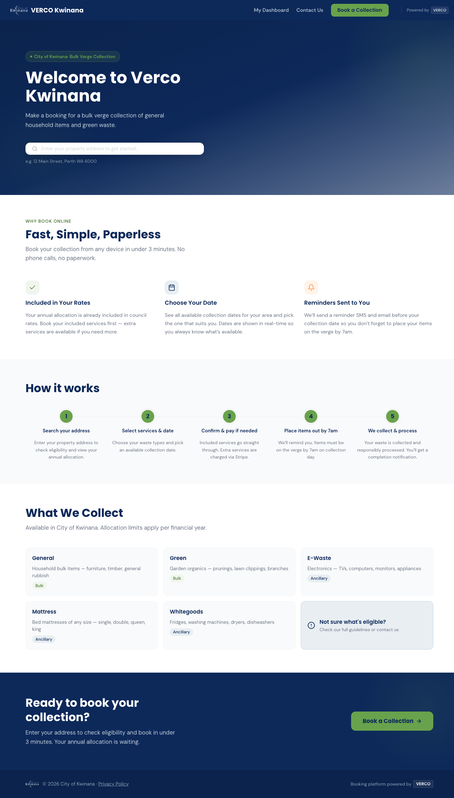

- **Headline:** "Welcome to Verco Kwinana"
- **Subheading:** "Make a booking for a bulk verge collection of general household items and green waste."
- **Address search box** with placeholder *"Enter your property address to get started…"*
- **"Fast, Simple, Paperless"** section with three feature tiles (*Included in Your Rates*, *Choose Your Date*, *Reminders Sent to You*)
- **"How it works"** strip with five numbered steps
- **"What We Collect"** grid showing the Bulk services (General, Green) and the Ancillary services (E-Waste, Whitegoods, Mattress)
- **"Ready to book your collection?"** CTA band
- Footer with copyright and a "Powered by VERCO" mark

**Action:** Click into the address box and start typing a City of Kwinana address. Google Places suggestions appear in a dropdown.

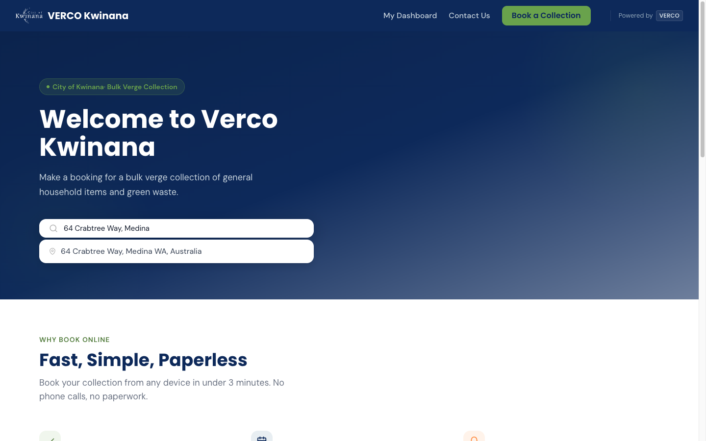

Click the correct suggestion. You're taken to **Step 1 — Address confirmation**.

### 2.2 Enter and confirm the address

The page header reads **"Book a Collection"** with the progress bar showing step 1.

The system looks up the address in the Kwinana eligibility list. One of three things happens:

#### A) Property found (the happy path)

A **green banner** appears: *"Property found! This property qualifies for verge collection services."*

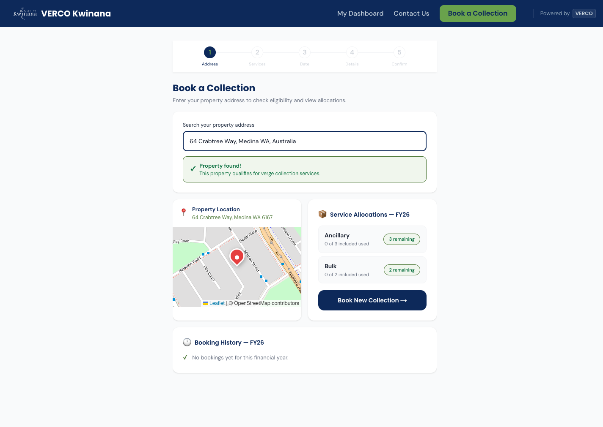

Below the banner you'll see:

- **Property Location** — a small Leaflet/OpenStreetMap snippet showing the address.
- **Service Allocations — FY26** — tiles showing *"Bulk — 0 of 2 included used, 2 remaining"* and *"Ancillary — 0 of 3 included used, 3 remaining"*.
- **Booking History — FY26** — your last 5 bookings this financial year (excludes cancelled and pending-payment). Empty on a fresh test property.
- **`Book New Collection →`** button.

**Action:** Click **Book New Collection →**.

#### B) Address not eligible

A **red banner** appears: *"Address not eligible — This address is not registered for verge collection services."*

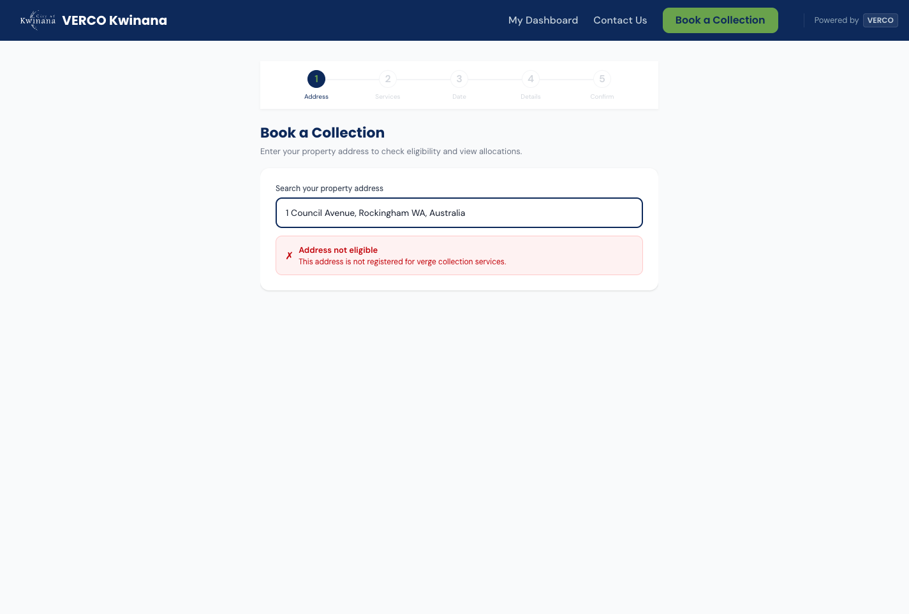

There is no Continue button. The resident is expected to contact the City of Kwinana directly. **Use this branch to test the rejection message** — try an address outside the City of Kwinana catchment.

#### C) Multi-unit (strata) property

A **purple banner** appears: *"Multi-unit property — Collections for {address} are arranged centrally. Please contact your strata manager."* If the client config has a contact email set, a "Contact us" link appears too.

This branch is for apartment buildings, retirement villages, and other properties flagged as MUD in the eligibility data. (Kwinana has ~73 such properties seeded in UAT.)

### 2.3 Choose services

Page header: **"Select Services"** (step 2).

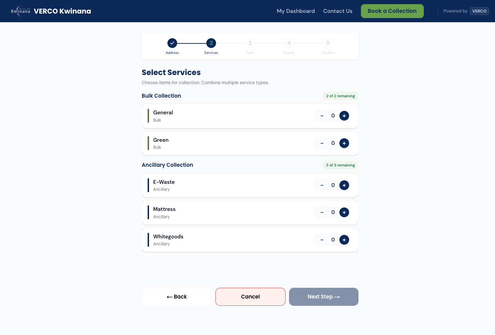

Two sections appear — **Bulk Collection** and **Ancillary Collection** — each with a live "**X of Y remaining**" badge at its top right (Bulk starts at 2 remaining, Ancillary at 3). Each service row has:

- **Service name and category label** (e.g. "General — Bulk", "Green — Bulk", "E-Waste — Ancillary", "Whitegoods — Ancillary", "Mattress — Ancillary")
- **Stepper** with `−`, current quantity, `+`

#### Adding an included unit

Click `+` on General to add 1. The Bulk badge decrements to "1 of 2 remaining".

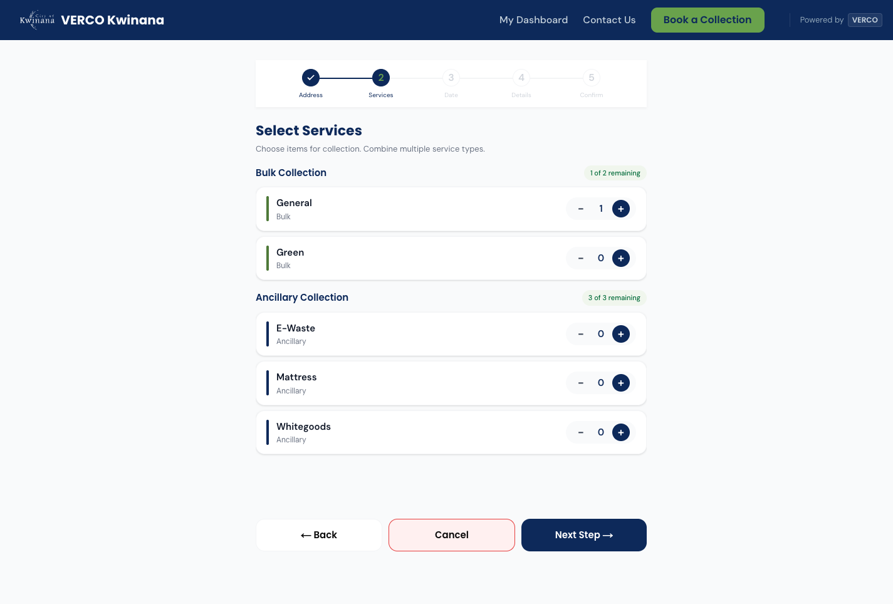

**Next Step** stays greyed out until at least one item is in the cart, then it activates.

#### Adding paid extras

Keep clicking `+` past the included allocation. A **green "Extra cost row"** appears beneath the service row:

> *"1 extra general @ $89.67 each ........ $89.67"*

And a bottom totals strip shows:

> **Total Extra Services Cost: $89.67**

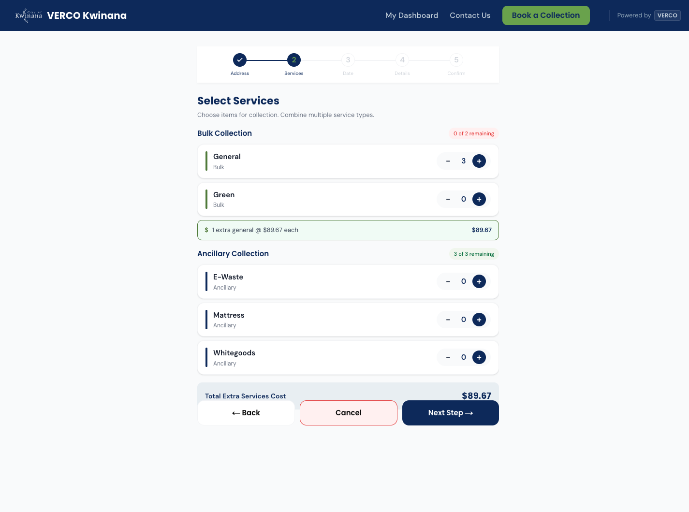

> **Tester note:** The price displayed here is calculated client-side for live feedback. The **real** price is re-calculated server-side when you submit the booking on step 5 — the two must match. If you ever see the confirm page reject a booking with "price mismatch", screenshot it and send to Dan.

**Action:** Choose the quantities you want, then click **Next Step →**.

### 2.4 Pick a collection date

Page header: **"Select Collection Date"** (step 3).

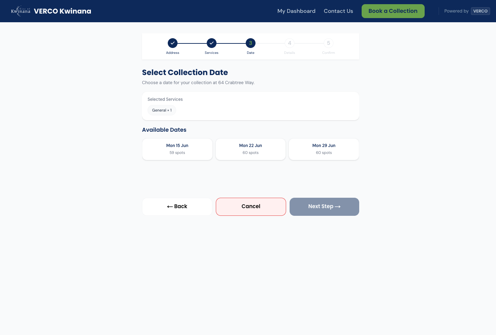

Above the date grid, a "Selected Services" chip strip (e.g. *"General × 1"*).

Below, a **3-column grid of available collection dates**. Each tile shows:

- Day of week, day of month, month name
- Number of remaining "spots" (e.g. *"60 spots"*)
- Orange **"Almost full"** label if 10 or fewer spots remain
- A green **"Selected ✓"** highlight on the date you tap

If no dates are available for this collection area, you'll see *"No available dates for this collection area."* — that means the collection schedule for this area hasn't been opened up for bookings yet.

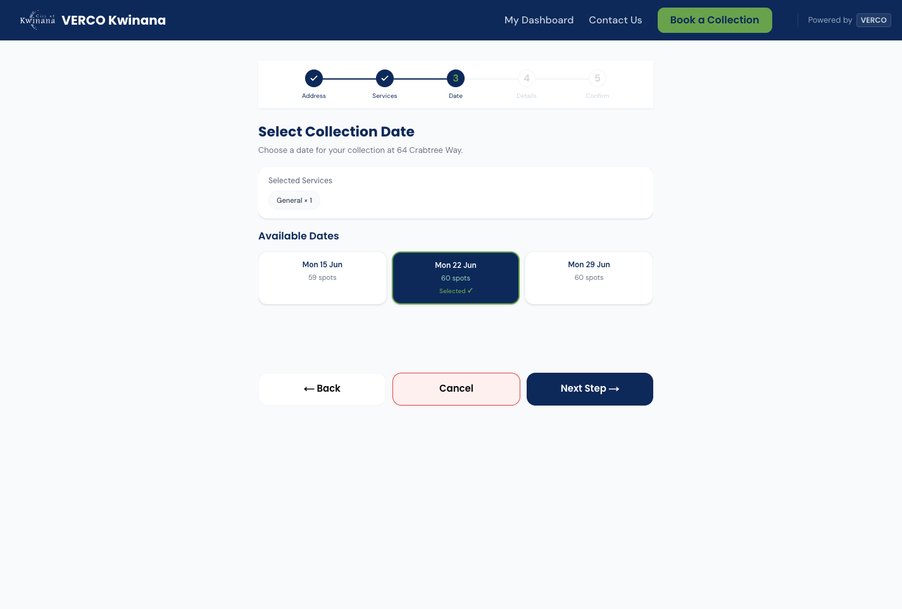

**Action:** Click a date tile, then **Next Step →**.

> **Behind the scenes:** The dates and remaining spots you see reflect the collection schedule for **your area** (KWN-1 to KWN-4 — determined by the property's address). Each area runs to its own schedule and capacity; you'll only ever see the dates that apply to the address you entered.

### 2.5 Confirm collection location & driver notes

Page header: **"Collection Details"** (step 4). Despite the name, this step is **only** about where the bin/items will be on the property and any notes for the driver.

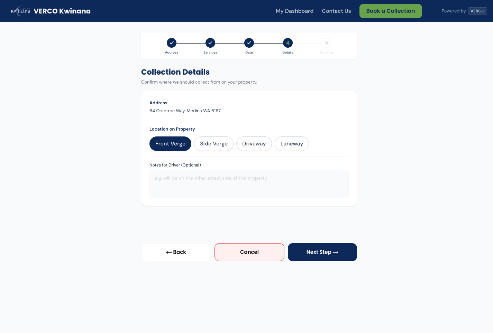

- **Address** — shown read-only at the top.
- **Location on Property** — pill-style buttons: *Front Verge*, *Side Verge*, *Driveway*, *Laneway*.
- **Notes for Driver (Optional)** — free text, 500 character limit. Placeholder: *"e.g. will be on the other street side of the property"*

**Action:** Pick a location, optionally add a note, click **Next Step →**.

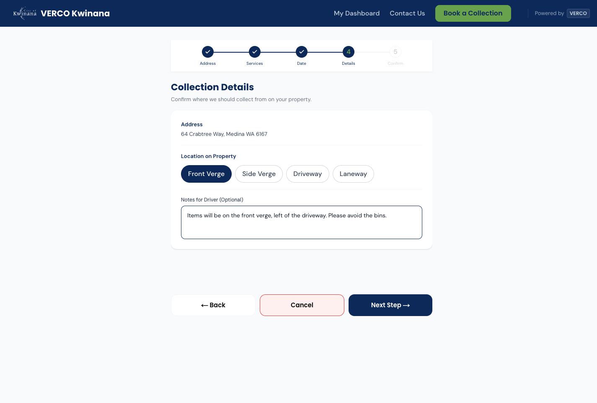

### 2.6 Enter contact details, verify your email, pay

Page header: **"Confirm Your Booking"** (step 5).


#### Top of page — Contact Information

Four required fields:

- **First Name*** *(autocompletes from the browser)*
- **Last Name*** *(autocompletes from the browser)*
- **Email***
- **Mobile*** — Australian format, auto-formats as you type to `0412 345 678`

> **Why first/last separately?** The system stores the resident's name as two fields and generates the display name from both — it's used in audit trails, NCN letters, refund emails, and so on. Single "full name" entry isn't supported.

#### Middle of page — Booking Summary

A read-only recap:

- **Address** — what you confirmed in step 1
- **Date** — what you picked in step 3
- **Location** — what you chose in step 4

#### Services breakdown

Two sub-sections:

- **Included in Allocation** — free units you're using from your annual allowance
- **Extra Services** — paid items, with per-line and total cost (only shown if there are extras)

#### Total block

- If everything is included: shows the word **Included** (no payment needed)
- If there are extras: shows the dollar total and the small footnote *"Payment will be collected via Stripe before your booking is confirmed."*

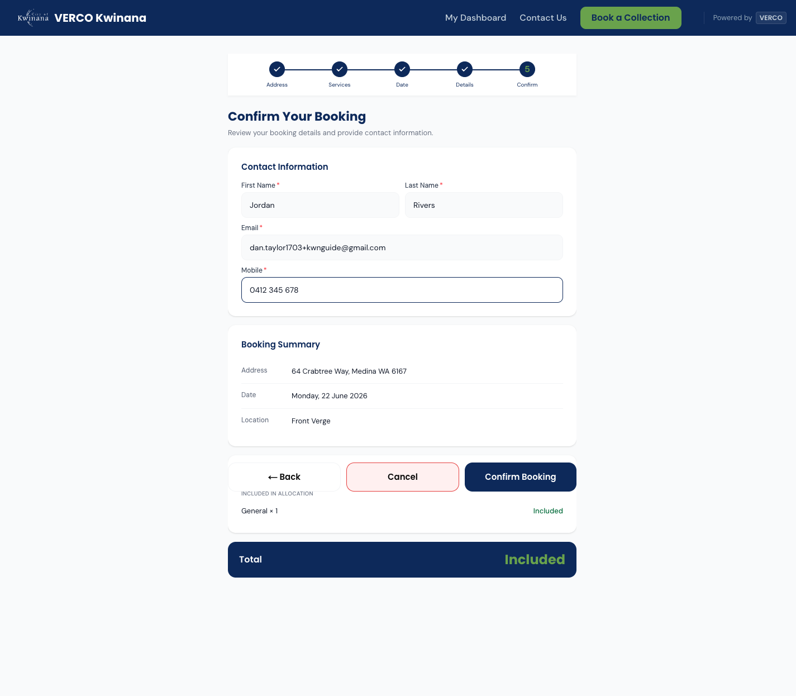

#### Submit button

Label changes depending on the booking:

- **Confirm Booking** (green) — free booking, no payment required
- **Proceed to Payment** (yellow-green) — there are paid extras

#### What happens when you click Submit

**If you're already signed in** (e.g. you previously verified your email earlier in the session), the booking is created immediately.

**If you're a guest** (first-time tester, fresh browser session) — this is the path Kwinana testers will hit most often. The bottom of the page swaps in an **inline 6-digit OTP verification panel**:

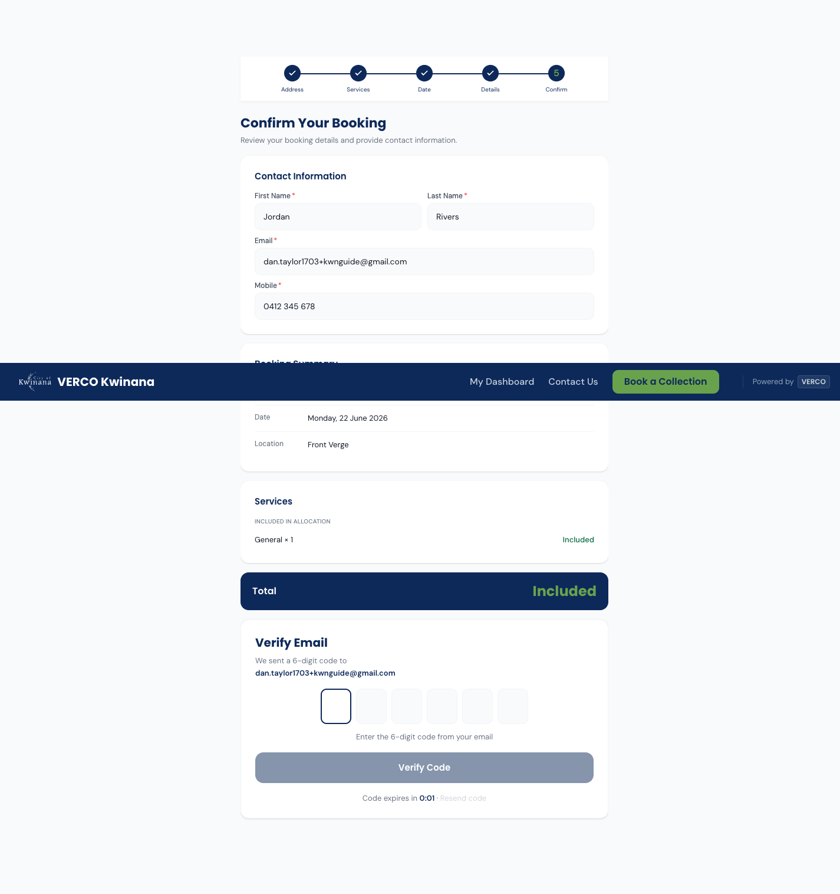

> *"Verify Email — We sent a 6-digit code to {your email}"*

1. **Check your inbox.** The email subject is *"Your VERCO OTP"* from **`bookings@verco.au`** and arrives within seconds.
2. **Type the 6 digits** into the boxes. The form auto-submits when you finish the last digit.
3. If the code is wrong (or stale), you get a clear inline error and "Try Again" / "Request a new code" options:

   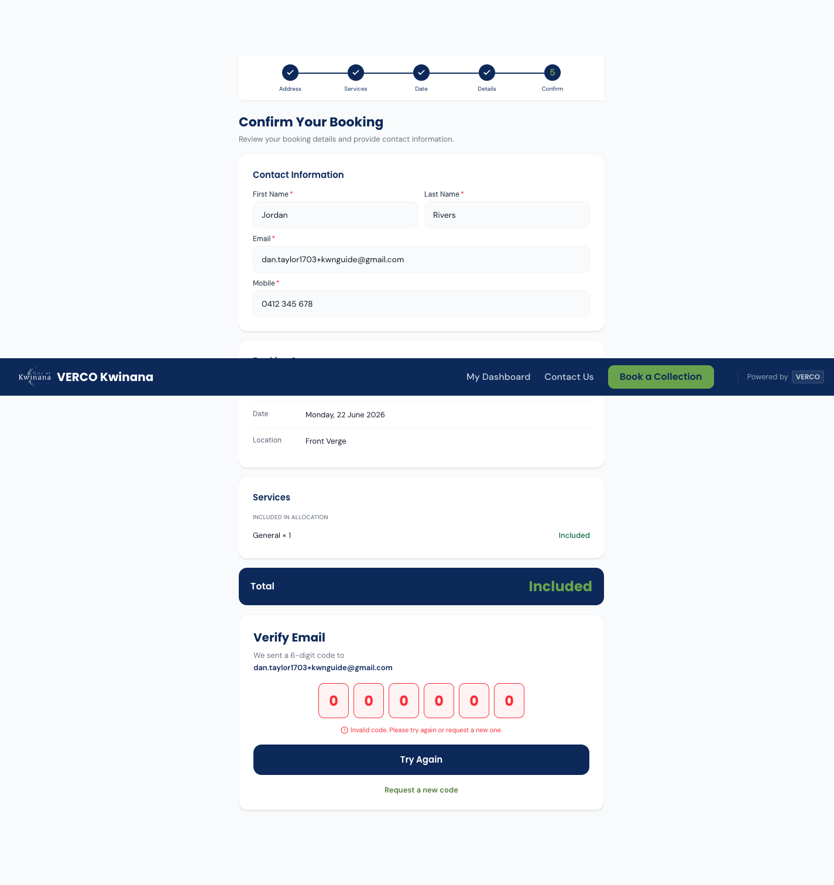

4. After 30 seconds you can request a fresh code.
5. Once verified, the booking is created.

**Free booking path:** You're redirected to `/booking/<ref>?success=true` — the booking detail page with a green success banner.

**Paid booking path:** You're redirected to **Stripe Checkout** (Stripe's hosted payment page).
- Use the test card from §1 above.
- After successful payment, you return to `/booking/<ref>?success=true`.
- A green "Payment received — confirming your booking…" banner shows briefly while the system catches the Stripe webhook and flips the status to **Confirmed**.

If you cancel out of Stripe, you return to your booking page in **Pending Payment** status with a "Pay Now" button you can click to try again.

> **Common tester mistake:** Forgetting to check email for the OTP. The form sits there waiting and looks frozen. The fix is always to check the inbox.

> **OTP rate-limiting gotcha:** If you click "Request a new code" multiple times in quick succession, Supabase will rate-limit you — you'll see *"For security purposes, you can only request this after N seconds."* Wait the cooldown out (usually 9–30 seconds) before retrying. The previous code is invalidated as soon as a new one is sent, so don't try to use the older one.

---

## 3. Part B — Managing a booking

Once a booking exists, the resident can come back at any time to view it, edit it, or cancel it.

### 3.1 Sign back in

From any page on `kwntest.verco.au`:

1. Click **My Dashboard** in the top nav, or visit `/auth` directly.

   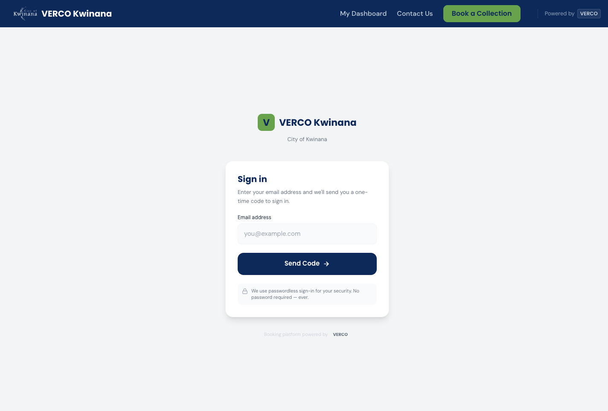

2. Page header: **"Sign in"** with the message *"Enter your email address and we'll send you a one-time code to sign in."*
3. Type your email, click **Send Code**.
4. You're redirected to `/auth/verify?email=…` showing **"Check your email — We sent a 6-digit code to {email}"**.

   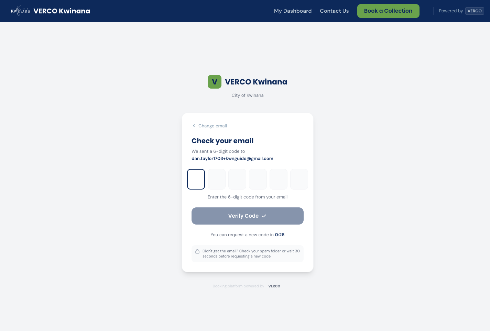

5. Six numeric cells, paste-friendly. Auto-verifies on the sixth digit.
6. On success: green tick *"You're signed in — Taking you to your dashboard now"* then you land on your dashboard.

Codes expire after 10 minutes; if it lapses, click **Resend code** (the 30-second cooldown applies again).

### 3.2 Your dashboard

URL: `/dashboard`. Page header: **"My Dashboard"** with a greeting like *"Good morning, Daniel."*

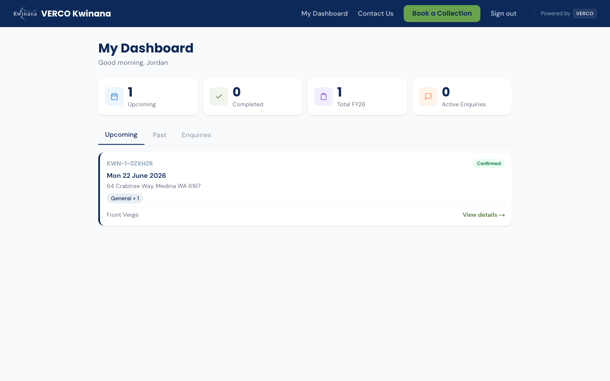

Four stat cards at the top:

| Card | Shows |
|---|---|
| **Upcoming** | Bookings scheduled but not yet collected |
| **Completed** | Bookings collected in this financial year |
| **Total {FY}** | All bookings (any status) for current FY |
| **Active Enquiries** | Open support tickets |

Below the stats, **three tabs**:

- **Upcoming** — future bookings, with a place-out reminder for any booking ≤2 days out
- **Past** — completed and cancelled bookings
- **Enquiries** — your support tickets

Each booking card on the dashboard shows:

- **Reference** (e.g. `KWN-1-Y4XXPB`, `KWN-3-MTPOY3` — the prefix encodes the collection area)
- **Status badge** (Confirmed / Scheduled / Completed / Cancelled / Non-conformance / etc.)
- **Collection date**
- **Address**
- **Service chips** with paid extras tagged: *"General (extra · $89.67)"*
- **Countdown** for bookings ≤7 days out: *"5 days away · cannot cancel after 3:30pm Sunday"*
- **Place-out reminder** (green banner) for bookings ≤2 days out

### 3.3 Open a booking

Click any booking card on the dashboard. You land on `/booking/<ref>`.

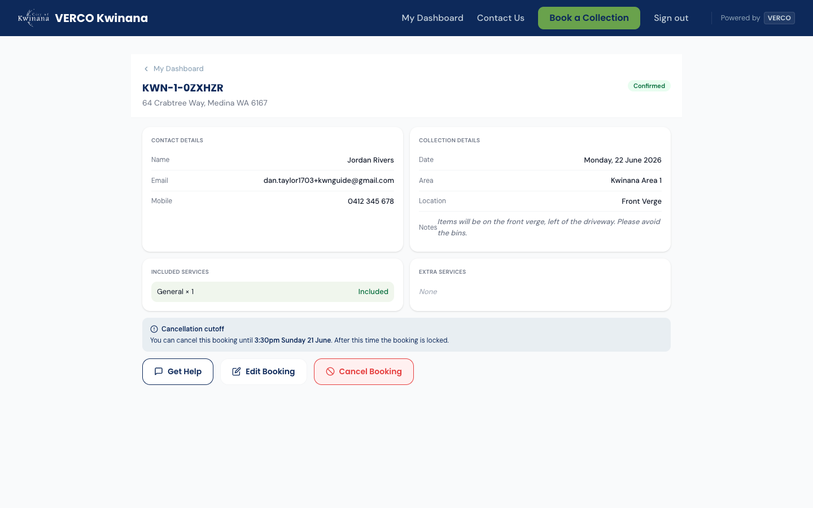

The booking detail page shows:

- **Header** — booking reference, status badge, address
- **Contact Details** — name, email, mobile
- **Collection Details** — date, area, location on property, driver notes
- **Included Services** — green-tinted block
- **Extra Services** — orange-tinted block with $ amounts and a **View receipt** link (when paid)
- **Cancellation cutoff card** (blue) — *"You can cancel this booking until 3:30pm Sunday 24 May. After this time the booking is locked."*
- **Action buttons** — Get Help, Edit Booking, Cancel Booking

#### Other conditional banners

| When | Banner |
|---|---|
| Status is **Pending Payment** | Orange "Payment required" banner with **Pay Now** button |
| Just returned from Stripe and status still pending | Green "Payment received — confirming your booking…" with auto-poll |
| Collection is in ≤2 days | Green "Place out your waste now — Items must be on the verge by 7am {date}. Do not place out more than 48 hours before collection." |

> **The place-out window for City of Kwinana collections is 48 hours.** Items put out earlier than that risk a "nothing presented" or non-conformance outcome — the banner message reflects the 48-hour rule.

### 3.4 Edit a booking

Click **Edit Booking** on a booking that's still in a cancellable status (Confirmed, Scheduled, or Submitted, and before the cutoff).

You're sent back to the **services step** of the booking wizard with the existing items pre-filled. The page URL contains `?replaces=<booking_id>` — this tells the system to treat the change as an in-place edit rather than a cancel-and-replace.

You can:

- Add or remove services
- Change the collection date
- Update location and driver notes
- Update contact details

The pricing engine **excludes the booking-being-edited from the FY usage calculation**, so your allocation numbers reflect what would be true if this booking didn't exist. That avoids the *"you've used 2/2 — you can't edit your only booking"* trap.

When you confirm the edit, the booking keeps its original reference and `booking_id`. The change is logged in the audit trail. If you removed paid items, a refund request is queued (see admin guide).

### 3.5 Cancel a booking

Click **Cancel Booking** on the booking detail page.

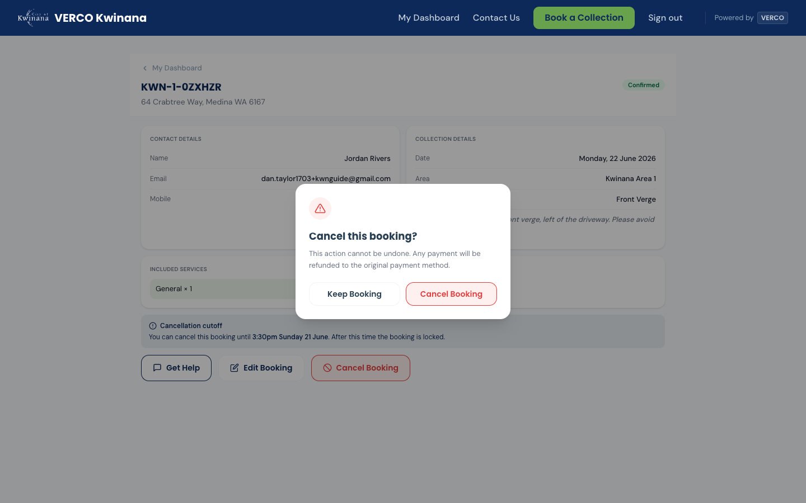

A confirmation dialog appears:

> *"Cancel this booking? This action cannot be undone. Any payment will be refunded to the original payment method."*

Two buttons: **Keep Booking** and **Cancel Booking**.

#### The cancellation cutoff

A resident can cancel up until **3:30pm AWST on the day before collection**. After that, the cancel button is hidden and any direct attempt is rejected with:

> *"Cancellation cutoff has passed (3:30pm the day before collection)."*

This is enforced in three places — front-end (button hidden), server action (rejects late requests), and database trigger (defence in depth). **There is no override available to the resident.** City of Kwinana staff can sometimes cancel after the cutoff via the admin app — see the admin guide.

#### What happens after cancellation

- Booking status flips to **Cancelled**.
- If extras were paid, a **refund request** is created with status **Pending**. Refunds are not automatic — a City of Kwinana or contractor admin must approve them in the admin app. The resident sees the refund within 1–3 business days of approval.
- A **booking cancelled** notification email is sent.

### 3.6 Dispute a non-conformance notice or "nothing presented"

When field staff finish a collection visit, they can mark the booking as one of:

- **Completed** — collected as expected
- **Non-conformance (NCN)** — items breach the rules (e.g. oversized, contaminated, in the wrong location). Photos are attached.
- **Nothing Presented (NP)** — nothing was on the verge to collect

If your booking comes back as NCN or NP, your booking detail page gets a new card.

#### NCN card

- **Reason** — e.g. "Oversized items"
- **Reported date**
- **Photos** — click to enlarge
- **Status** — usually **Issued** when first raised
- **Rebooked-as** link if a replacement booking has already been arranged

If the status is **Issued**, a red **"Dispute this Notice"** button appears. Clicking it:

1. Confirms with you ("Are you sure?")
2. Adds a notes field for your dispute reason
3. Flips the NCN status to **Disputed**
4. Shows the confirmation: *"Your dispute has been submitted. Our team will review and respond."*

City of Kwinana staff then triage the dispute in the admin app — see **§4.5 Triaging exceptions** below for the staff side of this flow.

#### NP card

Same shape as NCN but without the photos and reason — just the date the field crew couldn't find anything. Same dispute flow.

#### Auto-close

NCNs and NPs auto-close to **Closed** after **14 days** if not disputed. After auto-close, the dispute button no longer appears.

---

## 4. Part C — Admin operational workflows (client-staff)

Once VERCO Kwinana goes live, the City of Kwinana's customer service officers and operations supervisors will spend most of their time in the **admin app** at `kwntest.verco.au/admin`. This part walks through everything you need to do at the desk: looking up a booking when a resident phones, helping them pay or cancel, triaging a non-conformance dispute, approving a refund, booking on behalf of a strata building, and managing the customer-service ticket queue.

The admin app uses the **same sign-in mechanism as the resident portal** (passwordless OTP), but it lives at a different URL and shows a completely different interface — sidebar navigation, table-based lists, slide-over detail panels.

> **Audience note:** Most of what's described here is available to anyone with the **client-staff** role. A few actions (importing properties, geocoding the address database, sender configuration) are restricted to **client-admin** or to D&M's contractor-admin team — those are called out inline when they appear.

> **Capture status (v1.0 draft):** the admin screens (§4.1 onward) are written from a live walk-through of the UAT app; their screenshots will be captured in the Kwinana re-shoot pass. Section text below is correct for Kwinana — verify the wording matches what you see when you capture, and flag anything that has shifted.

### 4.1 Sign in to the admin app + dashboard orientation

**URL:** `https://kwntest.verco.au/admin`

If you're not already signed in, visit `kwntest.verco.au/auth` and complete the OTP exactly as described in §3.1 (the resident sign-in flow). Once signed in, navigate to `/admin` directly, or use the URL above.

<!-- SCREENSHOT: 21-admin-dashboard.png — admin app landing page, full viewport (Kwinana re-shoot) -->

The admin dashboard has six visible regions:

**Top bar (left to right):**
- **VERCO logo** — your home anchor; click to return to `/admin`
- **Tenant selector pill** (e.g. *"VERCO Kwinana"* with a green dot) — only visible if your account has access to more than one tenant. Most City of Kwinana staff have a single tenant, so the switcher won't appear at all.
- **Global search box** — search bookings by reference (e.g. `KWN-1-Y4XXPB`), address, or contact name. Hits any booking your role can see.
- **Avatar initials** (top right) — your account menu

**Sidebar (left), grouped into three:**
- **GENERAL** — Dashboard (where you are)
- **OPERATIONS** — Bookings, Collection Dates, Properties, MUDs, Illegal Dumping, Allocations
- **EXCEPTIONS** — Non-Conformance, Nothing Presented
- **CUSTOMER** — Service Tickets, Refunds

The Bookings link carries a number badge (e.g. **5**) when there are pending-payment bookings still incomplete.

**Main area — four stat cards:**

| Card | Means |
|---|---|
| Bookings This Week | Confirmed bookings with collection dates in the next 7 days |
| Collections Completed | FY-to-date total — field staff marked these "Completed" |
| Open Exceptions | NCN + Nothing-Presented notices still unresolved |
| Open Tickets | Service tickets in any non-Resolved status |

Below the stats are two side-by-side panels:

- **Upcoming Collection Dates** — the next collection days for each area (KWN-1 to KWN-4), with a small bar showing utilisation (`0/60`, `47/60`, etc.). Click "View all" to drill into the full schedule.
- **This Week's Summary** — booking counts in each status (Submitted, Confirmed, Completed, Cancelled, Non-Conformance, Nothing Presented). At a glance you can see whether the week looks healthy or whether exceptions are piling up.

**Bottom-right floating button:** *"Report a bug"* — opens a small form for logging UI issues to the D&M dev team. Use this for *unexpected app behaviour* (a button doesn't work, a value is wrong). For *customer service problems* (a resident's request you can't fulfil), use Service Tickets — see §4.7.

---

### 4.2 Looking up a booking

**URL:** `https://kwntest.verco.au/admin/bookings`

This is the workhorse screen. Click **Bookings** in the sidebar — you land on a table of every booking your role can see.

<!-- SCREENSHOT: 22-admin-bookings-list.png — bookings table with KWN-1..4 mix visible (Kwinana re-shoot) -->

**Filter strip** (top of the table):
- Search box — by ref, address, or contact name
- **All Statuses** dropdown — narrow to a single status (Confirmed, Pending Payment, Cancelled, Non-conformance, Nothing Presented, Scheduled, Submitted, Completed, Rebooked)
- **All Areas** dropdown — narrow to a single collection area (KWN-1, KWN-2, KWN-3, KWN-4)
- **All Types** dropdown — Residential vs. MUD

The *"Showing X of Y"* count updates live as you filter.

<!-- SCREENSHOT: 23-admin-bookings-filter-applied.png — same view, filtered to "Confirmed" (Kwinana re-shoot) -->

**Table columns:**

| Column | What it shows |
|---|---|
| REF | e.g. `KWN-1-Y4XXPB`, `KWN-2-OCN6ID` — the area prefix is your fastest visual filter |
| ADDRESS | Street + suburb only (resident name is in the detail panel) |
| TYPE | Residential / MUD |
| SERVICES | e.g. "General × 1, Green × 1" — what was booked |
| COLLECTION DATE | The scheduled day |
| AREA | The collection area code (KWN-1 to KWN-4) |
| STATUS | Coloured badge — see legend below |
| CREATED | Relative time ("18 May", "9 days ago") |

**Status badge legend:**

| Badge | Meaning |
|---|---|
| 🟢 **Confirmed** | Booking is locked in for that date |
| 🟢 **Completed** | Field crew collected successfully |
| 🟠 **Pending Payment** | Booking exists but Stripe charge incomplete. Paired with a small green **Pay** pill — clicking it opens Stripe Checkout for the resident's cart. |
| 🟠 **Submitted** | Legacy state where the booking awaits manual confirmation. Rare — most bookings auto-confirm now. |
| 🔵 **Scheduled** | Locked in for collection (auto-flipped from Confirmed at 3:25pm AWST the day before) |
| 🔴 **Cancelled** | No longer active. Refund (if any) tracked separately. |
| 🔴 **Non-conformance** | Field crew couldn't collect as booked |
| 🔴 **Nothing Presented** | Field crew visited and found nothing on the verge |
| 🟣 **Rebooked** | A follow-up booking has been created after an NCN/NP |

**Top-right actions:**
- **Export CSV** — downloads the current filtered table as a CSV. Useful for ad-hoc reports.
- **+ New Booking** — opens the booking wizard pre-loaded with admin context. See **§4.6 for the strata path**; otherwise the wizard is identical to the resident flow in Part A, with one difference noted in §4.4.

> **Area scoping.** City of Kwinana is a single local government with four collection areas (KWN-1 to KWN-4). Client-staff see bookings across all four — there are no sub-councils or sub-clients to narrow you away from. The **All Areas** filter is a convenience for focusing on one area's run, not a permission boundary.

---

### 4.3 Reading the booking detail panel

Click any row in the bookings list — the right side of the screen opens a **slide-over panel** with everything about that booking.

<!-- SCREENSHOT: 24-admin-booking-detail-confirmed.png — Confirmed booking, slideover open (Kwinana re-shoot) -->

The URL updates to `/admin/bookings/<uuid>` (a long random ID, not the human-readable ref). You can copy this URL to share a specific booking with a colleague — they'll land on the same view.

> **A quirk worth knowing.** The main area to the left of the slideover keeps saying *"Select a booking to view details"* while the panel is open — that's not a bug, it's the empty-state for when you close the panel. To close the panel: click the **X** in the panel's top-right, or hit Esc.

The panel has the following sections, stacked top-to-bottom:

#### Header

- **Booking reference** (e.g. `KWN-2-OCN6ID`)
- **Status badge** (same colours as the list)
- **Sub-header** — "Residential · Kwinana Area 2" or "MUD · Kwinana Area 1"

#### COLLECTION DETAILS (with pencil icon to edit)

- **Address** — full street + suburb + postcode (resident name is *not* here; that's in CONTACT)
- **Location** — Front Verge / Side Verge / Driveway / Laneway (whatever the resident selected at step 4 of the wizard)
- **Collection Date** — formatted "Wednesday, 20 May 2026"
- **Notes** — driver instructions the resident left, or italic *"Nothing"* if blank

#### CONTACT (with pencil icon to edit)

- **Name** — e.g. "Sarah Jenkins" or, if the booking was created by staff on behalf of a resident, "Sarah Jenkins **(Admin)**"
- **Mobile** — `+61 4XX XXX XXX`
- **Email** — the resident's verified email

> **The "(Admin)" suffix is a leakage signal worth recognising.** It means a staff member created this booking on the resident's behalf (e.g. a strata booking, or a phone-in request). Useful when triaging: a resident may not remember a booking they didn't make themselves.

#### SERVICES (with pencil icon to edit)

A list of every service line, each with a **status pill**:
- **Included** (green) — comes out of the resident's FY allocation, no charge
- **$X.XX** (orange) — an "extra" line beyond the allocation, paid via Stripe
- A "Total charged" row at the bottom sums the extras

#### ACTIVITY (audit timeline)

Every change to this booking, oldest at the top:
- "Status changed to Confirmed" — when the booking was confirmed
- "Service item created" — when each service line was added
- "0 fields updated" — system housekeeping events (often duplicated; safe to ignore for now)
- Click any entry to expand the field-level diff

Use the timeline to answer disputes: *"the resident says they didn't add Green"* → check whether the Green line came in at create time or was added later, and by whom.

#### Action buttons (bottom of panel)

These change based on the booking's current status:

| Status | Buttons available |
|---|---|
| **Pending Payment** | **Pay Now** (green outline) → opens Stripe Checkout; **Cancel Booking** (red outline) |
| **Submitted** (legacy) | **Confirm Booking** (green) → flips to Confirmed; **Cancel Booking** (red outline) |
| **Confirmed** | **Cancel Booking** (red outline) — until 3:30pm the day before |
| **Scheduled** | **Cancel Booking** (red outline) — staff-only post-cutoff override; see §4.4e |
| **Completed** / **Cancelled** / **Non-conformance** / **Nothing Presented** | No state-changing buttons here; raise a new booking from the bookings list instead |

<!-- SCREENSHOT: 25-admin-booking-detail-pending-payment.png — Pending Payment booking with Pay Now + Cancel Booking buttons visible (Kwinana re-shoot) -->

---

### 4.4 Helping a resident — confirm, pay, cancel

This section covers the four most common phone-in scenarios.

#### a) "I can't find my booking"

If the resident gives you their booking reference, paste it into the **top-right global search** — it jumps straight to the detail panel.

If they don't have the reference:
1. Click **Bookings** in the sidebar
2. Type their **address**, **last name**, or **email** into the table search box
3. The list narrows live

If you find nothing:
- Check the **status filter** isn't accidentally set to a single status. Reset to "All Statuses".
- Check the **area filter** isn't pinned to a single area (KWN-1 to KWN-4) — reset it to "All Areas".
- Check whether they signed up with a **different email** than they're quoting now. Email is the identity anchor; a typo at sign-up creates a "phantom" account they can't access. Look at Service Tickets for prior history under any email.

#### b) Resident wants to pay now (Pending Payment)

1. Find the booking (status will say **Pending Payment**)
2. Open the detail panel
3. Scroll to the bottom — click **Pay Now**
4. Stripe Checkout opens **in the same browser** — you can either hand the laptop to the resident in person, or read out the Stripe-generated payment URL for them to complete remotely
5. Once Stripe confirms payment, the booking status flips to **Confirmed** within seconds (a webhook handles this; no manual step needed on your side)

> **Tip:** If the resident is on the phone in a different state and you don't have a way to share the Stripe URL securely, raise a Service Ticket (§4.7) describing the situation. D&M's contractor-admin team can generate a one-time secure link.

#### c) Resident wants to confirm a "Submitted" booking

Most bookings auto-confirm now (free path → Confirmed immediately; paid path → Confirmed on Stripe success), so the **Submitted** status is rare. If you encounter one:

1. Open the detail panel
2. Verify the contact details + services + date look right
3. Click **Confirm Booking** — the green button at the bottom
4. The status flips to Confirmed; the audit log captures your name as the actor

#### d) Resident wants to cancel a booking (pre-cutoff)

1. Open the detail panel
2. Click **Cancel Booking** (red outline)
3. A confirmation dialog appears: *"Cancel this booking? This action cannot be undone. Any payment will be refunded to the original payment method."*
4. Click **Cancel Booking** to confirm, or **Keep Booking** to back out

<!-- SCREENSHOT: 26-admin-cancel-dialog.png — confirmation dialog over dimmed slideover (Kwinana re-shoot) -->

What happens after cancellation:
- Booking status flips to **Cancelled**
- If the resident paid for extras, a **Refund Request** is auto-created in the Refunds queue (see §4.5). The refund is **not automatic** — someone has to approve it.
- A "booking cancelled" notification email is sent to the resident.

#### e) Cancelling after the cutoff (staff-only override)

Residents lose the ability to cancel at **3:30pm AWST the day before collection**. After that, the cancel button is hidden from their dashboard. Field crew are already on the road or about to be.

**Staff can still cancel post-cutoff**, but the policy expectation is:
- **Don't cancel within 24h of collection unless there's a genuine operational reason** (e.g. weather closure, address error). Doing so doesn't refund the resident automatically — you'll need to manually approve a refund or note in the audit trail why no refund applies.
- **Document the reason in the booking notes before cancelling** (use the pencil icon next to COLLECTION DETAILS). The audit trail captures the cancellation actor, but not the *why* — notes give the why.
- The same Cancel Booking button works post-cutoff for staff. The DB trigger that blocks resident cancellations has a staff bypass.

> **Edit a confirmed booking instead of cancelling.** If the resident wants to change the date or services (rather than drop entirely), use the **Edit Booking** flow (pencil icon on COLLECTION DETAILS or SERVICES) — keeps the same reference, audit-trails the change, doesn't create a refund. This is almost always preferable to cancel-and-rebook.

---

### 4.5 Triaging exceptions — NCN, Nothing Presented, refunds

When field crew can't complete a collection as booked, they record one of two exception types:

- **Non-conformance (NCN)** — items breach the rules (oversized, contaminated, wrong location). Photos attached.
- **Nothing Presented (NP)** — nothing was on the verge to collect.

Both flow into your queue if the resident **disputes** them.

#### a) The Non-Conformance list

**URL:** `https://kwntest.verco.au/admin/non-conformance`

<!-- SCREENSHOT: 27-admin-ncn-list.png — non-conformance notices list (may be empty in early UAT) (Kwinana re-shoot) -->

**Filter strip:**
- Search box — by booking ref, address, reason
- **All Statuses** dropdown — Issued / Disputed / Under Review / Resolved / Rescheduled / Closed
- **All Reasons** dropdown — e.g. Oversized, Contamination, Incorrect Location, Asbestos, Hazardous

**Columns:** BOOKING / ADDRESS / AREA / REASON / PHOTOS / STATUS / REPORTED / REPORTED BY.

#### b) The NCN state machine

```
Issued        → Disputed         (resident disputes within 14 days)
Issued        → Closed           (auto-close cron after 14 days if no dispute)
Disputed      → Under Review     (you take it on)
Under Review  → Resolved         (NCN dismissed — your investigation found the field call was incorrect)
Under Review  → Rescheduled      (a new collection date offered without a new booking)
Under Review  → Rebooked         (a new booking created for the same address)
```

You **cannot** triage an NCN that's still in **Issued** status — that's the resident's window. Only **Disputed** notices (where the resident pushed back) need your attention.

#### c) Triaging a Disputed NCN

1. Open the NCN detail (click the row)
2. Read the field crew's notes + look at the photos
3. Read the resident's dispute reason (captured when they clicked "Dispute" in their dashboard)
4. Decide:
   - **Field crew was right** (e.g. photos clearly show oversized items): change status to **Under Review → Resolved**, add a note explaining your finding to the resident
   - **Resident was right** (items were small but photographed misleadingly): **Resolved** with a refund or apology note; consider raising the issue with field crew
   - **Genuine ambiguity**: offer a **Rescheduled** date (no new booking) or **Rebooked** (a fresh booking with new ref). Both inform the resident via email automatically.

#### d) Auto-close at 14 days

If a resident *doesn't* dispute within 14 days of the NCN being issued, the system auto-closes it. Your queue gets cleaner; the resident loses their right to dispute. After auto-close, you can still see the NCN in the list (filter status = **Closed**) but you can't act on it.

#### e) Nothing Presented

**URL:** `https://kwntest.verco.au/admin/nothing-presented`

Same flow as NCN but without photos or reasons — the field crew just records "nothing here to collect". A common cause: the resident didn't place items out, or placed them outside the 48-hour window. Same dispute mechanism, same triage decisions, same auto-close.

<!-- SCREENSHOT: 28-admin-np-list.png — nothing-presented list view (Kwinana re-shoot) -->

#### f) Refund Requests

**URL:** `https://kwntest.verco.au/admin/refunds`

<!-- SCREENSHOT: 29-admin-refunds-list.png — refund requests queue (Kwinana re-shoot) -->

Refunds are **never automatic**. Every refund needs a staff approval. The queue feeds from two sources:

1. **Cancellation refunds** — auto-created when a resident cancels a Confirmed booking that had paid extras
2. **Manual refunds** — created by a staff member as part of NCN/NP resolution

**Columns:** BOOKING / RESIDENT / AMOUNT / REASON / STATUS / STRIPE REF / REQUESTED / REVIEWED BY.

#### g) Approving a refund

1. Open the refund detail
2. Verify the amount matches what was paid (the system pre-populates from the original Stripe charge)
3. Click **Approve** — the system calls Stripe's refund API, the **STRIPE REF** column populates with the refund ID, and the status flips to **Issued**
4. The resident sees the money in their account in 1–3 business days
5. Your name is captured in **REVIEWED BY** for audit

Decline a refund only when the request is genuinely out-of-policy (e.g. a cancellation made after the field crew has already visited and completed the collection). Add a note explaining why; the resident is emailed.

---

### 4.6 Multi-unit dwellings (strata) — booking on behalf

**URL:** `https://kwntest.verco.au/admin/muds`

A **MUD** is any property where verge collections can't be arranged by individual residents — apartment blocks, retirement villages, gated communities, dual-occupancy strata. The strata manager (or a building rep) requests a collection on behalf of all the units. (Kwinana has ~73 MUDs seeded in UAT.)

> **Important: admin-on-behalf is the *only* way to book a MUD collection.** There's no resident-facing flow for strata yet — when someone in a flagged MUD tries to book at `/book`, they hit the purple "contact your strata manager" banner (§2.2C). The booking has to be created by you, in the admin app.

#### a) The MUDs list

<!-- SCREENSHOT: 30-admin-muds-list.png — MUDs table with status cards visible (Kwinana re-shoot) -->

Four status cards at the top:
- **Contact Made** — strata manager has been identified + contacted, but not yet onboarded
- **Registered** — strata manager has an admin-bound account; can be booked on behalf of
- **Inactive** — strata building is flagged as not currently subscribed (e.g. opted out, demolished)
- **Not Set** — no strata status assigned yet

**Filter strip:** Search by address/MUD code, All areas, All statuses.

**Columns:** ADDRESS / AREA / MUD CODE (e.g. `KWN-MUD-58`) / UNITS / STATUS / STRATA CONTACT / CADENCE (**Quarterly** = fixed schedule, **Ad-hoc** = request-by-request) / ACTIONS.

#### b) Converting a property into a MUD

Done from the **Properties** page (`/admin/properties`), not from the MUDs list.

<!-- SCREENSHOT: 31-admin-properties-list.png — eligible properties list (Kwinana re-shoot) -->

1. Open `/admin/properties` (~18,915 records across Kwinana's four areas — use the search box)
2. Find the property by address
3. Click the row's **kebab menu** (⋮) → **"Convert to MUD"**
4. Enter unit count, strata contact name + email + mobile, and cadence
5. Save — the property reappears in `/admin/muds`

#### c) Booking on behalf of a strata building

1. From the MUDs list, click a row to open its detail page
2. Click **"Book Collection"** (the only call-to-action available on a MUD detail)
3. The booking wizard opens, pre-loaded with:
   - The MUD address (read-only — can't change it)
   - **Type: MUD** (different allocation rules — unit count × per-unit allocation)
   - Strata contact pre-filled in CONTACT (your name appears with the "(Admin)" suffix as actor)
4. Walk through the wizard as you would for a resident: services, date, location, confirm
5. Submit — the booking lands directly in **Confirmed** status (no OTP step required, because the strata manager has been onboarded already)

> **Allocation maths is different for MUDs.** A 50-unit MUD with the standard 2-Bulk-per-property allocation gets `50 × 2 = 100` Bulk units per FY (shared across General and Green), plus the per-unit Ancillary budget. The pricing engine knows this from `UNITS` × per-unit-allocation; you don't manually scale anything.

#### d) PII handling on MUDs

The **strata contact** name + email + mobile sit in the MUDs table because admins need them. They are **never** exposed to:
- Field crew (`field` role) — they see only the address and items to collect
- Rangers (`ranger` role) — same restriction
- Other residents in the building — who don't have visibility into who their strata manager is via this app

When sharing screenshots of the MUDs list externally, **blur the STRATA CONTACT column** before sharing.

---

### 4.7 Service tickets — your customer service queue

**URL:** `https://kwntest.verco.au/admin/service-tickets`

<!-- SCREENSHOT: 32-admin-service-tickets.png — service tickets list (Kwinana re-shoot) -->

The Service Tickets queue is where resident-side enquiries land that aren't directly tied to a booking action. Examples:

- *"I can't see my booking on the dashboard"*
- *"I didn't receive my OTP email"*
- *"I want to change my email address"*
- *"The address autocomplete won't accept my street"*
- *"I need an invoice for accounting"* (when the receipt isn't enough)

**Filter strip:** All Statuses, All Priorities, All Categories. Search by subject.

**Columns:** TICKET (e.g. `TKT-DOF0KT`) / SUBJECT / RESIDENT / CATEGORY (Booking Enquiry, Account Issue, Technical, Billing, Other) / PRIORITY (Low, Normal, High, Urgent) / STATUS (New, In Progress, Awaiting Resident, Resolved, Closed) / ASSIGNED / CREATED / ACTIONS.

#### Triage workflow

1. **Filter** to Status = "New" + Assigned = empty — the unclaimed queue
2. **Open** the highest-priority ticket
3. **Read** the resident's message + any linked booking
4. **Assign** yourself (or your colleague) so others don't double-handle
5. **Reply** via the ticket comment thread (the resident is emailed)
6. **Change status** to "Awaiting Resident" if you're waiting on them, or "Resolved" once handled
7. **Close** after the resident confirms or after 7 days of silence on Resolved status

> **"Report a bug" floating button vs. Service Tickets.** The floating bug-report button (bottom-right of every admin page) goes to D&M's **dev team** — use it for app misbehaviour. Service Tickets is your **internal customer queue** — use it for things you need to action for a resident. Two different inboxes, two different audiences.

---

### What's NOT in this guide (yet)

A few admin surfaces exist but are deferred from v1.0 because they're either contractor-admin-only or not yet relevant to client-staff training:

- **Collection Dates** — the schedule administration UI. Mostly contractor-admin; client-staff read-only.
- **Allocations** — per-area allocation rules. Contractor-admin only.
- **Illegal Dumping** — separate workflow at `/admin/illegal-dumping`; not part of the Kwinana service catalogue today, covered in a future revision if the module is switched on for Kwinana.
- **User management** — creating new admin users for City of Kwinana staff. Client-admin only; documented separately in `kwn-onboarding-staff.md` (planned).

If you find yourself needing one of these in day-to-day work and it's not in this guide yet, ping Dan and we'll prioritise the addition.

---

## 5. Suggested dummy-booking scenarios

Pick three to five testers, give each one a fresh test email, and run the following scenarios. Each should produce a different outcome — together they cover the bulk of what the support team will see.

| # | Scenario | Expected outcome |
|---|---|---|
| 1 | Book 1 × General (within the 2-Bulk allocation) | Free booking, no Stripe, booking confirmed immediately |
| 2 | Book 1 × General + 1 × Green (fills the 2-Bulk allocation) | Free booking, confirmed |
| 3 | Book 3 × General (exceeds the 2 included Bulk) | 2 free + 1 paid; Stripe Checkout for the extra; payment with `4242…` card @ $89.67 |
| 4 | Book 1 × E-Waste + 1 × Whitegoods + 1 × Mattress (fills the 3 included Ancillary) | Free booking, confirmed |
| 5 | Book 2 × Mattress (exceeds the 1-mattress per-service limit) | 1 free + 1 paid @ $45.00, even though the Ancillary category budget isn't fully used |
| 6 | Test a payment failure | Use card `4000 0000 0000 0002`; booking should stay Pending Payment with **Pay Now** button |
| 7 | Edit a confirmed booking (add an extra service) | Same booking ref, audit trail updated |
| 8 | Cancel a confirmed booking before the cutoff | Status → Cancelled; refund request queued if paid |
| 9 | Try to cancel after the cutoff | Cancel button hidden; if you force the URL, you get the "cutoff has passed" error |
| 10 | Try to book at an ineligible address (anything outside the City of Kwinana) | Red "not eligible" banner; cannot proceed |
| 11 | Try to book at a MUD address | Purple "strata manager" banner; cannot proceed |
| 12 | Run through OTP sign-in with a wrong code | Inline error message, can retry or request a new code |
| 13 | Hit the OTP rate limit (request 3 codes in quick succession) | "For security purposes, you can only request this after N seconds" |
| 14 | Receive an NCN (requires coordination with field tester) and dispute it | NCN card with dispute button → Disputed status |

For each scenario, **note the booking reference** (e.g. `KWN-1-Y4XXPB`) so the admin testers can pick it up from the back-office side.

### Admin-side scenarios (Part C exercises)

Pair these with resident scenarios above — one tester runs the resident half, another picks up the booking ref in `/admin` and runs the staff side.

| # | Scenario | Expected outcome |
|---|---|---|
| A1 | Look up a booking from the global search box using a resident's ref | Detail slideover opens straight to that booking |
| A2 | Filter the bookings list to Status = "Pending Payment" + Area = "KWN-1" | List narrows to just KWN-1 pending-payment bookings |
| A3 | Open a Pending Payment booking and click **Pay Now** | Stripe Checkout opens; on test card success the status flips to Confirmed within ~15 seconds |
| A4 | Cancel a Confirmed booking pre-cutoff | Cancellation dialog confirms; status → Cancelled; if extras were paid, refund request appears in `/admin/refunds` |
| A5 | Approve a refund request in `/admin/refunds` | Status → Issued; Stripe Ref column populates; your name appears in Reviewed By |
| A6 | Triage a Disputed NCN by walking from `/admin/non-conformance` → detail → set status to Resolved | NCN status → Resolved; resident is emailed; audit log captures actor |
| A7 | Book on behalf of a MUD by opening the MUDs list, picking a Registered MUD, and walking the wizard | Booking lands directly in Confirmed (no OTP); ref begins with the area prefix; CONTACT shows your name with "(Admin)" suffix |
| A8 | Convert a residential property into a MUD via `/admin/properties` → kebab menu → "Convert to MUD" | Property disappears from `/admin/properties`, appears in `/admin/muds` with status "Contact Made" |
| A9 | Raise a service ticket on behalf of a resident (use the kebab menu on a booking) | Ticket appears in `/admin/service-tickets`; resident is notified; status starts as "New" |
| A10 | Walk a colleague through the audit trail for a booking that's been edited | ACTIVITY timeline shows each change with field-level diff; you can name who made the change and when |

---

## 6. Tester tips & FAQs

**Q: How do I clear my dummy bookings?**
A: Don't — at least, not yourself. The bookings stay in the system as part of the test history. If you need a true reset, message Dan and he'll wipe the UAT data.

**Q: I can't see my dummy booking on the dashboard.**
A: Two common causes:
- You're signed in with a different email than the one you used to book. Sign out and back in.
- The booking is **Pending Payment** — those appear on the dashboard but in a separate section. Look for the orange banner.

**Q: The OTP code never arrives.**
A: Check the spam folder first — sender is `bookings@verco.au`, subject is "Your VERCO OTP". If still nothing after 60 seconds, click **Resend code** (mind the 30-second cooldown). If it's still failing, the test SendGrid account may have a delivery issue — flag to Dan.

**Q: The OTP code arrived but the site rejects it.**
A: Three possibilities:
1. **Stale code** — you requested a new code, which invalidates the previous one. Use only the *latest* code received.
2. **Rate limit** — repeated request_new_code clicks trigger a Supabase cooldown. Wait 30 seconds before trying again.
3. **Typo** — easy to do under time pressure. Use copy-paste from the email if you can.

**Q: The dashboard says "Good morning" but it's afternoon.**
A: That's intentional — the greeting changes based on the time of day in **Perth time**. If you're testing from outside WA, it may not match your local clock.

**Q: Can two testers share a single email and see each other's bookings?**
A: Yes. Anyone who signs in with `kwn.test@gmail.com` sees the same dashboard. Use the Gmail `+` trick if you want separate residents in the same inbox.

**Q: What's the address autocomplete using under the hood?**
A: Google Places, proxied through a Verco edge function so the API key isn't exposed to the browser. If autocomplete stops returning results, it's usually a Google quota or proxy issue — flag to Dan.

**Q: I see bookings from another council or area on my dashboard — what gives?**
A: If your test email is also linked to an admin account on the Verco platform, the dashboard surfaces bookings from any tenant you have access to. End residents only ever see their own. If you want a clean single-tenant view, use a fresh `+suffix` email that has no admin role.

**Q: I clicked "Edit Booking" but the wizard shows my service is now $89.67 even though it was free originally.**
A: This is expected if your booking used up the last of your allocation and you're trying to add an extra item on top. The original items stay at their original price (free); only the additions are priced fresh.

**Q: The Stripe receipt link doesn't open anything.**
A: In UAT mode, Stripe sometimes returns a receipt URL that requires sign-in to Stripe's test dashboard. That's a Stripe-side thing, not a Verco bug.

---

## 7. Reporting issues

When you find a bug or something confusing:

1. **Take a screenshot** of the screen as it looked to you.
2. **Note the booking reference** if one exists (e.g. `KWN-1-Y4XXPB`).
3. **Note the test email** you were signed in as.
4. **Note the time** (Perth time) it happened.
5. **Describe what you expected vs. what you saw** — a sentence each is fine.
6. Send to **Dan Taylor** via the City of Kwinana project channel or email.

For urgent issues (e.g. the test site is down, or Stripe is rejecting all cards), message Dan directly.

Inside the admin app, the floating **"Report a bug"** button (bottom-right corner of every page) routes UI / behaviour issues straight to the D&M dev team — use that for admin-side problems instead. Service Tickets (§4.7) are for resident-facing customer queries you need to action.

---

**Document version:** 1.1
**Last updated:** 2026-06-05
**Next review:** after first round of City of Kwinana dummy bookings + the Part C admin screenshot capture

### Revision log

- **1.1 — 2026-06-05**: Replaced the placeholder resident screenshots with **live Kwinana captures** (images 01–20, shot from `kwntest.verco.au` and stored under `screenshots/kwn/`). Updated the §2.1 hero description and screenshots banner to match the live site. Part C admin screens (21–32) still pending capture.
- **1.0 — 2026-06-05**: Initial City of Kwinana release, rebranded from the WMRC / Verge Valet user guide (v1.2). Single-LGA structure (no sub-clients, no member councils — four collection areas KWN-1 to KWN-4); Kwinana service catalogue (Bulk + Ancillary, dual-limit allocation); 48-hour place-out window; `kwntest.verco.au`; VERCO Kwinana contact details. Resident screenshots shipped as reused Verge Valet placeholders (replaced in v1.1).

*Resident-side screenshots (01–20) were captured live from the Kwinana UAT site `kwntest.verco.au` on 2026-06-05 (booking ref `KWN-1-0ZXHZR`, test resident on a `+`-suffixed inbox). Part C admin screenshots (21–32) are described from a live walk-through but not yet captured — they require an admin session and contact/strata PII redaction before publishing.*
