## What this guide is

From **Monday 24 August 2026** City of Vincent's Verge Valet bookings run on **Verco** — the same platform Mosman Park, Cottesloe and Peppermint Grove moved to on 29 June. The old Softr/Airtable booking app is closed to new Vincent bookings from that morning; every existing Vincent booking from 1 July, and every survey response since August 2025, has been carried across so nothing is lost.

This guide is for **City of Vincent staff** who take resident calls, help residents book, or report on the service. It has two parts:

- **Part A** — what a Vincent resident sees when they book, so you can walk a caller through it.
- **Part B** — the admin app: finding a booking, helping a resident pay or cancel, exceptions, strata buildings, service tickets, reports and surveys.

Your login is **scoped to City of Vincent** — you see Vincent bookings, notices, tickets and surveys, and nothing from the other member councils. WMRC head-office staff see all councils; D&M staff see everything and handle field operations.

> **Operating model is unchanged.** You view and support; booking changes that affect pricing or capacity (date moves, service changes, refunds) continue to route through **WMRC** (`vergevalet@wmrc.wa.gov.au`) with D&M support, exactly as before. Where this guide shows a button you *can* press, it also says when you *should* hand off instead.

---

## 1. Vincent at a glance

| | |
|---|---|
| Resident booking site | `https://vvtest.verco.au` (the Verge Valet site — residents pick *City of Vincent* or start typing a Vincent address) |
| Admin app | `https://vvtest.verco.au/admin` |
| Collection days | **Tuesday and Thursday**, 60 bulk collections per day |
| Included allocation per property, per financial year | **2 collections** — Bulk Waste up to 2, Green Waste up to 1 (a Green collection counts as one of the 2) |
| Extra (paid) collections | Bulk Waste **$195.45** · Green Waste **$114.55** — paid by card at the time of booking |
| Services | Bulk Waste, Green Waste (no mattress service for Vincent) |
| Place-out window | Items on the verge no earlier than **72 hours** before collection day |
| Booking / cancellation cut-off | **3:30pm the day before** collection |
| Booking references | New bookings: `VIN-` + 6 characters (e.g. `VIN-K7Q2RM`). Bookings carried over from the old system keep their old reference (e.g. `VIN-B-59803`). Both work in search. |
| Eligible properties | 17,881 — every Vincent address from the old system, plus 97 strata buildings (MUDs) |
| Help for residents | WMRC Verge Valet team — `vergevalet@wmrc.wa.gov.au` |

> **The financial-year allocation counter is correct from day one.** Every Vincent booking since 1 July 2026 was imported, so a resident who used one collection in July on the old system sees *"1 of 2 used"* on Verco — they don't get a fresh allocation because the system changed.

---

## 2. Part A — What a resident sees

You won't usually book for residents (they self-serve), but most calls are "I'm stuck at step X". This is the flow, step by step.

### 2.1 Address

The resident opens `vvtest.verco.au`, clicks **Book a Collection**, and starts typing their address. Google suggestions appear after a few characters; they pick theirs.

- **Eligible address** → a green *"Property found"* banner and an allocation tile: *"Collection — 1 of 2 included used, 1 remaining"*.
- **Not eligible** → a red *"This address is not eligible"* message. Usually the address is outside Vincent, or it's a brand-new property not yet on the list. Take the address and raise a **Service Ticket** (§3.7) — D&M can add a property in minutes.
- **Strata building** → a purple *"contact your strata manager"* banner. Strata collections are booked by staff on the building's behalf (§3.6), never by individual residents.

### 2.2 Services

The resident chooses **Bulk Waste** and/or **Green Waste** and a quantity. The tile shows what's included and what's paid: anything beyond the 2 included collections is priced live (**$195.45** bulk / **$114.55** green). Nothing is charged until the final step.

### 2.3 Date

A calendar shows the next **Tuesdays and Thursdays** with spaces remaining. Full days are greyed out. The first bookable day is always at least two days ahead — same-day and next-day bookings aren't possible.

### 2.4 Location and notes

**Front Verge**, **Side Verge** or **Driveway**, plus an optional note for the crew (*"items beside the carport"*). Notes go straight to the collection crew's run sheet.

### 2.5 Contact, verification, terms, payment

1. Name, mobile and email.
2. A **6-digit code** is emailed; the resident types it in. No passwords, no app.
3. They tick the **terms and conditions**.
4. **Free booking** → confirmed immediately. **Paid extras** → a card payment screen (Stripe); the booking confirms the moment payment succeeds.

A **confirmation email and SMS** arrive straight away with the reference and a link to view, change or cancel the booking. A **reminder** goes out 3 days before collection.

### 2.6 After booking

From the link in their email the resident can **change services or date** (up to the cut-off) or **cancel** (up to 3:30pm the day before). After collection they get a short **feedback survey** — the results feed the Reports page you'll use (§3.9).

> **Common call: "I never got the code."** Ask them to check junk mail, and to confirm the email they typed. The code expires after a few minutes — they can request a new one. If it still fails, raise a Service Ticket.

---

## 3. Part B — The admin app

### 3.1 Sign in and find your way around

**URL:** `https://vvtest.verco.au/admin`

Sign in with your **council email address** — the same 6-digit code flow residents use. There is no password. If you're not sure your account exists yet, ask WMRC; accounts are created by WMRC or D&M and scoped to Vincent.

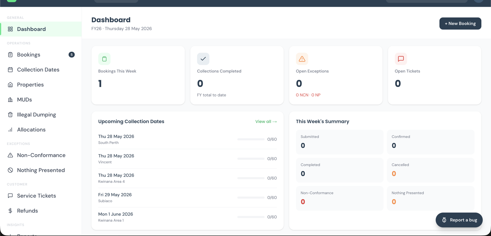

**Top bar:** the Verco logo (home), a **global search box** (reference, address or resident name — the fastest way to a booking), and your initials (account menu).

**Sidebar:**

| Section | Pages | You'll use it for |
|---|---|---|
| OPERATIONS | Bookings, Collection Dates, Properties, MUDs, Illegal Dumping | Day-to-day lookups (§3.2–3.6) |
| EXCEPTIONS | Non-Conformance, Nothing Presented | Disputed collections (§3.5) |
| CUSTOMER | Service Tickets, Refunds, Surveys | Your queue (§3.7), feedback (§3.10) |
| INSIGHTS | Reports | Monthly figures (§3.9) |
| ADMIN | Users, Audit Log | Rarely — WMRC manages users |

Some pages (Run Sheets, Clients, Notification Templates) are D&M-only and don't appear for you.

**Dashboard cards:** *Bookings This Week* (confirmed, next 7 days) · *Collections Completed* (financial year to date) · *Open Exceptions* (NCN + Nothing Presented awaiting action) · *Open Tickets*. Below them: the next Vincent collection days with a capacity bar (`47/60`), this week's bookings by status, and the latest survey feedback.

> **You only see Vincent.** Your account is narrowed to the City of Vincent sub-client. The area filter on every list still appears but only `VIN` rows come back. If a resident quotes a reference that isn't `VIN-…`, they've booked under another council's address — hand to WMRC.

**Bottom-right "Report a bug" button** — for the app misbehaving (a button does nothing, a value is wrong). It goes to D&M's developers. Resident requests go in **Service Tickets** instead.

---

### 3.2 Looking up a booking

**URL:** `https://vvtest.verco.au/admin/bookings`

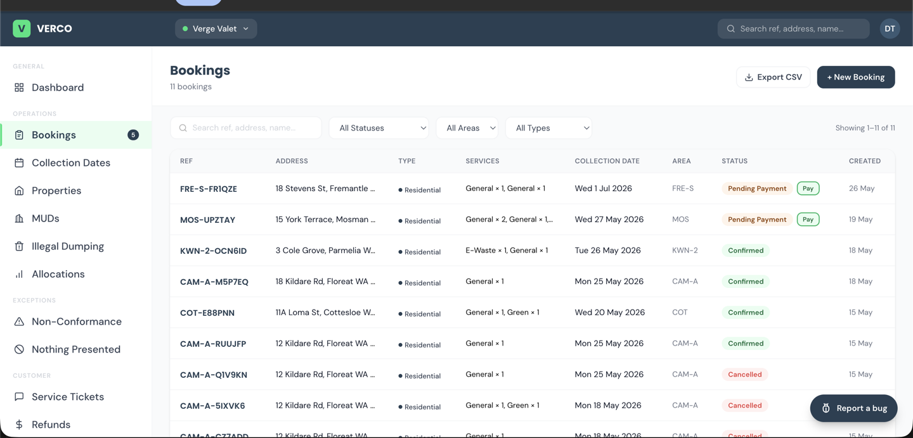

**Fastest path:** paste the reference into the top-right global search. Otherwise click **Bookings** and type the **address**, **surname** or **email** into the search box — the list narrows as you type.

**Filters:** status · type (Residential / MUD / Illegal Dumping) · service · collection-date range. Click a column header to sort. *"Showing X of Y"* updates live. **Export CSV** (top right) downloads whatever is on screen.

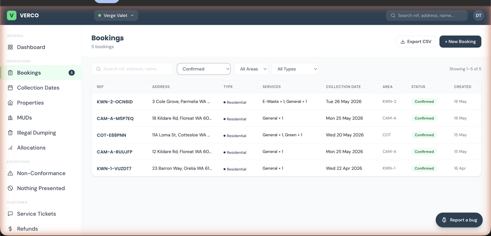

**Status badges:**

| Badge | Meaning |
|---|---|
|  **Confirmed** | Locked in for that date |
|  **Scheduled** | On tomorrow's run — flipped automatically at 3:25pm the day before |
|  **Completed** | Collected |
|  **Pending Payment** | Booking exists but the card payment wasn't finished. A green **Pay** pill reopens the payment page. |
|  **Cancelled** | No longer active |
|  **Non-conformance** | Crew attended but couldn't collect as booked — see §3.5 |
|  **Nothing Presented** | Crew attended, nothing on the verge |
|  **Rebooked** | A follow-up booking was created after an exception |

**Can't find it?** Reset the status filter to *All Statuses*; check the collection-date range isn't set; ask whether they signed up with a different email — email is the identity anchor, and a typo at sign-up creates an account they can't see.

> **Bookings carried over from the old system** show their old reference (`VIN-B-…`), the original date, location and notes, and the correct status (Completed, Confirmed, Non-conformance). Their "Activity" timeline starts at the import on 23 August — earlier history is in the old system only.

---

### 3.3 Reading a booking

Click any row to open the booking's page (`/admin/bookings/<id>`). You can copy the URL to a colleague.

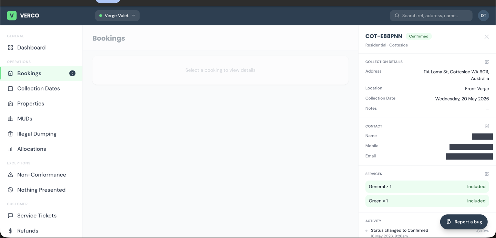

- **Header** — reference, status badge, *"Residential · City of Vincent"*.
- **COLLECTION DETAILS** — address, verge location, collection date, crew notes.
- **CONTACT** — name, mobile, email. A name ending **(Admin)** means staff made the booking on the resident's behalf; the resident may not remember it.
- **SERVICES** — each line marked **Included** (from the allocation) or a **$ amount** (paid extra), with a total.
- **ACTIVITY** — every change, oldest first, with who made it. This is how you settle *"I never added Green Waste"* — check when the line was added and by whom.

**Buttons at the bottom** depend on status: *Pending Payment* → **Pay Now** / **Cancel**; *Confirmed* → **Cancel** (until 3:30pm the day before); *Completed / Cancelled / Non-conformance* → none (raise a new booking instead).

---

### 3.4 Helping a resident — pay, change, cancel

**Pay a Pending Payment booking.** Open the booking → **Pay Now** → the card page opens. Either the resident pays there with you, or read them the payment link. Confirmation happens within seconds of payment.

**Change the date or services.** Prefer this over cancel-and-rebook: open the booking → pencil icon on COLLECTION DETAILS or SERVICES → the wizard reopens with the same reference; the change is audit-trailed and no refund is triggered. *Policy:* date and service changes for Vincent are actioned by **WMRC** — take the details and pass them on unless you've been asked to do these yourself.

**Cancel (before 3:30pm the day prior).** Open the booking → **Cancel Booking** → confirm.

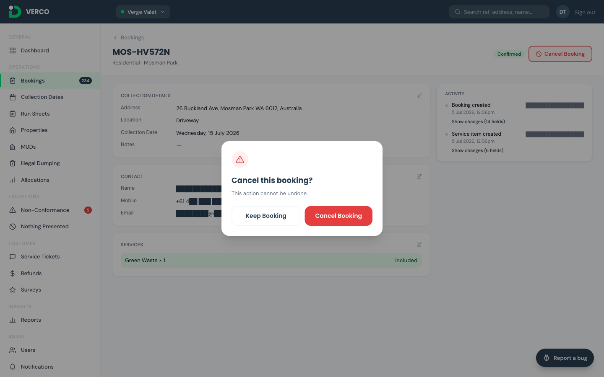

After cancelling: status becomes **Cancelled**, the resident is emailed, and — if they paid for extras — a **Refund Request** is raised for approval (§3.5f). Refunds are never automatic.

**Cancelling after the cut-off.** Staff can, but the crew is already dispatched. Only do it for a genuine operational reason, and write the reason in the booking notes first — the audit trail records *who*, the notes record *why*.

---

### 3.5 Exceptions — non-conformance, nothing presented, refunds

When the crew can't collect as booked they record one of two notices from the truck:

- **Non-conformance (NCN)** — items breach the rules (oversized, contaminated, wrong spot). Photos attached.
- **Nothing Presented (NP)** — nothing was on the verge.

The resident is emailed and has **14 days to dispute**. If they don't, the notice closes itself. If they do, it lands in your queue.

**a) Lists.** `/admin/non-conformance` and `/admin/nothing-presented` — filter by status (Issued / Disputed / Under Review / Resolved / Rescheduled / Closed) and, for NCNs, by reason.

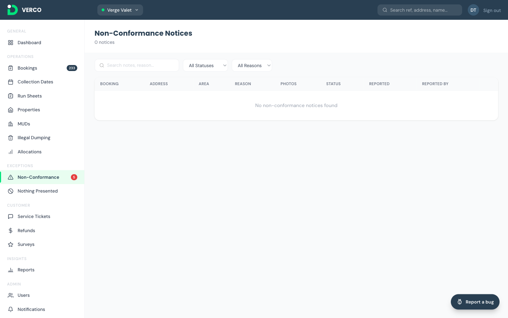

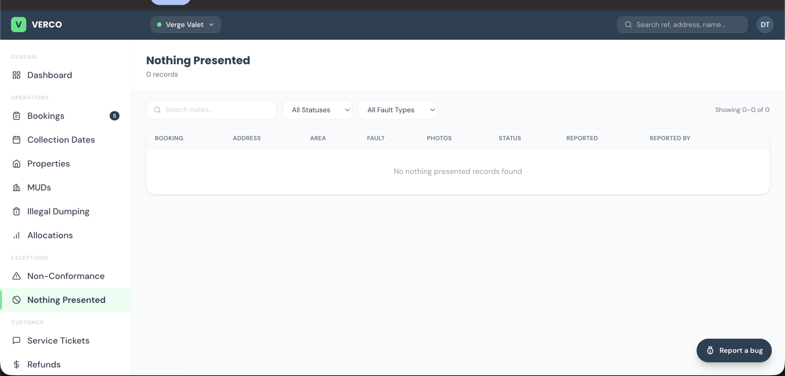

**b) What you can act on.** Only **Disputed** notices. An *Issued* notice is still in the resident's 14-day window.

**c) Triage a dispute.** Open the notice → read the crew's note and photos → read the resident's dispute → decide:

| Finding | Action |
|---|---|
| Crew was right (photos show oversized/contaminated items) | **Under Review → Resolved**, with a note the resident will see |
| Resident was right | **Resolved** with an apology note; D&M reviews the crew call |
| Genuinely unclear | **Rescheduled** (new date, same booking) or **Rebooked** (fresh booking). Both email the resident automatically. |

*Policy:* Vincent staff can triage, but where the outcome is a free re-collection or a refund, loop in WMRC first.

**d) Refund requests.** `/admin/refunds`.

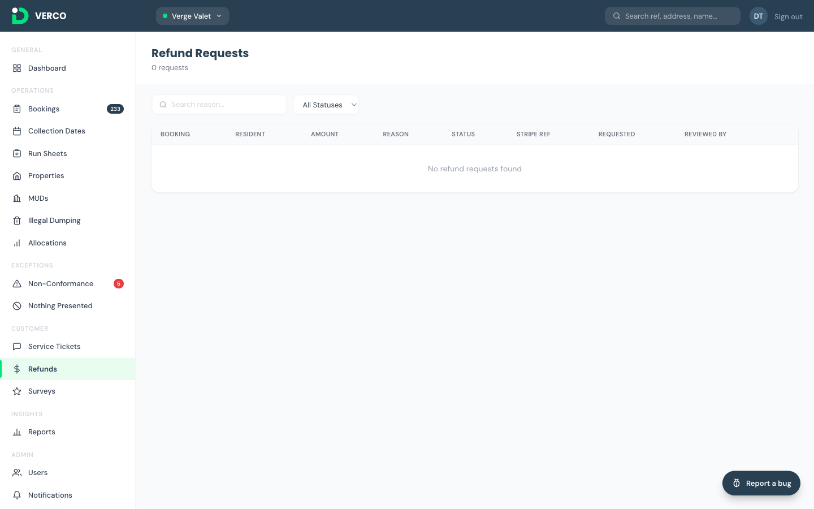

Every refund needs a person to approve it. They come from cancellations of paid bookings and from exception resolutions. Open the request → check the amount matches what was paid → **Approve** (the card refund is issued automatically, 1–3 business days) or **Reject** with a reason the resident is emailed. **Refund approval is a D&M/WMRC step** — you'll see the queue, but leave approvals to them unless agreed otherwise.

---

### 3.6 Strata buildings (MUDs)

**URL:** `https://vvtest.verco.au/admin/muds`

Vincent has **97** multi-unit dwellings on the list. Residents in these buildings can't book for themselves — a **strata manager** arranges collections for the whole building, and a staff member books on their behalf.

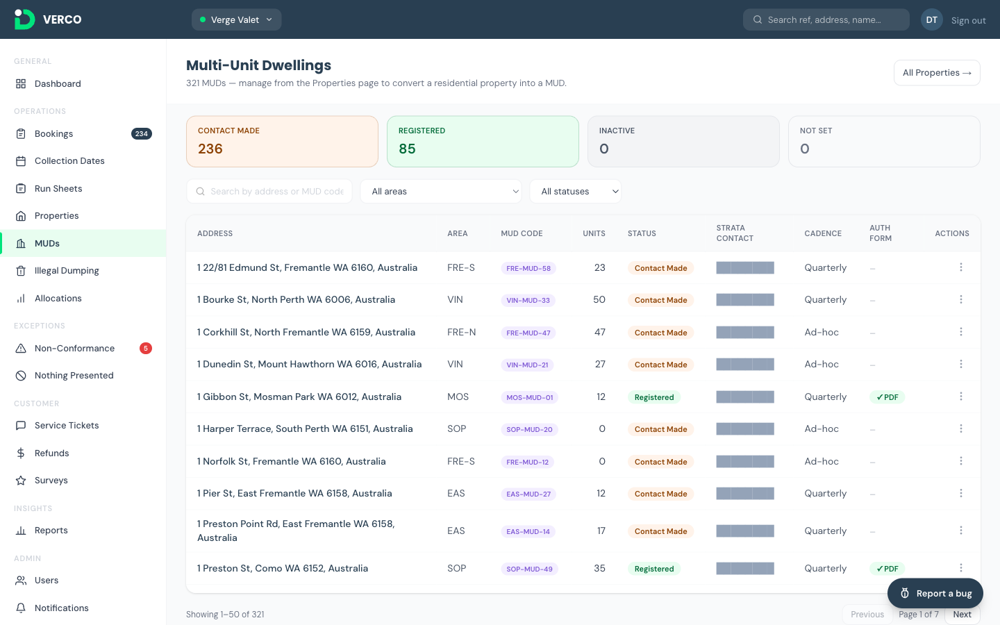

A building is bookable only once it is **Registered**: signed authorisation form on file, a strata contact (name, email, mobile), and waste-location notes. *Contact Made* and *Not Set* buildings can't be booked yet — WMRC is working through those with the strata managers.

**To book for a Registered building:** open it from the list → **Book Collection** → the wizard opens with the address locked, type *MUD*, and the strata contact pre-filled → services, date, location → submit. It confirms immediately (no code step). The allocation is the building's **unit count × 2**, shared across Bulk and Green.

**Resident in a strata building phones you:** take their details, confirm which building, and refer them to their strata manager (or WMRC if the building isn't Registered yet). Don't try to book a single unit through the resident flow — the system will refuse.

The strata contact details are visible to you and WMRC only — never to crews, and never to other residents. Don't include the contact column in anything you share.

---

### 3.7 Service tickets — your queue

**URL:** `https://vvtest.verco.au/admin/service-tickets`

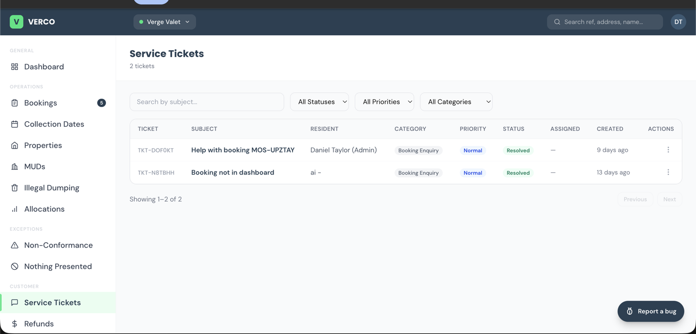

Anything a resident needs that isn't a button on their booking: *"my address isn't recognised"*, *"I didn't get the code"*, *"I need to change my email"*, *"I need an invoice"*.

1. Filter to **New**, unassigned.
2. Open the highest priority → read the message and any linked booking.
3. **Assign** yourself so nobody double-handles it.
4. **Reply** in the thread — the resident is emailed your reply.
5. Set **Awaiting Resident** if you're waiting on them, **Resolved** when done, **Closed** after they confirm (or after a week of silence).

Tickets you can't action (a property to add, a refund, a crew query) — assign to WMRC or D&M with a note. That's the hand-off mechanism; you don't need to email separately.

---

### 3.8 Illegal dumping

**URL:** `https://vvtest.verco.au/admin/illegal-dumping`

Dumped waste with no booking. Rangers raise these from the field app; office staff can log one here with **New ID Collection** — address, waste type, estimated volume, a photo, and a collection date. The volume is a guide for the crew; what's actually collected is confirmed at closeout.

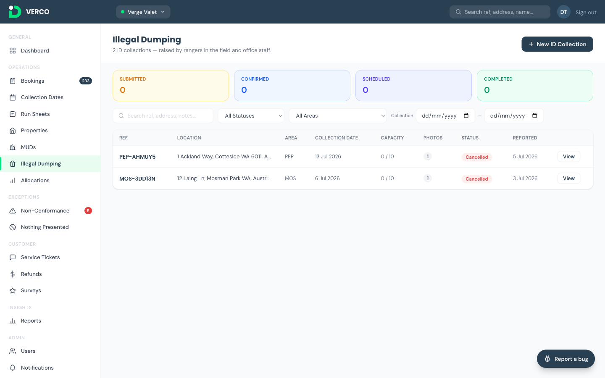

---

### 3.9 Reports

**URL:** `https://vvtest.verco.au/admin/reports`

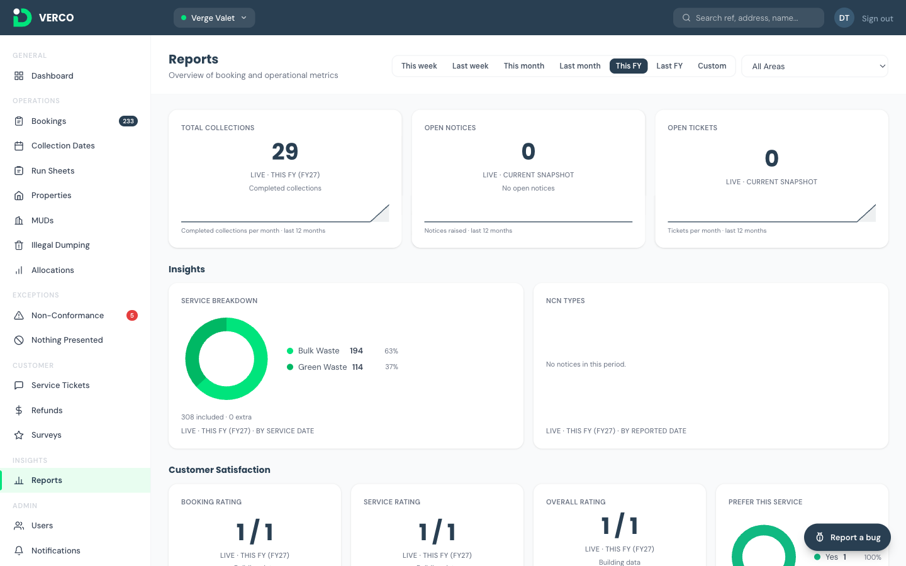

Your monthly numbers, live and filtered to Vincent:

1. **Headline** — total collections, open notices, open tickets.
2. **Insights** — Bulk vs Green split; why collections were non-conformant.
3. **Customer satisfaction** — booking, service and overall ratings plus the *"Do you prefer this service?"* split, from resident surveys. **Vincent's history runs from August 2025**, so the trend is meaningful from day one.
4. **Service level** — on-time collection, rectification within 2 days, ticket first-response and resolution, property penetration — each with target and a 12-month sparkline. A couple of D&M-operational cards are hidden from council logins by design.

Use the **period selector** on each card for the month you're reporting on.

---

### 3.10 Surveys

**URL:** `https://vvtest.verco.au/admin/surveys`

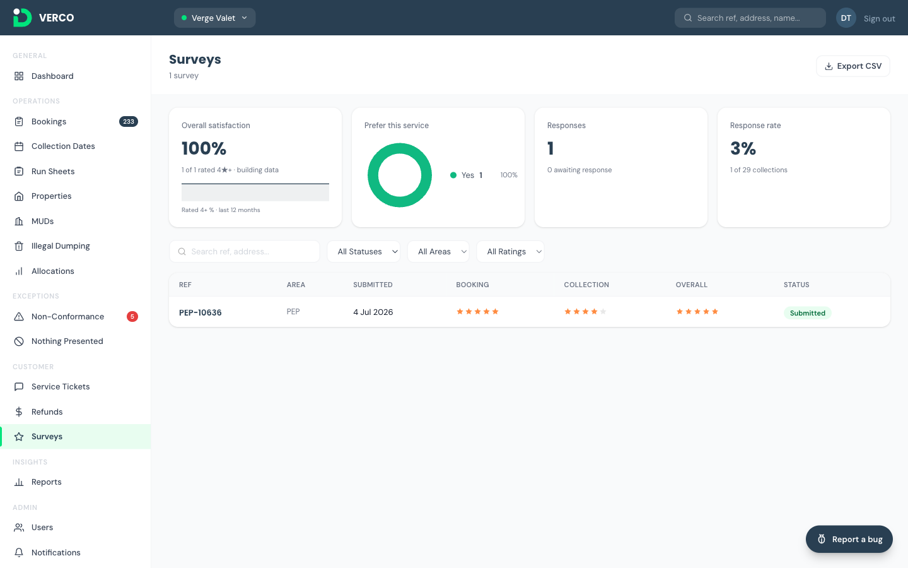

Every completed collection triggers a short survey. Responses list here newest first; click one for the resident's answers; **Export CSV** for your own analysis. Responses imported from the old system are marked **Airtable** and show the old booking reference. The **response rate** counts Verco-era collections only.

No action needed — this is a listening tool, and it feeds the Reports page.

---

## 4. Quick reference — who does what

| Situation | You | WMRC | D&M |
|---|---|---|---|
| Resident can't find their booking | Search, explain status | — | — |
| Resident wants to pay | **Pay Now** with them on the phone | — | — |
| Date or service change | Take details | **Actions it** | — |
| Cancel before cut-off | Can do, or pass to WMRC | Actions it | — |
| Cancel after cut-off | Pass on — reason required | Decides | Crew impact |
| Address not recognised / new property | Service Ticket | — | **Adds property** |
| Disputed non-conformance | Read + triage | Confirms outcome | Crew review |
| Refund | Don't approve | **Approves** | Approves |
| Strata booking | Refer to strata manager | **Books on behalf** | Books on behalf |
| App looks broken | **Report a bug** button | — | Fixes |
| Something to collect with no booking | Log an ID collection | — | Crew |

---

## 5. First-week notes

- **Two reference formats** will coexist for a few weeks: `VIN-B-…` (carried over) and `VIN-…` (new). Search handles both.
- **The old booking site is closed to Vincent** from Monday 24 August. If a resident says they booked "on the old site" after that, ask for the reference — if it doesn't exist in Verco, raise a ticket immediately so D&M can check.
- **Capacity shows real numbers.** Tuesday 25 and Thursday 27 August were already full from old-system bookings; residents will see the next available Tuesday/Thursday.
- **Reminder SMS and emails** go out automatically; residents who booked on the old system get them from Verco now.
- Anything odd in the first week — a booking that doesn't look right, a resident who insists they were told something different — send it to `vergevalet@wmrc.wa.gov.au` with the reference, and D&M will trace it in the audit log.

---

### Revision log

- **1.0 — 24 August 2026.** Vincent go-live edition. Derived from the Verge Valet User Guide v1.4 (Part C) with Vincent's service rules, collection days, pricing, history import and hand-off model. Screenshots are from the shared Verge Valet admin app (a Vincent login sees the same screens narrowed to `VIN`).
