## What this guide is

The Verco **ranger app** does two jobs, and only two:

1. **Answer one question at a verge pile:** *"Is this a booked collection, or is it illegal dumping?"* You type the address, and the app tells you whether there's a legitimate booking and whether the resident was allowed to put the pile out yet.
2. **Log illegal dumping** where there's no booking — dropping a pin, photographing the waste, and scheduling a collection so a D&M crew clears it.

That's it. You **raise** the report; the **crew collects it**. You will never mark a pile as collected, never see a resident's name or phone number, and never make a household booking — those are deliberately not your job, and this guide explains why the buttons for them aren't there.

The app runs in your phone's web browser (or as a home-screen icon). Everything below is written so you can follow it standing at a pile with one hand on your phone.

> **A note on privacy.** Rangers get **zero contact details** — no names, no emails, no phone numbers, ever. It's not hidden behind a setting; the app simply never loads it. You'll see the **address**, the **booking reference**, the **services booked**, and the **collection status** — enough to judge a pile, nothing that identifies a resident.

---

## 1. Before you start — access & orientation

### 1.1 What you can and can't do

| You **can** | You **cannot** |
|---|---|
| Look up any address in your assigned areas | See any resident's name, email, or phone number |
| See whether a pile has a booking and if the place-out window is open | Mark a pile as collected / closed out (that's the crew) |
| Raise an illegal dumping (ID) report with photos and a collection date | Make or edit a household verge booking |
| Track the IDs you've raised and their collection status | See bookings or piles outside your assigned areas |

If you go looking for a "mark as done" or "new booking" button and can't find one — that's correct. The ranger app is intentionally a **lookup-and-report** tool.

### 1.2 Signing in

The app lives at **`https://field.verco.au`**. (If D&M issues you a separate training link, it looks and works identically — just check the address bar matches the link you were given.)

Sign-in is **passwordless** — there's nothing to remember:

1. Open `field.verco.au`. You'll see the **Sign in** screen: *"Enter your email address and we'll send you a one-time code to sign in."*
2. Type the **email address D&M set up your ranger access with**, and tap **Send code**.
3. Check your inbox for a **6-digit code** from **`bookings@verco.au`**, subject **"Your VERCO OTP"**. (If it's not there in a minute, check your spam folder.)
4. Type the 6 digits into the code screen. You're in.

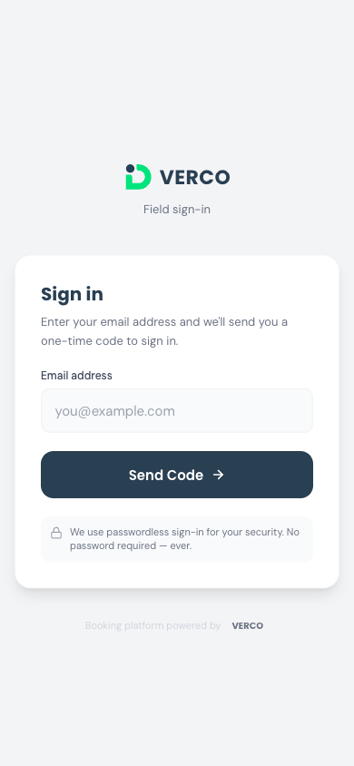

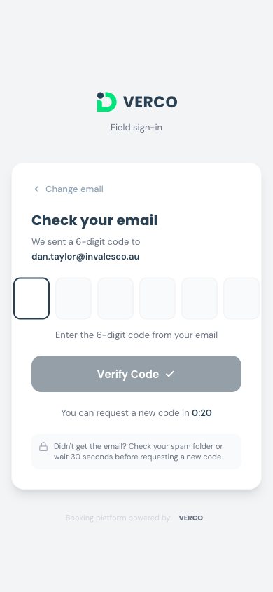

The code is single-use and expires quickly — if it times out, just request another. Once you're signed in, the app remembers you on that phone, so you normally only do this the first time (and again if you sign out or clear your browser).

> **You land on Lookup.** As a ranger, signing in drops you straight onto the **Address Lookup** screen — your home base.

### 1.3 Add it to your phone's home screen

The app is a **Progressive Web App (PWA)** — you can pin it like a normal app so it opens full-screen without browser clutter.

- **iPhone (Safari):** tap the **Share** button → **Add to Home Screen** → **Add**. It appears as **"Verco Field"**.
- **Android (Chrome):** tap the **⋮** menu → **Add to Home screen** / **Install app**.

Do this once and thereafter you tap the green Verco icon like any other app.

### 1.4 The screen furniture

Every screen shares the same frame:

**Top bar (navy):**
- The **VERCO** logo mark on the left.
- A **Ranger** pill showing your role.
- **Sign out** on the right.
- Today's date (Perth time).
- A green pill listing **your area codes** — the patch you're scoped to (e.g. `COT · MOS · PEP` for a Cottesloe / Mosman Park / Peppermint Grove ranger). A ranger covering more councils sees a longer list.

**Bottom bar (three tabs):**

| Tab | What it's for |
|---|---|
| **Lookup** | Search an address to judge a pile — your main screen. |
| **New ID** | Start a fresh illegal-dumping report using your phone's GPS. |
| **My IDs** | The list of illegal-dumping reports you've raised, with their status. |

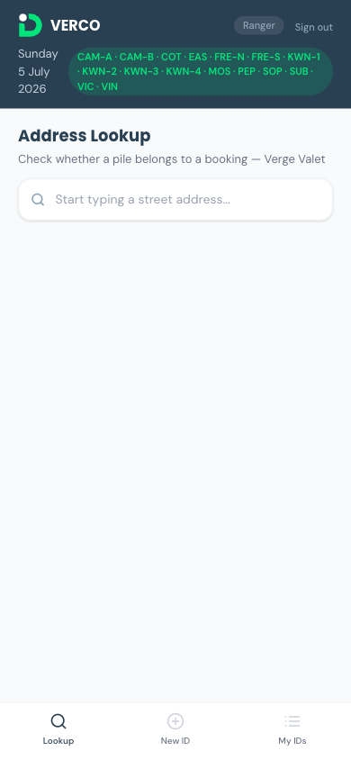

### 1.5 Your patch — how your areas are set

You only ever see addresses, piles, and history for the **collection areas assigned to your login**. A D&M administrator sets this up — you can't widen it yourself, and you don't need to pick an area anywhere. A City of Cockburn ranger, for example, is scoped to Cockburn's Verge Valet areas and simply won't see anyone else's.

If you open **Lookup** and see:

> *"No collection areas are assigned to your account — contact your administrator."*

…then your access hasn't been finished. Contact D&M (see §7) and they'll assign your areas.

---

## 2. The core job — booking or illegal dumping?

This is the heart of the app. You're standing at a verge pile. Is it a resident's booked collection, or is someone dumping? Three taps tell you.

### 2.1 Look up the address

1. Tap the **Lookup** tab. The heading reads **Address Lookup**, with *"Check whether a pile belongs to a booking — {your council}"* underneath.
2. Start typing the street address in the search box (**"Start typing a street address..."**). Results appear once you've typed **3 or more characters** (until then it prompts *"Keep typing — 3+ characters"*).
3. Matching properties in your areas list underneath — street on the top line, suburb below. A property that's a block of units carries a small **MUD** tag (multi-unit dwelling).
4. Tap the property you want.

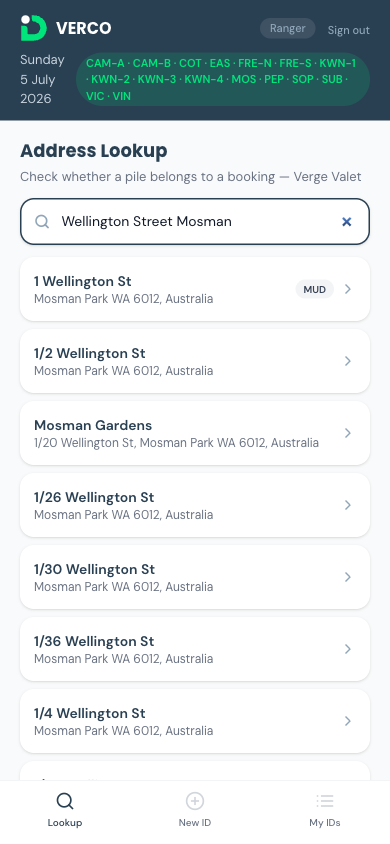

**Two things you might see instead of results:**

- **"No matches — Address not eligible for verge collection — likely a candidate for an ID."** The address isn't on the Verge Valet eligibility list at all. A pile here is very likely illegal dumping — go straight to raising an ID (§3).
- **"Search failed — Check your signal and try again."** with a **Retry** button. This is a *connection* problem, **not** a verdict. Don't treat it as "no booking" — move to better signal and tap **Retry**.

> **A failed search is never a green light to raise an ID.** "No matches" (address genuinely not eligible) is different from "Search failed" (your phone lost signal). Only the first is a reason to consider an ID.

### 2.2 Read the verdict

Tapping a property opens its detail screen. At the top: the address and an **Open in Google Maps** button. Then the app shows one of **three colour-coded verdict banners** — this is the answer.

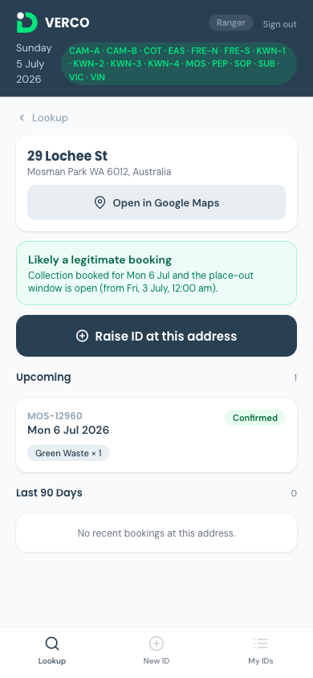

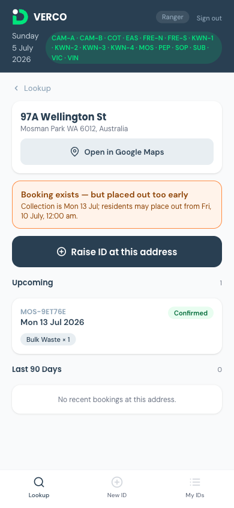

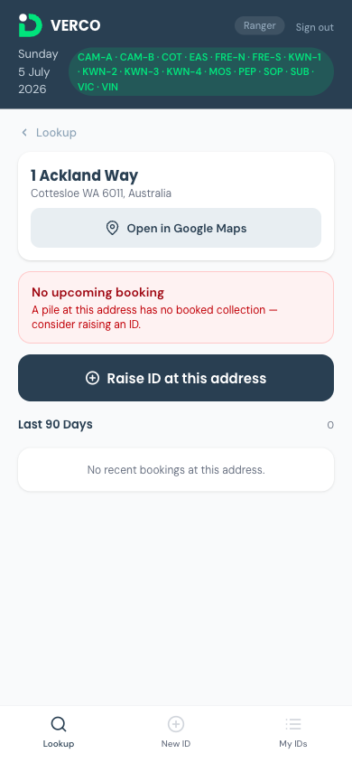

| Banner | Colour | What it means | What you do |
|---|---|---|---|
| **Likely a legitimate booking** |  Green | There's an upcoming booking **and** the place-out window is open — the resident is allowed to have the pile out. It shows the collection date and the time the window opened. | Leave it. It's booked and legal. |
| **Booking exists — but placed out too early** |  Amber | There **is** a booking, but the resident put the pile out **before** the place-out window opened. It shows the collection date and when residents *may* place out from. | Not dumping — it's a booked pile out early. Handle per your council's early-placement policy (e.g. a courtesy word), **not** as an ID. |
| **No upcoming booking** |  Red | No booking exists for this address. | Likely illegal dumping — **Raise ID at this address** (§3). |

Below the banner you also get context:

- An **Upcoming** section — any future or still-open collections at that address, each with its reference, date, services, and status.
- A **Last 90 Days** section — recent collections, so you can see if the verge was just serviced (a pile the morning after a collection may simply be leftovers, not a fresh dump).

**If you instead see a red *"Couldn't load booking history — Check your signal and reload before judging this pile"* box:** that's a connection failure, not a verdict. Don't raise an ID off it. Get signal and reload.

> **Why "reload before judging"?** The whole point of the app is to stop a legitimate booking being reported as dumping. If the history didn't load, the app refuses to guess — and so should you.

### 2.3 The place-out window, explained

Verge Valet residents may put their pile on the verge from **72 hours before** their collection day (that's the window the green/amber banners pivot on). Concretely: a pile out **within** that 72-hour window with a booking is **legitimate** (green); a pile out with a booking but **before** the window has opened is **too early** (amber); a pile with **no** booking is a candidate for an ID (red).

The banners always spell out the actual dates and times for that specific address, so you never have to do the maths in your head — just read the line under the heading.

### 2.4 Quick decision table

| At the pile, the app says… | Your call |
|---|---|
|  Likely a legitimate booking | Move on — booked and within the window. |
|  Booking exists — placed out too early | Booked, but early. Council early-placement process, not an ID. |
|  No upcoming booking | Raise an ID (§3). |
|  No matches (address not eligible) | Raise an ID (§3). |
|  Search failed / Couldn't load history | Connection issue — get signal, retry/reload. Do **not** raise an ID off an error. |

---

## 3. Raising an illegal dumping (ID) report

When the verdict is red (or the address isn't eligible at all), you log an ID. This creates a booking that lands on the crew's run sheet so they come and clear it.

### 3.1 Two ways to start

- **From a property you just looked up:** tap **Raise ID at this address** on the property screen. The location pin is **pre-filled from the property**, so you don't need to be standing on the exact spot.
- **From scratch:** tap the **New ID** tab. The app uses **your phone's GPS** to pin where you're standing — so do this while you're *at* the pile.

Either way you land on the **New ID Collection** form (*"Illegal dumping — log location and schedule collection"*). It fills in top-to-bottom; the lower sections stay greyed out until the location is confirmed.

### 3.2 Location

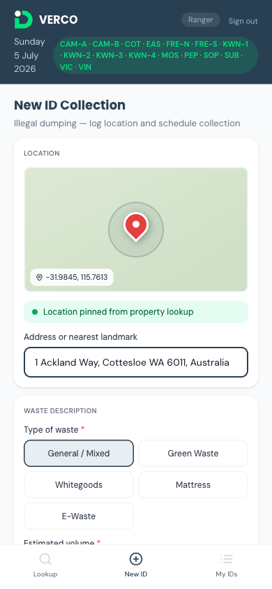

- If you started from **New ID**, the app requests your location. You'll see **"Acquiring GPS location…"** with a spinner, then **"GPS locked · ±Nm accuracy"** and a pin on a small map once it has a fix.
- If you started from a **lookup**, it's already **locked** on the property's pin ("Location pinned from property lookup").
- The **Address or nearest landmark** field auto-fills from the GPS fix (or from the property). **You can edit it** — tidy it up or add a landmark ("opposite the reserve car park") if the auto-address is vague.

**If GPS fails** ("Location permission denied" or "Unable to determine location"): enable location services for your browser and try again. A location is required to submit — the rest of the form stays locked until you have one.

### 3.3 Describe the waste

Once location is set, the **Waste Description** section unlocks.

- **Type of waste** (required, pick one or more):

  | Waste type |
  |---|
  | General / Mixed |
  | Green Waste |
  | Whitegoods |
  | Mattress |
  | E-Waste |

- **Estimated volume** (required, pick one). Volumes are counted in **3 m³ allocation units**:

  | Button | Rough size |
  |---|---|
  | **1 allocation** | 3 m³ |
  | **2 allocations** | 6 m³ |
  | **3+ allocations** | 9 m³+ |

- **Description** (optional): a free-text line to describe what's there.

> **Volume is an estimate, not a bill.** Your allocation pick is a *guide for the crew* — the actual amount collected is confirmed by the crew at the truck when they clear it. Don't agonise over it; give your best eyeball estimate.

### 3.4 Photos

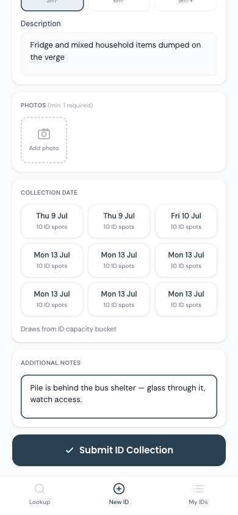

**At least one photo is required.** Tap **Add photo** to open your camera (you can add several). Photos are your evidence — they're what backs the report if anyone queries it later. Get a clear shot of the pile and, if relevant, anything that identifies the spot.

Photos upload as you add them, so you need signal here. If an upload fails you'll get a *"Couldn't upload…"* message — check your connection and re-add it.

### 3.5 Collection date

Pick when the crew should collect (the date grid is shown in the screenshot above). Each date tile shows the day and how many **ID spots** are left on that date (there's a daily cap per area). Tap a date to select it — it shows a **Selected ✓**. If a date is full it won't have spots available; pick another.

### 3.6 Notes for the crew

**Additional Notes** (optional) is your channel to the crew: *"Access notes, hazards, special instructions for field crew…"* Flag anything that affects the collection — locked gate, glass through the pile, park on the verge opposite, sharps, etc.

### 3.7 Submit & confirmation

Tap **Submit ID Collection**. If anything required is missing, the app tells you exactly what (waste type, volume, at least one photo, a date). Once it goes through you get the **ID Collection Logged** confirmation:

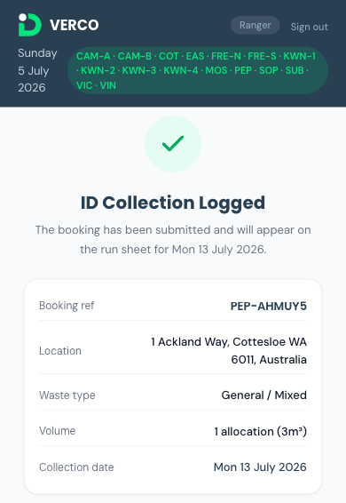

- A green tick and *"The booking has been submitted and will appear on the run sheet for {date}."*
- A summary card: **Booking ref**, **Location**, **Waste type**, **Volume**, **Collection date**.
- Two buttons: **View My IDs** (jumps to your list of raised IDs) and **Log Another ID Collection**.

**Your booking reference** looks like your area code followed by six characters — e.g. `MOS-9ET76E`. Jot it down or trust **My IDs** to keep it (§4).

> **Tracking tip.** The **View My IDs** button takes you straight to your list of raised IDs; or tap **Log Another ID Collection** if you're clearing several piles on the same round.

### 3.8 What happens after you submit

The ID is created as a **Confirmed** booking. Overnight the system schedules it onto the crew's run sheet, and a D&M crew collects it on the date you chose — photographing the empty verge and recording the outcome. You don't need to do anything further; your job ends at "logged". You can watch its progress in **My IDs**.

---

## 4. Tracking your reports — My IDs

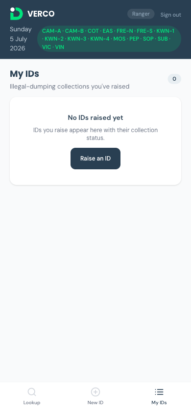

The **My IDs** tab (*"Illegal-dumping collections you've raised"*) lists every ID you've logged, newest first, with a count badge. Each card shows:

- The **reference** and the **address**.
- The scheduled **collection date** ("Collection Wed 2 Jul").
- A **status badge**.
- **Waste type** chips and the **volume**.

Tap any card to open its full detail.

**The statuses you'll see, in order:**

| Status | Meaning |
|---|---|
| **Confirmed** | Logged and accepted; not yet on a run sheet. |
| **Scheduled** | Assigned to the crew's run sheet for the collection day. |
| **Completed** | Crew cleared the pile. |
| **Non-conformance** | Crew found a problem (e.g. hazardous or prohibited material) and couldn't collect as-is. |
| **Nothing Presented** | Crew arrived and there was nothing there to collect. |
| **Cancelled** | The collection was cancelled. |

If you haven't logged anything yet, the tab shows **"No IDs raised yet"** with a shortcut to **Raise an ID**.

---

## 5. Worked field scenarios

Run through these to get comfortable before you're relying on it on the road.

| # | You see… | Do this | Expected result |
|---|---|---|---|
| 1 | A neat pile on a verge you patrol | **Lookup** the address | A verdict banner — green/amber/red — plus upcoming and recent bookings |
| 2 | Green **"Likely a legitimate booking"** | Note the date, move on | Nothing to log — it's booked and within the 72-hour window |
| 3 | Amber **"placed out too early"** | Apply your council's early-placement process | Not an ID — it's a genuine booking, just early |
| 4 | Red **"No upcoming booking"** | Tap **Raise ID at this address** | The ID form opens with the location pre-pinned |
| 5 | A dump on a vacant lot / non-residential spot | Search it → **"No matches"** | Not eligible — raise an ID from the **New ID** tab (GPS-pinned) |
| 6 | Complete an ID with a photo and date | Submit | **ID Collection Logged**, a `VV-…` reference, and it appears in **My IDs** as **Confirmed** |
| 7 | Check an ID a day later | Open **My IDs** | Status has moved to **Scheduled** (then **Completed** after the crew visits) |
| 8 | Lost signal mid-lookup | See **"Search failed"** / **"Couldn't load booking history"** | Get signal, **Retry** / reload — do **not** raise an ID off the error |

---

## 6. Tips & FAQs

**Why can't I see the resident's name or number?**
By design. Rangers are given zero contact details — the app never loads them. You have everything you need to judge a pile (address, booking, status) without any personal information.

**The banner says "placed out too early" — is that illegal dumping?**
No. There's a real booking; the resident was just early. Handle it through your council's early-placement process, not as an ID.

**Lookup says "No collection areas are assigned to your account."**
Your access wasn't finished. Contact D&M (see §7) to have your collection areas assigned.

**What's an "allocation"?**
A 3 m³ unit of waste. "2 allocations" ≈ 6 m³. It's an on-the-spot estimate to help the crew plan — the exact amount is confirmed by the crew when they collect, so give your best guess and move on.

**My GPS won't lock.**
Enable location services for your browser, make sure you're outside with a clear sky view, and try again. If you're raising the ID from a lookup instead, the pin comes from the property and you don't need GPS at all.

**A photo won't upload.**
Photos upload over your data connection — if one fails you'll see a "Couldn't upload" note. Move to better signal and re-add it. You need at least one photo to submit.

**Can I mark a pile as collected, or close out a job?**
No — that's the crew's role in their own field view. You raise; they collect and record the outcome. You'll see that outcome reflected in **My IDs**.

**Can I make a booking for a resident?**
No. If a resident wants to book a collection, direct them to the Verge Valet booking portal (or council customer service). The ranger app is lookup-and-report only.

**Do I need signal the whole time?**
For lookups, verdicts, and photo uploads, yes — the app checks live data and refuses to guess when it can't reach it (that's deliberate, so an outage never reads as "no booking"). Find signal before judging a pile or submitting.

**I signed out / changed phones — how do I get back in?**
Just go to `field.verco.au` and sign in again with your email and a fresh 6-digit code. Nothing to reinstall (though you may want to re-add it to your home screen — §1.3).

---

## 7. Getting help & reporting problems

If something's wrong — a verdict looks incorrect, a screen won't load, or your areas aren't set up:

1. **Take a screenshot** of what you're seeing.
2. **Note the reference** if there is one (e.g. `MOS-9ET76E`).
3. **Note the address** and the **time** (Perth time) it happened.
4. **Say what you expected vs. what you saw** — a sentence each is plenty.
5. Send it to **D&M Waste Management** on the channel your council uses for Verge Valet, or email the D&M Verge Valet contact.

For anything urgent (the app is down, or you can't sign in at all), contact D&M directly.

---

**Document version:** 1.2
**Last updated:** 2026-07-05
**Next review:** after the first round of live ranger use

### Revision log

- **1.2 — 2026-07-05**: Restyled to the **D&M Waste Management design system** (v1.0, April 2026) — Poppins display / DM Sans body, the navy `#293F52` + green `#00E47C` palette, a navy gradient cover with the D&M logo, brand callout cards (green top bar, not a left border), navy table headers, and a D&M running footer. Replaced the traffic-light emoji with brand status dots (design-system rule: no emoji).
- **1.1 — 2026-07-05**: Added live screenshots captured on `field.verco.au` (sign-in, verify, app frame, address lookup, all three verdict banners — green/amber/red, the New ID form top + bottom, and the My IDs tab). Corrected example values against live data — area codes are bare (`COT`, `MOS`, `PEP`…), ID references are `{AREA}-{code}` e.g. `MOS-9ET76E`. The post-submit confirmation (R09) was captured via a controlled test ID (`PEP-AHMUY5`) that was cancelled immediately — cropped to the success + summary card so it doesn't show the pre-#305 button label. §3.7 documents the confirmation's primary CTA as **View My IDs** to match fix #305 (routes rangers to their My IDs list rather than a crew-only run sheet).
- **1.0 — 2026-07-05**: Initial release. Full ranger field-app walkthrough — sign-in, orientation, the lookup/verdict flow (place-out window), raising illegal-dumping reports, tracking via My IDs, worked scenarios, and FAQs. Written from a live read of the ranger surfaces in the Verco codebase (`app/(field)/field/lookup`, `.../illegal-dumping/new`, `.../my-ids`).

*The words and outcomes are stable; exact colours and layouts may shift slightly as the app evolves. If a screen doesn't match what's written here, trust the app and flag the difference to D&M.*
