## What this guide is

This document walks through Verge Valet from **two angles**:

- **Parts A + B — the resident experience.** What a household sees when booking, managing, or disputing a verge collection. WMRC customer service will field calls about every screen here, so the fastest way to be ready is to **make dummy bookings yourselves** and step through each branch.
- **Part C — the admin operational core.** What WMRC's client-staff users do in the back-office app at `vvtest.verco.au/admin` — looking up a booking, confirming or cancelling on a resident's behalf, triaging non-conformance disputes, approving refunds, managing multi-unit dwellings (strata), and reviewing service tickets. These are the day-to-day workflows that replace the existing phone-and-spreadsheet process.

Each part is self-contained — if you're a customer service officer, work through A + B; if you're an operations lead or supervisor, A + B will give you context for what residents are seeing, then C tells you what to do about it.

This guide tells you exactly what to expect, what to type, and where to look — with screenshots of every step taken from the live UAT site.

> **Related guide — the field app.** Council **rangers** who check verge piles and log illegal dumping in the field use a separate mobile app, documented in **`docs/wmrc-ranger-guide.md`** (Verge Valet — Ranger Field App Guide). This guide does not cover the field/ranger app.

> **What's new since v1.2 (the UAT-era developments).** This revision folds in everything that shipped during UAT: the **Terms & Conditions** acceptance step (§2.6), **SMS** notifications alongside email, the availability-calendar **date step** (§2.4), the post-collection **feedback survey** (§3.7), the admin **Illegal Dumping / ID intake** form (§4.8), the **Reports** analytics dashboard (§4.9), the admin **Surveys** module (§4.10), the **Registered** gate on MUD bookings (§4.6), and per-council **sub-client scoping** (§4.1). The admin UI also had a design refresh and the booking detail moved from a slide-over panel to a full page — so **Part C screenshots are being re-captured** (see revision log).

---

## 1. Before you start — environment & test data

### Test URL

| Environment | URL | Use for |
|---|---|---|
| **UAT (test)** | [`https://vvtest.verco.au`](https://vvtest.verco.au) | **All dummy bookings.** Real-feeling copy of production pointing at test data and a test Stripe account. No trucks dispatched, no real money charged. |
| Production | (Verge Valet's live domain — to be confirmed at go-live) | **Do not test here.** |

> **Always check the URL** before you start. The browser tab and address bar should both read `vvtest.verco.au`. If you accidentally land on the production domain, close the tab.

### Test addresses

The Verge Valet eligibility list on UAT is seeded with **Town of Vincent** properties. Use any of these to trigger the "Property found!" branch:

- `126 Shakespeare Street, Mount Hawthorn`
- `2 Orange Avenue, Perth`
- `21 Union Street, North Perth`
- `6 Aranda Place, Leederville`
- `3/552 Fitzgerald Street, North Perth`

Or use any address you know is in the Town of Vincent catchment — Google Places autocomplete will surface it.

To deliberately test the **"not eligible"** branch, enter any address outside the Vincent catchment (e.g. a Cottesloe or Mandurah street). You'll see the red rejection banner.

### Test payment cards

If a booking exceeds the included allocation (more than 3 bulk collections in a single FY for Verge Valet), you'll be sent to Stripe Checkout to pay for the extras. **UAT Stripe is in test mode** — use these instead of a real card:

| Scenario | Card number | Expiry | CVC |
|---|---|---|---|
| Successful payment | `4242 4242 4242 4242` | Any future date (e.g. `12/30`) | Any 3 digits (e.g. `123`) |
| Payment declined | `4000 0000 0000 0002` | Any future date | Any 3 digits |
| Requires 3D Secure | `4000 0027 6000 3184` | Any future date | Any 3 digits |

Email, name, and postcode on the Stripe form can be anything.

### Test email accounts

Sign-in is **passwordless** — every login sends a 6-digit one-time code (OTP) to the email you enter. Use a real inbox you can access, ideally a shared WMRC test mailbox so the whole team can see the codes.

The OTP email arrives from **`bookings@verco.au`** with the subject **"Your VERCO OTP"**. If you don't see it, check spam.

> **Tip:** You can also use Gmail's "+" trick — e.g. `wmrc.test+jenny@gmail.com` and `wmrc.test+pat@gmail.com` both arrive in the same `wmrc.test@gmail.com` inbox but are treated as separate residents by Verco.

### Verge Valet service catalogue

Verge Valet offers **two services** — shown in the portal as **Bulk Waste** and **Green Waste** — which both draw from the same annual **Collection** allocation:

- **Bulk Waste** — Household bulk items (furniture, equipment, floor coverings)
- **Green Waste** — Garden organics (prunings, lawn clippings, branches)

> **The included allocation is set per member council — it is *not* a single fixed number _(corrected 2026-07-05)_.** Most councils allow **3** included collections per property per financial year, but it varies: e.g. **Fremantle 1**, **Vincent 2**, most councils **3**, **Peppermint Grove 6**. Don't quote a flat "3" to residents — the address-eligibility screen (§2.2) always shows that property's exact allocation and how many remain.

Collections beyond the included allocation become **paid extras** (priced per unit; the amount is shown before payment, and Stripe handles checkout). There are **no ancillary services** on Verge Valet (no mattresses, e-waste, or whitegoods) — a deliberate difference from other Verco tenants.

---

## 2. Part A — Making a booking (resident flow)

The booking wizard has **five visible steps** in the progress bar at the top of every page. A sixth step — email verification — appears as an inline panel on the confirm page.

```
1. Address  →  2. Services  →  3. Date  →  4. Details  →  5. Confirm
```

### 2.1 Land on the portal

Open [`https://vvtest.verco.au`](https://vvtest.verco.au). You should see the Verge Valet hero page:

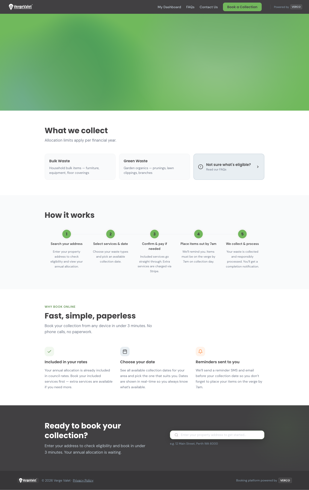

- **Headline:** "Verge Valet™ is for bulky waste."
- **Subheading:** "Save your Verge Valet™ collection for items that can't be reused or repaired."
- **Address search box** with placeholder *"Enter your property address to get started…"*
- **"Why book online"** section with three feature tiles
- **"How it works"** strip with five numbered steps
- **"What we collect"** grid showing Bulk Waste and Green Waste services
- **"Ready to book your collection?"** CTA band
- Footer with copyright and a "Powered by VERCO" mark

**Action:** Click into the address box and start typing a Town of Vincent address. Google Places suggestions appear in a dropdown.

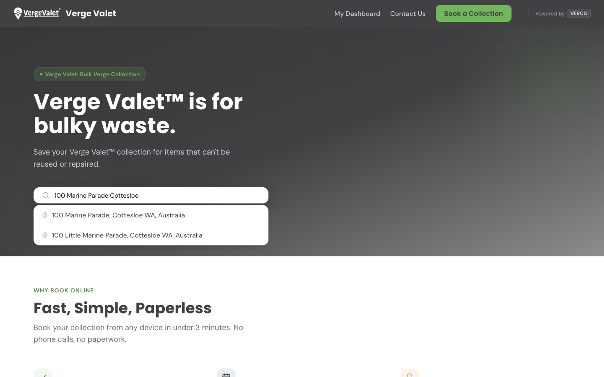

Click the correct suggestion. You're taken to **Step 1 — Address confirmation**.

### 2.2 Enter and confirm the address

The page header reads **"Book a Collection"** with the progress bar showing step 1.

The system looks up the address in the Verge Valet eligibility list. One of three things happens:

#### A) Property found (the happy path)

A **green banner** appears: *"Property found! This property qualifies for verge collection services."*

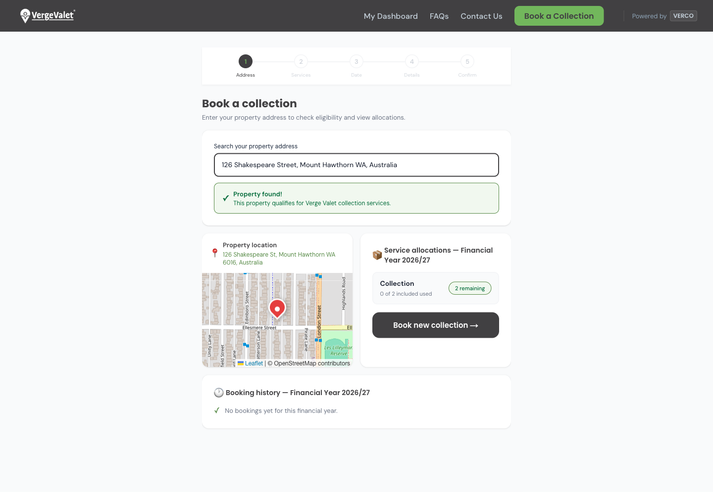

Below the banner you'll see:

- **Property Location** — a small Leaflet/OpenStreetMap snippet showing the address.
- **Service allocations** — a tile showing that property's included allocation and how many remain (e.g. *"Collection — 0 of 2 included used, 2 remaining"* for a Vincent address; other councils differ — see §1).
- **Booking History — FY26** — your last 5 bookings this financial year (excludes cancelled and pending-payment). Empty on a fresh test property.
- **`Book New Collection →`** button.

**Action:** Click **Book New Collection →**.

#### B) Address not eligible

A **red banner** appears: *"Address not eligible — This address is not registered for verge collection services."*

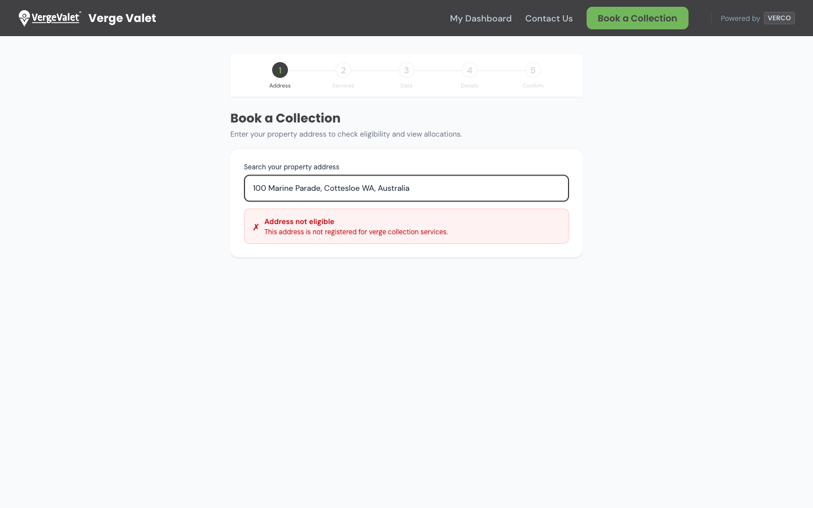

There is no Continue button. The resident is expected to contact WMRC directly. **Use this branch to test the rejection message** — try an address outside the Town of Vincent catchment.

#### C) Multi-unit (strata) property

A **purple banner** appears: *"Multi-unit property — Collections for {address} are arranged centrally. Please contact your strata manager."* If the Verge Valet client config has a contact email set, a "Contact us" link appears too.

This branch is for apartment buildings, retirement villages, and other properties flagged as MUD in the eligibility data.

### 2.3 Choose services

Page header: **"Select Services"** (step 2).

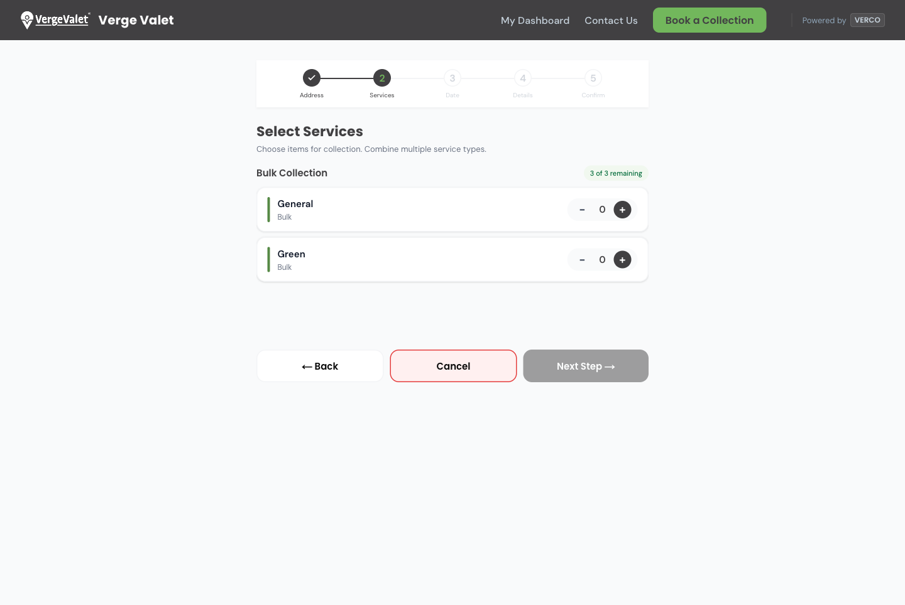

A single section — **Bulk Collection** — shows a live "**X of Y remaining**" badge at the top right. Each service row has:

- **Service name** — **Bulk Waste** or **Green Waste** (both draw from the same **Collection** allocation)
- **Stepper** with `−`, current quantity, `+`

#### Adding an included unit

Click `+` on **Bulk Waste** to add 1. The remaining badge decrements (e.g. "1 of 2 remaining").

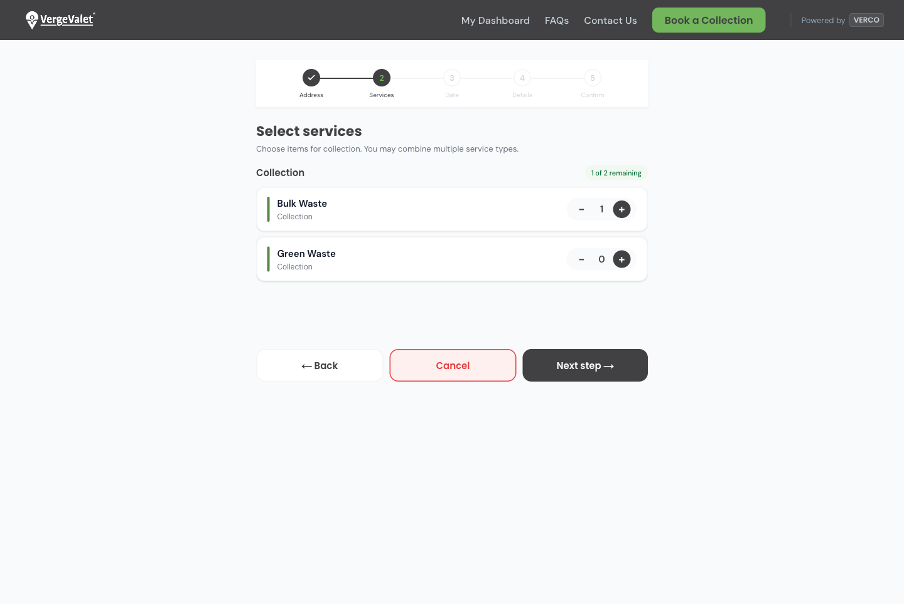

**Next Step** stays greyed out until at least one item is in the cart, then it activates.

#### Adding paid extras

Keep clicking `+` past the included allocation. A **green "Extra cost row"** appears beneath the Bulk Waste row:

> *"3 extra general @ $195.45 each ........ $586.35"*

And a bottom totals strip shows:

> **Total Extra Services Cost: $586.35**

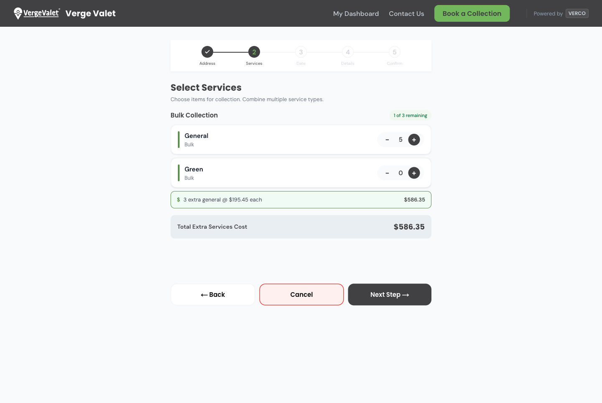

> **Tester note:** The price displayed here is calculated client-side for live feedback. The **real** price is re-calculated server-side when you submit the booking on step 5 — the two must match. If you ever see the confirm page reject a booking with "price mismatch", screenshot it and send to Dan.

**Action:** Choose the quantity you want, then click **Next Step →**.

### 2.4 Pick a collection date

Page header: **"Select Collection Date"** (step 3).

> **Updated since v1.2 — screenshots 08/09 being re-captured.** The date step is now an **availability calendar** (it used to be a plain list of date tiles). The two screenshots below show the old list layout; the wording and outcome are the same, but the visual has changed — the re-shoot is tracked in the revision log.

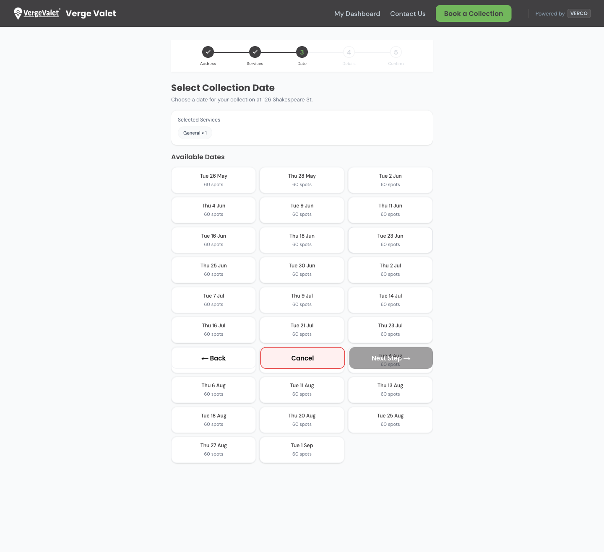

Above the calendar, a "Selected Services" chip strip (e.g. *"Bulk Waste × 1"*).

Below, a **calendar of available collection dates**. Each bookable date carries a small status chip:

- **Available** (green) — spots free.
- **Low Availability** (amber) — **10 or fewer** spots left; book soon.
- Dates with no capacity, or not yet opened for this area, are not selectable.
- Tapping a date highlights it as **Selected ✓**.

If no dates are available for this collection area, that means the collection schedule for this area hasn't been opened up for bookings yet — or the area hasn't been switched **Active** for go-live (see §4.1 on staged rollout).

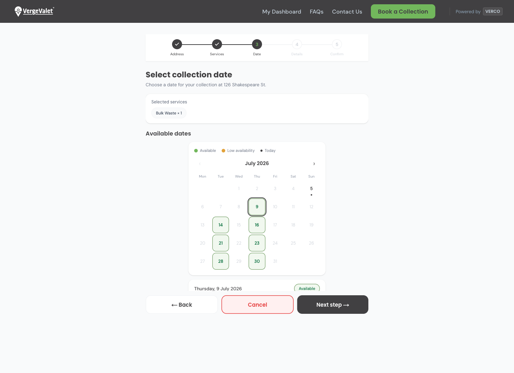

**Action:** Click a date, then **Next Step →**.

> **Behind the scenes:** For Verge Valet, multiple sub-clients share a single pooled capacity called the **MCP pool**. The dates and remaining spots you see reflect that pool — not the individual sub-council. (For the Vincent test data above, you'll see Vincent's own dates.)

### 2.5 Confirm collection location & driver notes

Page header: **"Collection Details"** (step 4). Despite the name, this step is **only** about where the bin/items will be on the property and any notes for the driver.


- **Address** — shown read-only at the top.
- **Location on Property** — pill-style buttons: *Front Verge*, *Side Verge*, *Driveway*. (Items elsewhere: the resident is asked to contact the team first.)
- **Notes for Driver (Optional)** — free text, 500 character limit. Placeholder: *"e.g. will be on the other street side of the property"*

**Action:** Pick a location, optionally add a note, click **Next Step →**.

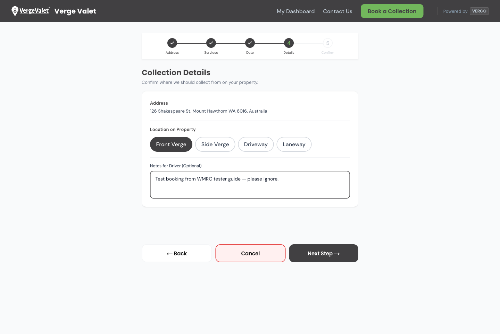

### 2.6 Enter contact details, verify your email, pay

Page header: **"Confirm Your Booking"** (step 5).

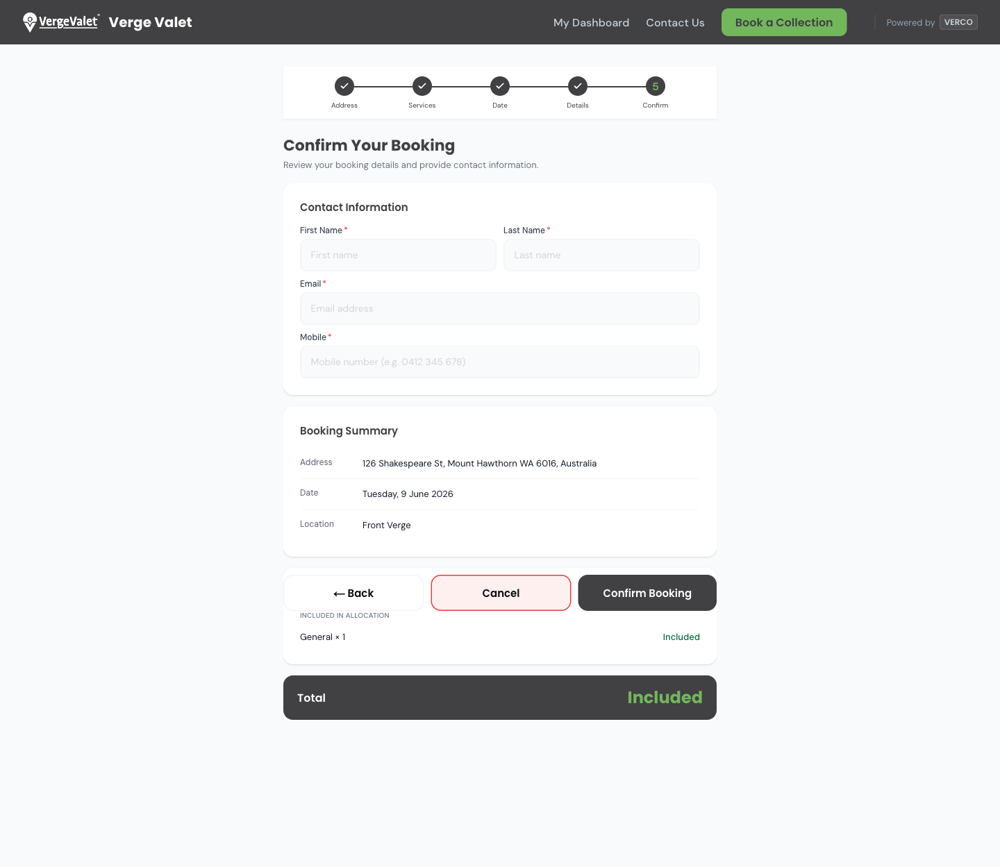

#### Top of page — Contact Information

Four required fields:

- **First Name*** *(autocompletes from the browser)*
- **Last Name*** *(autocompletes from the browser)*
- **Email***
- **Mobile*** — Australian format, auto-formats as you type to `0412 345 678`

> **Why first/last separately?** The system stores the resident's name as two fields and generates the display name from both — it's used in audit trails, NCN letters, refund emails, and so on. Single "full name" entry isn't supported.

#### Middle of page — Booking Summary

A read-only recap:

- **Address** — what you confirmed in step 1
- **Date** — what you picked in step 3
- **Location** — what you chose in step 4

#### Services breakdown

Two sub-sections:

- **Included in Allocation** — free units you're using from your annual allowance
- **Extra Services** — paid items, with per-line and total cost (only shown if there are extras)

#### Total block

- If everything is included: shows the word **Included** (no payment needed)
- If there are extras: shows the dollar total and the small footnote *"Payment will be collected via Stripe before your booking is confirmed."*

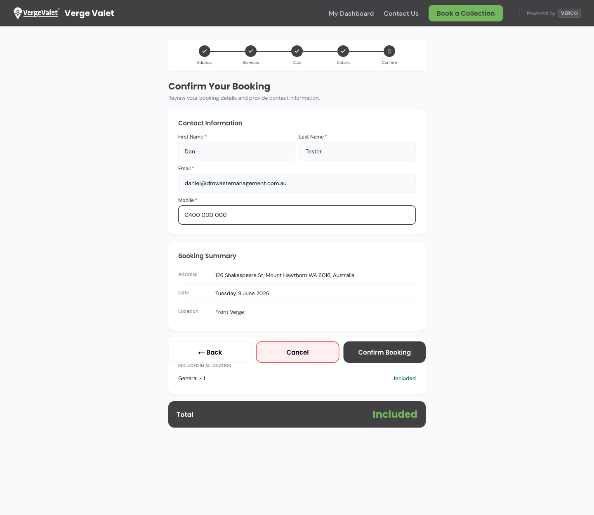

#### Submit button

Label changes depending on the booking:

- **Confirm Booking** (green) — free booking, no payment required
- **Proceed to Payment** (yellow-green) — there are paid extras

#### Accept the Terms & Conditions _(new since v1.2)_

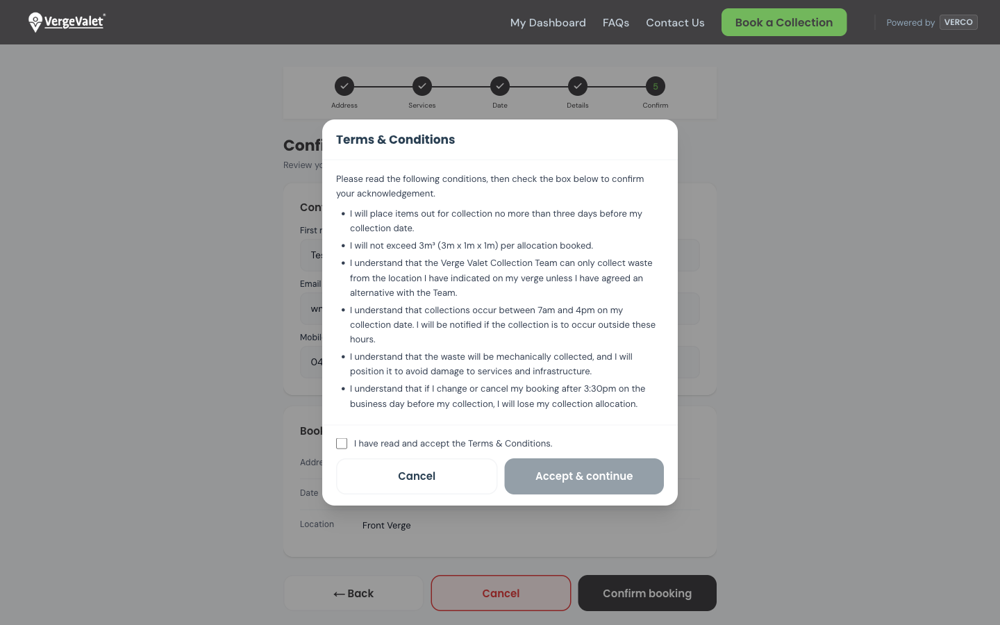

When you click the submit button, a **Terms & Conditions** dialog appears before the booking is created. It shows the council's terms (scrollable), with a single **"I accept…"** checkbox pinned at the bottom.

- **Tick the box** to enable the accept/continue button, then proceed.
- Verco records *which version* of the terms you accepted, *when*, and *how* (web) against the booking — so there's a clear audit trail.
- This step appears for **both guest and signed-in residents**, and for bookings staff make on a resident's behalf.

> **Data-driven — it only appears when a council has published terms.** Verge Valet's terms are live, so residents see this step. If a council hasn't entered terms yet, the step is silently skipped. Staff enter/maintain the terms in the admin app (`/admin/clients/{id}` → **Terms & Conditions** tab).

#### What happens when you click Submit

**If you're already signed in** (e.g. you previously verified your email earlier in the session), the booking is created immediately.

**If you're a guest** (first-time tester, fresh browser session) — this is the path WMRC testers will hit most often. The bottom of the page swaps in an **inline 6-digit OTP verification panel**:

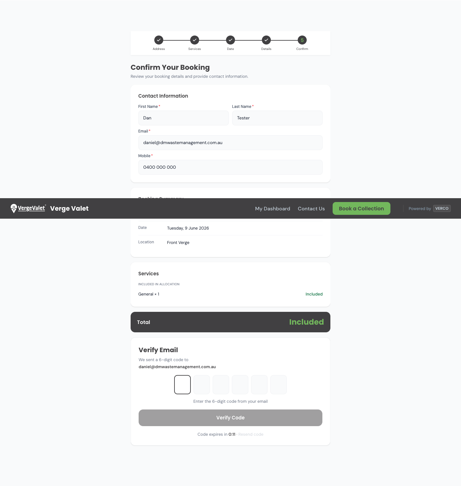

> *"Verify email to confirm booking — We sent a 6-digit code to {your email}"*

1. **Check your inbox.** The email subject is *"Your VERCO OTP"* from **`bookings@verco.au`** and arrives within seconds.
2. **Type the 6 digits** into the boxes. The form auto-submits when you finish the last digit.
3. If the code is wrong (or stale), you get a clear inline error and "Try Again" / "Request a new code" options:

   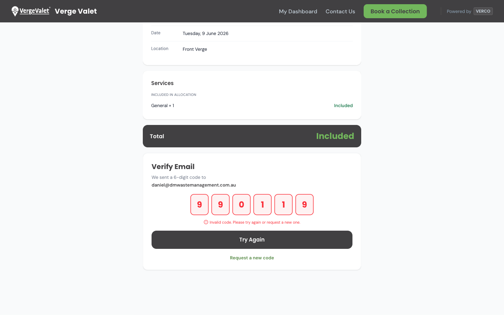

4. After 30 seconds you can request a fresh code.
5. Once verified, the booking is created.

**Free booking path:** You're redirected to `/booking/<ref>?success=true` — the booking detail page with a green success banner.

**Paid booking path:** You're redirected to **Stripe Checkout** (Stripe's hosted payment page).
- Use the test card from §1 above.
- After successful payment, you return to `/booking/<ref>?success=true`.
- A green "Payment received — confirming your booking…" banner shows briefly while the system catches the Stripe webhook and flips the status to **Confirmed**.

If you cancel out of Stripe, you return to your booking page in **Pending Payment** status with a "Pay Now" button you can click to try again.

> **You'll get an SMS too _(new since v1.2)_.** Once a booking is confirmed, Verge Valet sends **both an email and an SMS** confirmation (sender ID **"VergeValet"**), and again as a **collection reminder** a couple of days before the collection date. The SMS carries a short link (`verco.au/b/{ref}`) back to the booking. Testers should expect a text as well as the email.

> **Common tester mistake:** Forgetting to check email for the OTP. The form sits there waiting and looks frozen. The fix is always to check the inbox.

> **OTP rate-limiting gotcha:** If you click "Request a new code" multiple times in quick succession, Supabase will rate-limit you — you'll see *"For security purposes, you can only request this after N seconds."* Wait the cooldown out (usually 9–30 seconds) before retrying. The previous code is invalidated as soon as a new one is sent, so don't try to use the older one.

---

## 3. Part B — Managing a booking

Once a booking exists, the resident can come back at any time to view it, edit it, or cancel it.

### 3.1 Sign back in

From any page on `vvtest.verco.au`:

1. Click **My Dashboard** in the top nav, or visit `/auth` directly.

   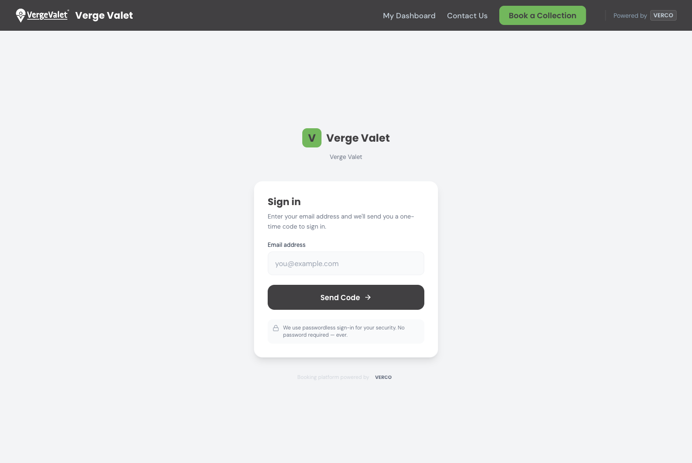

2. Page header: **"Sign in"** with the message *"Enter your email address and we'll send you a one-time code to sign in."*
3. Type your email, click **Send Code**.
4. You're redirected to `/auth/verify?email=…` showing **"Check your email — We sent a 6-digit code to {email}"**.

   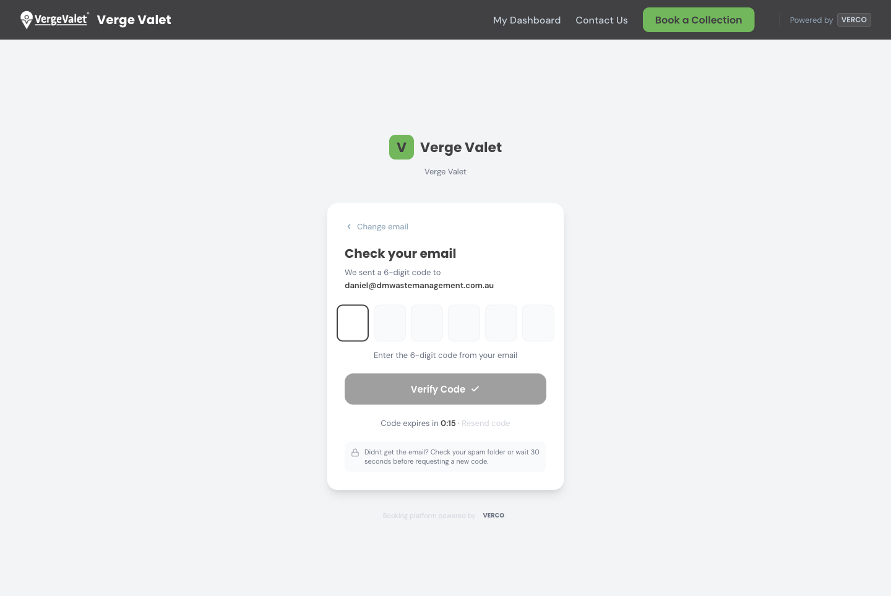

5. Six numeric cells, paste-friendly. Auto-verifies on the sixth digit.
6. On success: green tick *"You're signed in — Taking you to your dashboard now"* then you land on your dashboard.

Codes expire after 10 minutes; if it lapses, click **Resend code** (the 30-second cooldown applies again).

### 3.2 Your dashboard

URL: `/dashboard`. Page header: **"My Dashboard"** with a greeting like *"Good morning, Daniel."*

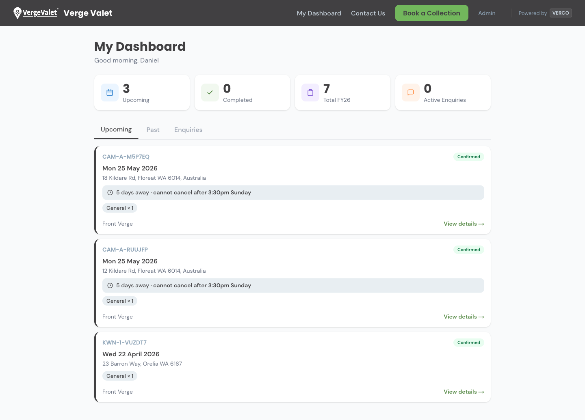

Four stat cards at the top:

| Card | Shows |
|---|---|
| **Upcoming** | Bookings scheduled but not yet collected |
| **Completed** | Bookings collected in this financial year |
| **Total {FY}** | All bookings (any status) for current FY |
| **Active Enquiries** | Open support tickets |

Below the stats, **three tabs**:

- **Upcoming** — future bookings, with a place-out reminder for any booking ≤3 days out
- **Past** — completed and cancelled bookings
- **Enquiries** — your support tickets

Each booking card on the dashboard shows:

- **Reference** (e.g. `CAM-A-M5P7EQ`, `KWN-1-VUZDT7` — the prefix encodes the client and area)
- **Status badge** (Confirmed / Scheduled / Completed / Cancelled / Non-conformance / etc.)
- **Collection date**
- **Address**
- **Service chips** with paid extras tagged: *"Bulk Waste (extra · $195.45)"*
- **Countdown** for bookings ≤7 days out: *"5 days away · cannot cancel after 3:30pm Sunday"*
- **Place-out reminder** (green banner) for bookings ≤3 days out

### 3.3 Open a booking

Click any booking card on the dashboard. You land on `/booking/<ref>`.

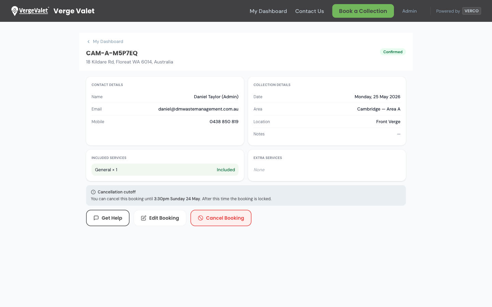

The booking detail page shows:

- **Header** — booking reference, status badge, address
- **Contact Details** — name, email, mobile
- **Collection Details** — date, area, location on property, driver notes
- **Included Services** — green-tinted block
- **Extra Services** — orange-tinted block with $ amounts and a **View receipt** link (when paid)
- **Cancellation cutoff card** (blue) — *"You can cancel this booking until 3:30pm Sunday 24 May. After this time the booking is locked."*
- **Action buttons** — Get Help, Edit Booking, Cancel Booking

#### Other conditional banners

| When | Banner |
|---|---|
| Status is **Pending Payment** | Orange "Payment required" banner with **Pay Now** button |
| Just returned from Stripe and status still pending | Green "Payment received — confirming your booking…" with auto-poll |
| Collection is in ≤3 days | Green "Place out your waste now — Items must be on the verge by 7am {date}. Do not place out more than 72 hours before collection." |

> **The 72-hour place-out window is specific to Verge Valet.** Other Verco clients have a 48-hour window — the message text reflects whichever rule applies to the tenant.

### 3.4 Edit a booking

Click **Edit Booking** on a booking that's still in a cancellable status (Confirmed, Scheduled, or Submitted, and before the cutoff).

You're sent back to the **services step** of the booking wizard with the existing items pre-filled. The page URL contains `?replaces=<booking_id>` — this tells the system to treat the change as an in-place edit rather than a cancel-and-replace.

You can:

- Add or remove services
- Change the collection date
- Update location and driver notes
- Update contact details

The pricing engine **excludes the booking-being-edited from the FY usage calculation**, so your allocation numbers reflect what would be true if this booking didn't exist. That avoids the *"you've used 3/3 — you can't edit your only booking"* trap.

When you confirm the edit, the booking keeps its original reference and `booking_id`. The change is logged in the audit trail. If you removed paid items, a refund request is queued (see admin guide).

### 3.5 Cancel a booking

Click **Cancel Booking** on the booking detail page.

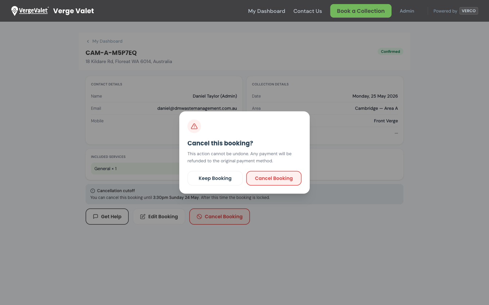

A confirmation dialog appears:

> *"Cancel this booking? This action cannot be undone. Any payment will be refunded to the original payment method."*

Two buttons: **Keep Booking** and **Cancel Booking**.

#### The cancellation cutoff

A resident can cancel up until **3:30pm AWST on the day before collection**. After that, the cancel button is hidden and any direct attempt is rejected with:

> *"Cancellation cutoff has passed (3:30pm the day before collection)."*

This is enforced in three places — front-end (button hidden), server action (rejects late requests), and database trigger (defence in depth). **There is no override available to the resident.** WMRC staff can sometimes cancel after the cutoff via the admin app — see the admin guide.

#### What happens after cancellation

- Booking status flips to **Cancelled**.
- If extras were paid, a **refund request** is created with status **Pending**. Refunds are not automatic — a WMRC or contractor admin must approve them in the admin app. The resident sees the refund within 1–3 business days of approval.
- A **booking cancelled** notification email is sent.

### 3.6 Dispute a non-conformance notice or "nothing presented"

When field staff finish a collection visit, they can mark the booking as one of:

- **Completed** — collected as expected
- **Non-conformance (NCN)** — items breach the rules (e.g. oversized, contaminated, in the wrong location). Photos are attached.
- **Nothing Presented (NP)** — nothing was on the verge to collect

If your booking comes back as NCN or NP, your booking detail page gets a new card.

#### NCN card

- **Reason** — e.g. "Oversized items"
- **Reported date**
- **Photos** — click to enlarge
- **Status** — usually **Issued** when first raised
- **Rebooked-as** link if a replacement booking has already been arranged

If the status is **Issued**, a red **"Dispute this Notice"** button appears. Clicking it:

1. Confirms with you ("Are you sure?")
2. Adds a notes field for your dispute reason
3. Flips the NCN status to **Disputed**
4. Shows the confirmation: *"Your dispute has been submitted. Our team will review and respond."*

WMRC staff then triage the dispute in the admin app — see **§4.5 Triaging exceptions** below for the staff side of this flow.

#### NP card

Same shape as NCN but without the photos and reason — just the date the field crew couldn't find anything. Same dispute flow.

#### Auto-close

NCNs and NPs auto-close to **Closed** after **14 days** if not disputed. After auto-close, the dispute button no longer appears.

### 3.7 After your collection — the feedback survey _(new since v1.2)_

<!-- SCREENSHOT: 34-survey.png — the standalone tenant-branded feedback survey page -->

Once a collection is marked **Completed**, the resident is emailed a short **feedback survey** with a link to `/survey/{token}`.

- The survey page is a **standalone, tenant-branded form** — just the council logo and the questions, no site navigation. It opens **without signing in** (the link itself is the key).
- It asks a fixed set of questions: whether they tried to **repair or sell** the items first, **star ratings** for the booking and the collection, an **overall rating**, free-text comments, and a *"Do you prefer …?"* service-preference question.
- **One response per link.** Re-opening a link you've already submitted shows an "already submitted" screen; a network hiccup shows a friendly retry screen (never a broken-page error).

Staff don't need to do anything here — responses flow into the admin **Surveys** module and the dashboard's "Recent Survey Feedback" card (§4.10), and feed the satisfaction metrics on the **Reports** dashboard (§4.9).

---

## 4. Part C — Admin operational workflows (client-staff)

Once Verge Valet goes live, WMRC's customer service officers and operations supervisors will spend most of their time in the **admin app** at `vvtest.verco.au/admin`. This part walks through everything you need to do at the desk: looking up a booking when a resident phones, helping them pay or cancel, triaging a non-conformance dispute, approving a refund, booking on behalf of a strata building, and managing the customer-service ticket queue.

The admin app uses the **same sign-in mechanism as the resident portal** (passwordless OTP), but it lives at a different URL and shows a completely different interface — sidebar navigation, table-based lists, slide-over detail panels.

> **Audience note:** Most of what's described here is available to anyone with the **client-staff** role. A few actions (importing properties, geocoding the address database, sender configuration) are restricted to **client-admin** or to D&M's contractor-admin team — those are called out inline when they appear.

> **Capture status (v1.3):** the admin section text below is current as of **2026-07-05**, verified against the live app (which had a UAT design refresh — unified pills/filters/headers, the full **Verco logo**, and the booking detail moved from a slide-over panel to a **full page**, §4.3). **Captured live (2026-07-05):** the full Part C set `21`–`24` and `26`–`38` — dashboard, bookings list + filtered, booking detail, cancel dialog, NCN/NP lists, refunds, MUDs, properties, service tickets, ID intake, Reports, and Surveys. Shots that would show resident/strata **names, emails or mobiles** (booking detail `24`, cancel `26`, MUDs `30`, tickets `32`) are **redacted** — those fields appear as grey blocks in the guide but are real in the app. **Only `25`** (a *Pending Payment* booking detail) is still a placeholder — there were no Pending-Payment bookings in the data at capture time; it's identical to `24` with a Pay Now button + orange banner. **Trust the words and outcomes throughout.**

### 4.1 Sign in to the admin app + dashboard orientation

**URL:** `https://vvtest.verco.au/admin`

If you're not already signed in, visit `vvtest.verco.au/auth` and complete the OTP exactly as described in §3.1 (the resident sign-in flow). Once signed in, navigate to `/admin` directly, or use the URL above.

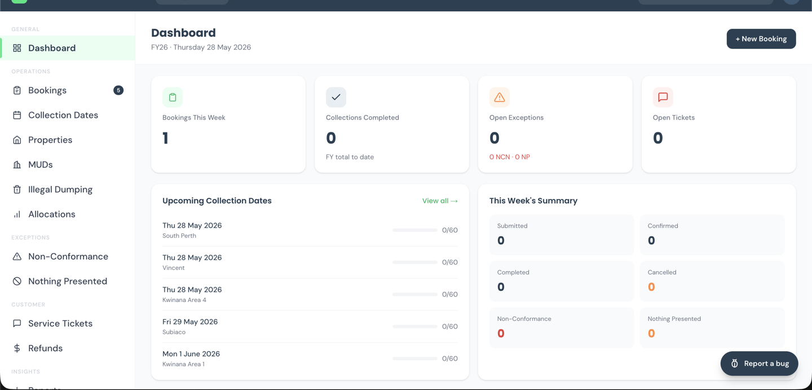

The admin dashboard has six visible regions:

**Top bar (left to right):**
- **VERCO logo** — your home anchor; click to return to `/admin`
- **Tenant selector pill** (e.g. *"Verge Valet"* with a green dot) — only visible if you have access to more than one tenant. WMRC head-office client-admins see all 9 sub-councils; a Cottesloe-only client-admin won't see a switcher at all.
- **Global search box** — search bookings by reference (e.g. `COT-E88PNN`), address, or contact name. Hits any booking your role can see.
- **Avatar initials** (top right) — your account menu

**Sidebar (left), grouped into sections:**
- **GENERAL** — Dashboard (where you are)
- **OPERATIONS** — Bookings, Collection Dates, Properties, MUDs, Illegal Dumping (§4.8), Allocations _(and **Run Sheets**, which is **D&M-contractor-only** — council staff won't see it)_
- **EXCEPTIONS** — Non-Conformance, Nothing Presented
- **CUSTOMER** — Service Tickets, Refunds, **Surveys** (§4.10)
- **INSIGHTS** — **Reports** (§4.9)
- **ADMIN** — Users, Notifications, Audit Log
- **CONFIGURATION** _(contractor-admin only — Bug Reports, Clients, Notification Templates)_

The Bookings link carries a number badge (e.g. **5**) when there are pending-payment bookings still incomplete. Which items you see depends on your role and **sub-client scoping** (below) — a council-scoped staff account sees a trimmed set.

**Main area — four stat cards:**

| Card | Means |
|---|---|
| Bookings This Week | Confirmed bookings with collection dates in the next 7 days |
| Collections Completed | FY-to-date total — field staff marked these "Completed" |
| Open Exceptions | NCN + Nothing-Presented notices still unresolved |
| Open Tickets | Service tickets in any non-Resolved status |

Below the stats are panels (the dashboard was reworked during UAT, so the layout differs from earlier screenshots — a re-capture is tracked in the revision log):

- **Upcoming Collection Dates** — the next collection days for each area, with a small bar showing utilisation (`0/60`, `47/60`, etc.). Click "View all" to drill into the full schedule.
- **This Week's Summary** — booking counts in each status (Confirmed, Completed, Cancelled, Non-Conformance, Nothing Presented).
- **Recent Survey Feedback** _(new since v1.2)_ — the latest resident survey responses (§4.10), so you can see satisfaction at a glance without leaving the dashboard.

> **Sub-client scoping — what a council-staff user sees may be narrowed to their own council _(new since v1.2)_.** Verge Valet is one Verco "client" with several member councils as **sub-clients**. A staff account can be scoped to a **single sub-client** — e.g. a **City of Cockburn (COT)** login sees only COT bookings, notices, tickets and surveys across the *entire* admin app, and zero Mosman Park or Vincent data. WMRC head-office staff (no narrowing) see everything. This is set when the account is created (§ADMIN → Users). If a colleague "can't see a booking you can see", sub-client scoping is the usual reason.

**Bottom-right floating button:** *"Report a bug"* — opens a small form for logging UI issues to the D&M dev team. Use this for *unexpected app behaviour* (a button doesn't work, a value is wrong). For *customer service problems* (a resident's request you can't fulfil), use Service Tickets — see §4.7.

---

### 4.2 Looking up a booking

**URL:** `https://vvtest.verco.au/admin/bookings`

This is the workhorse screen. Click **Bookings** in the sidebar — you land on a table of every booking your role can see.

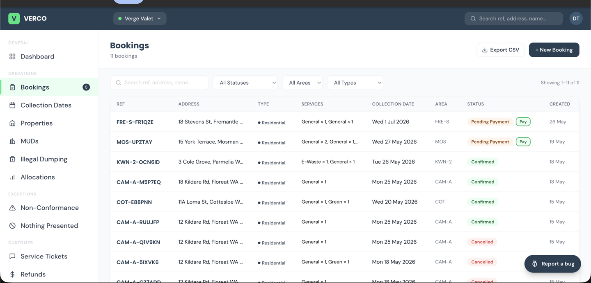

**Filter strip** (top of the table):
- Search box — by ref, address, or contact name
- **All Statuses** dropdown — narrow to a single status (Confirmed, Pending Payment, Cancelled, Non-conformance, Nothing Presented, Scheduled, Submitted, Completed, Rebooked)
- **All Areas** dropdown — narrow to a single sub-client area (CAM-A, COT, MOS, PEP, FRE-N, FRE-S, SUB, VIN, SOP, VIC, KWN-1, KWN-2 …)
- **All Types** dropdown — Residential vs. MUD vs. Illegal Dumping
- **All Services** dropdown _(new since v1.2)_ — narrow to bookings containing a given service (Bulk Waste, Green Waste, …)
- **Date range** _(new since v1.2)_ — restrict to collection dates within a from/to window
- **Column sorting** _(new since v1.2)_ — click the Ref / Type / Status / Created / Area headers to sort

The *"Showing X of Y"* count updates live as you filter.

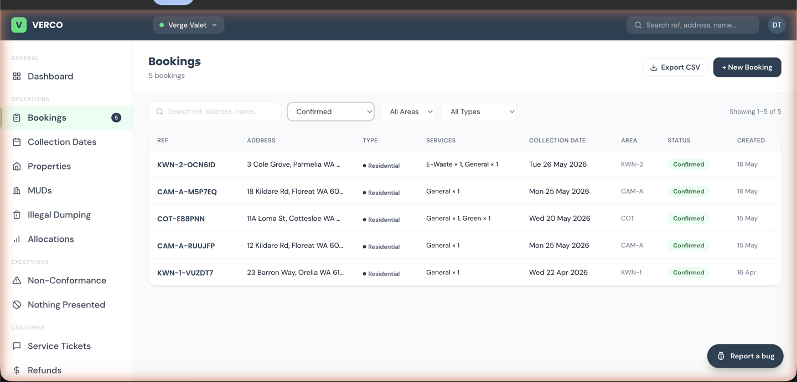

**Table columns:**

| Column | What it shows |
|---|---|
| REF | e.g. `COT-E88PNN`, `KWN-2-OCN6ID` — the area prefix is your fastest visual filter |
| ADDRESS | Street + suburb only (resident name is in the detail panel) |
| TYPE | Residential / MUD / Illegal Dumping |
| SERVICES | e.g. "Bulk Waste × 1, Green Waste × 1" — what was booked |
| COLLECTION DATE | The scheduled day |
| AREA | The sub-client area code |
| STATUS | Coloured badge — see legend below |
| CREATED | Relative time ("18 May", "9 days ago") |

**Status badge legend:**

| Badge | Meaning |
|---|---|
| <span class="tl tl-g"></span> **Confirmed** | Booking is locked in for that date |
| <span class="tl tl-g"></span> **Completed** | Field crew collected successfully |
| <span class="tl tl-a"></span> **Pending Payment** | Booking exists but Stripe charge incomplete. Paired with a small green **Pay** pill — clicking it opens Stripe Checkout for the resident's cart. |
| <span class="tl tl-a"></span> **Submitted** | Legacy state where the booking awaits manual confirmation. Rare — most bookings auto-confirm now. |
| <span class="tl tl-b"></span> **Scheduled** | Locked in for collection (auto-flipped from Confirmed at 3:25pm AWST the day before) |
| <span class="tl tl-r"></span> **Cancelled** | No longer active. Refund (if any) tracked separately. |
| <span class="tl tl-r"></span> **Non-conformance** | Field crew couldn't collect as booked |
| <span class="tl tl-r"></span> **Nothing Presented** | Field crew visited and found nothing on the verge |
| <span class="tl tl-p"></span> **Rebooked** | A follow-up booking has been created after an NCN/NP |

**Top-right actions:**
- **Export CSV** — downloads the current filtered table as a CSV. Useful for ad-hoc reports.
- **+ New Booking** — opens the booking wizard pre-loaded with admin context. See **§4.6 for the strata path**; otherwise the wizard is identical to the resident flow in Part A, with one difference noted in §4.4.

> **Sub-client scoping.** If you're a Cottesloe-specific client-admin (your `user_role` is narrowed to one sub-client), you'll only ever see `COT-*` rows in this list — bookings from Mosman Park or Vincent are invisible to you, even though they share the WMRC tenant. WMRC head-office staff (no sub-client narrowing) see everything.

---

### 4.3 Reading the booking detail

Click any row in the bookings list to open the booking's **detail page** with everything about that booking.

> **Changed since v1.2 — it's a full page now, not a slide-over.** The detail used to open as a panel over the list; it's now a **dedicated full page** (`/admin/bookings/<uuid>`). Use your browser Back button (or the Bookings link) to return to the list. The old "slide-over" screenshots are being re-captured.

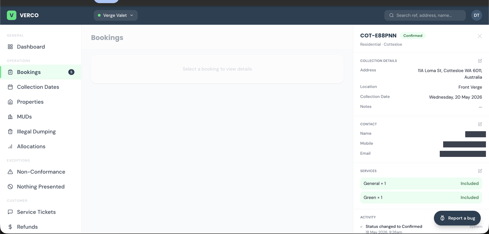

The URL is `/admin/bookings/<uuid>` (a long random ID, not the human-readable ref). You can copy this URL to share a specific booking with a colleague — they'll land on the same view.

The page has the following sections, stacked top-to-bottom:

#### Header

- **Booking reference** (e.g. `COT-E88PNN`)
- **Status badge** (same colours as the list)
- **Sub-header** — "Residential · Cottesloe" or "MUD · Cambridge — A"

#### COLLECTION DETAILS (with pencil icon to edit)

- **Address** — full street + suburb + postcode (resident name is *not* here; that's in CONTACT)
- **Location** — Front Verge / Side Verge / Driveway (whatever the resident selected at step 4 of the wizard)
- **Collection Date** — formatted "Wednesday, 20 May 2026"
- **Notes** — driver instructions the resident left, or italic *"Nothing"* if blank

#### CONTACT (with pencil icon to edit)

- **Name** — e.g. "Sarah Jenkins" or, if the booking was created by staff on behalf of a resident, "Sarah Jenkins **(Admin)**"
- **Mobile** — `+61 4XX XXX XXX`
- **Email** — the resident's verified email

> **The "(Admin)" suffix is a leakage signal worth recognising.** It means a staff member created this booking on the resident's behalf (e.g. a strata booking, or a phone-in request). Useful when triaging: a resident may not remember a booking they didn't make themselves.

#### SERVICES (with pencil icon to edit)

A list of every service line, each with a **status pill**:
- **Included** (green) — comes out of the resident's FY allocation, no charge
- **$X.XX** (orange) — an "extra" line beyond the allocation, paid via Stripe
- A "Total charged" row at the bottom sums the extras

#### ACTIVITY (audit timeline)

Every change to this booking, oldest at the top:
- "Status changed to Confirmed" — when the booking was confirmed
- "Service item created" — when each service line was added
- "0 fields updated" — system housekeeping events (often duplicated; safe to ignore for now)
- Click any entry to expand the field-level diff
- **Actor names now resolve** _(improved since v1.2)_ — a resident-made change shows the **resident's name** rather than a generic "System", so you can tell who did what at a glance.

Use the timeline to answer disputes: *"the resident says they didn't add Green"* → check whether the Green line came in at create time or was added later, and by whom.

#### Action buttons (bottom of panel)

These change based on the booking's current status:

| Status | Buttons available |
|---|---|
| **Pending Payment** | **Pay Now** (green outline) → opens Stripe Checkout; **Cancel Booking** (red outline) |
| **Submitted** (legacy) | **Confirm Booking** (green) → flips to Confirmed; **Cancel Booking** (red outline) |
| **Confirmed** | **Cancel Booking** (red outline) — until 3:30pm the day before |
| **Scheduled** | **Cancel Booking** (red outline) — staff-only post-cutoff override; see §4.4e. **D&M contractor staff can also Reschedule** a Scheduled booking _(new since v1.2)_ — previously it was locked once scheduled. |
| **Completed** / **Cancelled** / **Non-conformance** / **Nothing Presented** | No state-changing buttons here; raise a new booking from the bookings list instead |

<!-- SCREENSHOT 25 (Pending Payment booking detail) not captured: there were no Pending Payment bookings in the data at capture time. The page is identical to the Confirmed detail above, with a Pay Now button and an orange "Payment required" banner. Capture when one exists. -->

---

### 4.4 Helping a resident — confirm, pay, cancel

This section covers the four most common phone-in scenarios.

#### a) "I can't find my booking"

If the resident gives you their booking reference, paste it into the **top-right global search** — it jumps straight to the detail panel.

If they don't have the reference:
1. Click **Bookings** in the sidebar
2. Type their **address**, **last name**, or **email** into the table search box
3. The list narrows live

If you find nothing:
- Check the **status filter** isn't accidentally set to a single status. Reset to "All Statuses".
- Check the **area filter** — they may live in a sub-council you're narrowed away from (sub-client scoping per §4.2).
- Check whether they signed up with a **different email** than they're quoting now. Email is the identity anchor; a typo at sign-up creates a "phantom" account they can't access. Look at Service Tickets for prior history under any email.

#### b) Resident wants to pay now (Pending Payment)

1. Find the booking (status will say **Pending Payment**)
2. Open the detail panel
3. Scroll to the bottom — click **Pay Now**
4. Stripe Checkout opens **in the same browser** — you can either hand the laptop to the resident in person, or read out the Stripe-generated payment URL for them to complete remotely
5. Once Stripe confirms payment, the booking status flips to **Confirmed** within seconds (a webhook handles this; no manual step needed on your side)

> **Tip:** If the resident is on the phone in a different state and you don't have a way to share the Stripe URL securely, raise a Service Ticket (§4.7) describing the situation. D&M's contractor-admin team can generate a one-time secure link.

#### c) Resident wants to confirm a "Submitted" booking

Most bookings auto-confirm now (free path → Confirmed immediately; paid path → Confirmed on Stripe success), so the **Submitted** status is rare. If you encounter one:

1. Open the detail panel
2. Verify the contact details + services + date look right
3. Click **Confirm Booking** — the green button at the bottom
4. The status flips to Confirmed; the audit log captures your name as the actor

#### d) Resident wants to cancel a booking (pre-cutoff)

1. Open the detail panel
2. Click **Cancel Booking** (red outline)
3. A confirmation dialog appears: *"Cancel this booking? This action cannot be undone. Any payment will be refunded to the original payment method."*
4. Click **Cancel Booking** to confirm, or **Keep Booking** to back out

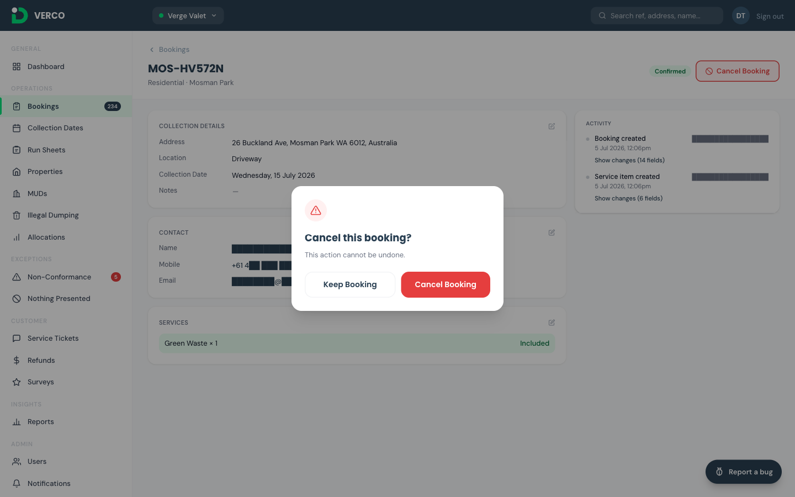

What happens after cancellation:
- Booking status flips to **Cancelled**
- If the resident paid for extras, a **Refund Request** is auto-created in the Refunds queue (see §4.5). The refund is **not automatic** — someone has to approve it.
- A "booking cancelled" notification email is sent to the resident.

#### e) Cancelling after the cutoff (staff-only override)

Residents lose the ability to cancel at **3:30pm AWST the day before collection**. After that, the cancel button is hidden from their dashboard. Field crew are already on the road or about to be.

**Staff can still cancel post-cutoff**, but the policy expectation is:
- **Don't cancel within 24h of collection unless there's a genuine operational reason** (e.g. weather closure, address error). Doing so doesn't refund the resident automatically — you'll need to manually approve a refund or note in the audit trail why no refund applies.
- **Document the reason in the booking notes before cancelling** (use the pencil icon next to COLLECTION DETAILS). The audit trail captures the cancellation actor, but not the *why* — notes give the why.
- The same Cancel Booking button works post-cutoff for staff. The DB trigger that blocks resident cancellations has a staff bypass.

> **Edit a confirmed booking instead of cancelling.** If the resident wants to change the date or services (rather than drop entirely), use the **Edit Booking** flow (pencil icon on COLLECTION DETAILS or SERVICES) — keeps the same reference, audit-trails the change, doesn't create a refund. This is almost always preferable to cancel-and-rebook.

---

### 4.5 Triaging exceptions — NCN, Nothing Presented, refunds

When field crew can't complete a collection as booked, they record one of two exception types:

- **Non-conformance (NCN)** — items breach the rules (oversized, contaminated, wrong location). Photos attached.
- **Nothing Presented (NP)** — nothing was on the verge to collect.

Both flow into your queue if the resident **disputes** them.

#### a) The Non-Conformance list

**URL:** `https://vvtest.verco.au/admin/non-conformance`

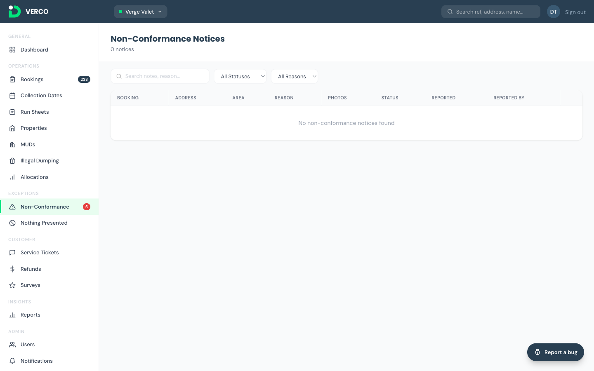

**Filter strip:**
- Search box — by booking ref, address, reason
- **All Statuses** dropdown — Issued / Disputed / Under Review / Resolved / Rescheduled / Closed
- **All Reasons** dropdown — e.g. Oversized, Contamination, Incorrect Location, Asbestos, Hazardous

**Columns:** BOOKING / ADDRESS / AREA / REASON / PHOTOS / STATUS / REPORTED / REPORTED BY.

#### b) The NCN state machine

```
Issued        → Disputed         (resident disputes within 14 days)
Issued        → Closed           (auto-close cron after 14 days if no dispute)
Disputed      → Under Review     (you take it on)
Under Review  → Resolved         (NCN dismissed — your investigation found the field call was incorrect)
Under Review  → Rescheduled      (a new collection date offered without a new booking)
Under Review  → Rebooked         (a new booking created for the same address)
```

You **cannot** triage an NCN that's still in **Issued** status — that's the resident's window. Only **Disputed** notices (where the resident pushed back) need your attention.

#### c) Triaging a Disputed NCN

1. Open the NCN detail (click the row)
2. Read the field crew's notes + look at the photos
3. Read the resident's dispute reason (captured when they clicked "Dispute" in their dashboard)
4. Decide:
   - **Field crew was right** (e.g. photos clearly show oversized items): change status to **Under Review → Resolved**, add a note explaining your finding to the resident
   - **Resident was right** (items were small but photographed misleadingly): **Resolved** with a refund or apology note; consider raising the issue with field crew
   - **Genuine ambiguity**: offer a **Rescheduled** date (no new booking) or **Rebooked** (a fresh booking with new ref). Both inform the resident via email automatically.

#### d) Auto-close at 14 days

If a resident *doesn't* dispute within 14 days of the NCN being issued, the system auto-closes it. Your queue gets cleaner; the resident loses their right to dispute. After auto-close, you can still see the NCN in the list (filter status = **Closed**) but you can't act on it.

#### e) Nothing Presented

**URL:** `https://vvtest.verco.au/admin/nothing-presented`

Same flow as NCN but without photos or reasons — the field crew just records "nothing here to collect". A common cause: the resident didn't place items out, or placed them outside the 72-hour window. Same dispute mechanism, same triage decisions, same auto-close.

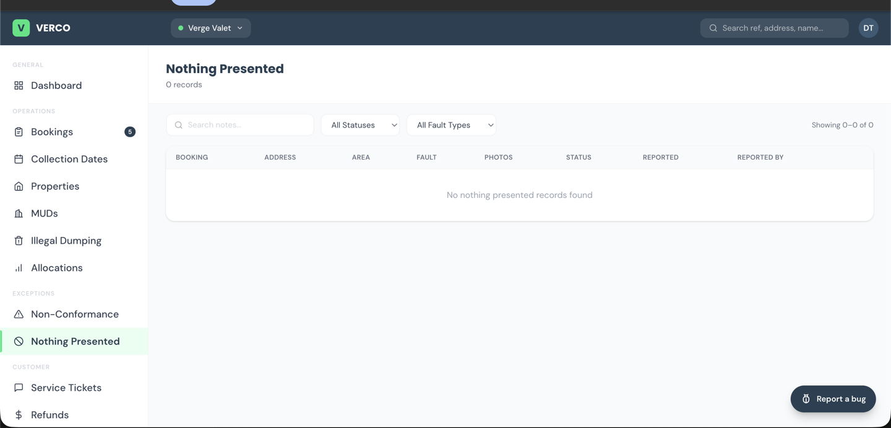

#### f) Refund Requests

**URL:** `https://vvtest.verco.au/admin/refunds`

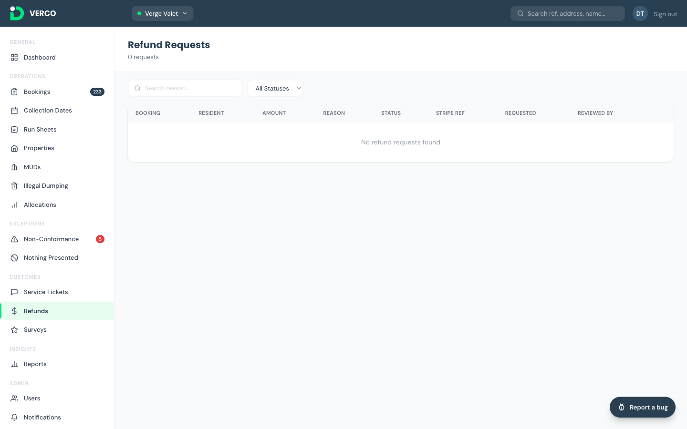

Refunds are **never automatic**. Every refund needs a staff approval. The queue feeds from two sources:

1. **Cancellation refunds** — auto-created when a resident cancels a Confirmed booking that had paid extras
2. **Manual refunds** — created by a staff member as part of NCN/NP resolution

**Columns:** BOOKING / RESIDENT / AMOUNT / REASON / STATUS / STRIPE REF / REQUESTED / REVIEWED BY.

#### g) Approving a refund

1. Open the refund detail
2. Verify the amount matches what was paid (the system pre-populates from the original Stripe charge)
3. Click **Approve** — the system calls Stripe's refund API, the **STRIPE REF** column populates with the refund ID, and the status flips to **Issued**
4. The resident sees the money in their account in 1–3 business days
5. Your name is captured in **REVIEWED BY** for audit

Decline a refund only when the request is genuinely out-of-policy (e.g. a cancellation made after the field crew has already visited and completed the collection). Add a note explaining why; the resident is emailed.

---

### 4.6 Multi-unit dwellings (strata) — booking on behalf

**URL:** `https://vvtest.verco.au/admin/muds`

A **MUD** is any property where verge collections can't be arranged by individual residents — apartment blocks, retirement villages, gated communities, dual-occupancy strata. The strata manager (or a building rep) requests a collection on behalf of all the units.

> **Important: admin-on-behalf is the *only* way to book a MUD collection.** There's no resident-facing flow for strata yet — when someone in a flagged MUD tries to book at `/book`, they hit the purple "contact your strata manager" banner (§2.2C). The booking has to be created by you, in the admin app.

#### a) The MUDs list

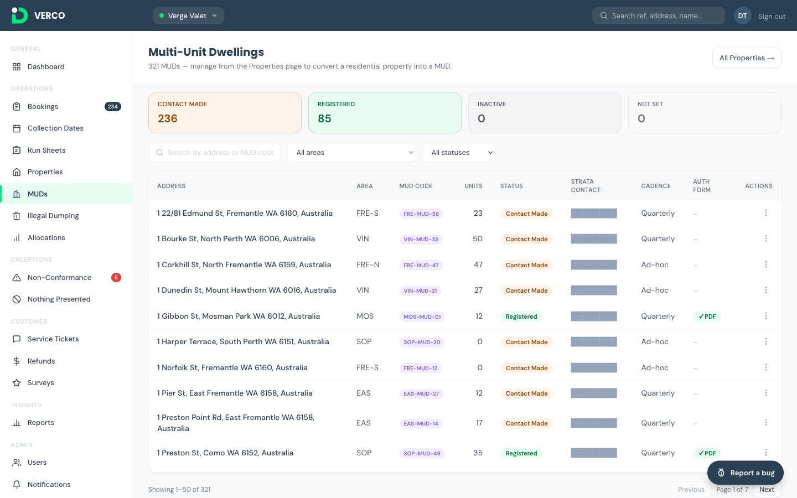

Status cards at the top:
- **Contact Made** — strata manager identified + contacted, but onboarding not yet complete
- **Registered** — fully onboarded; **this is the only status you can book on behalf of**
- **Inactive** — flagged as not currently subscribed (e.g. opted out, demolished)
- **Not Set** — no strata status assigned yet

> **The "Registered" gate _(clarified since v1.2)_.** A MUD only becomes **Registered** — and therefore bookable — once **all three** of these are on file: a **signed Auth form**, a **strata contact** (name + email + mobile), and **waste-location notes**. The admin-on-behalf booking flow **rejects any MUD that isn't Registered**, so if "Book Collection" is blocked, check which of the three is missing. (Admin-on-behalf remains the *only* way to book a MUD — there's still no strata self-service portal.)

**Filter strip:** Search by address/MUD code, All areas, All statuses.

**Columns:** ADDRESS / AREA / MUD CODE (e.g. `FRE-MUD-58`) / UNITS / STATUS / STRATA CONTACT / **AUTH FORM** _(new — the signed authorisation form, opened via a short-lived secure link)_ / CADENCE (**Quarterly** = fixed schedule, **Ad-hoc** = request-by-request) / ACTIONS.

#### b) Converting a property into a MUD

Done from the **Properties** page (`/admin/properties`), not from the MUDs list.

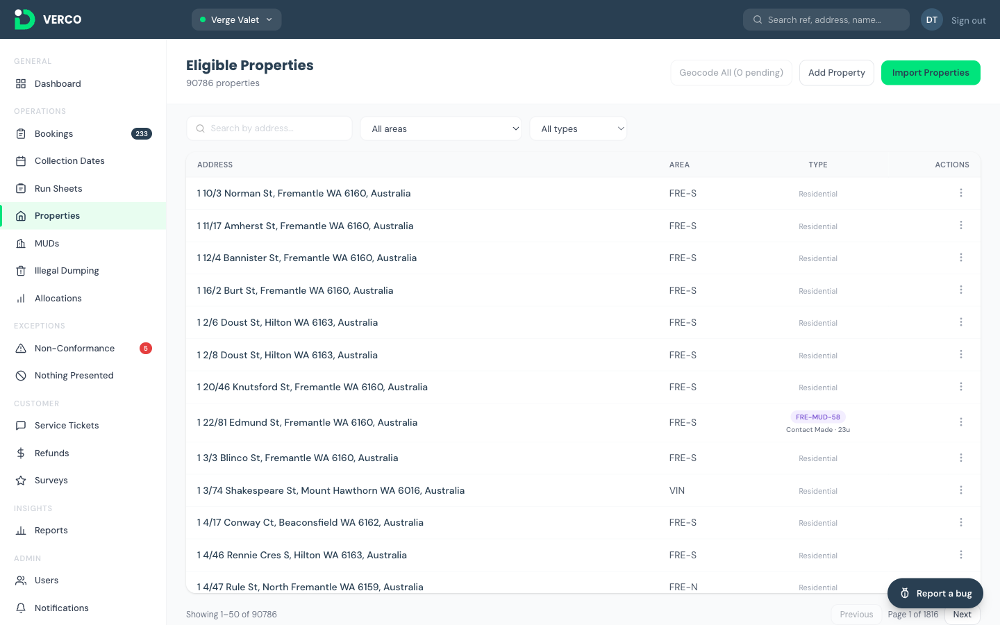

1. Open `/admin/properties` (89,390 records on Verge Valet — use the search box)
2. Find the property by address
3. Click the row's **kebab menu** (⋮) → **"Convert to MUD"**
4. Enter unit count, strata contact name + email + mobile, and cadence
5. Save — the property reappears in `/admin/muds`

#### c) Booking on behalf of a strata building

1. From the MUDs list, click a row to open its detail page
2. Click **"Book Collection"** (the only call-to-action available on a MUD detail)
3. The booking wizard opens, pre-loaded with:
   - The MUD address (read-only — can't change it)
   - **Type: MUD** (different allocation rules — unit count × per-unit allocation)
   - Strata contact pre-filled in CONTACT (your name appears with the "(Admin)" suffix as actor)
4. Walk through the wizard as you would for a resident: services, date, location, confirm
5. Submit — the booking lands directly in **Confirmed** status (no OTP step required, because the strata manager has been onboarded already)

> **Allocation maths is different for MUDs.** A 50-unit MUD gets `units × the council's per-property allocation` per FY (shared across Bulk Waste and Green Waste) — e.g. at a council with a 3-per-property allocation that's `50 × 3 = 150`. The pricing engine knows this from `UNITS` × per-unit-allocation; you don't manually scale anything.

#### d) PII handling on MUDs

The **strata contact** name + email + mobile sit in the MUDs table because admins need them. They are **never** exposed to:
- Field crew (`field` role) — they see only the address and items to collect
- Rangers (`ranger` role) — same restriction
- Other residents in the building — who don't have visibility into who their strata manager is via this app

When sharing screenshots of the MUDs list externally, **blur the STRATA CONTACT column** before sharing.

---

### 4.7 Service tickets — your customer service queue

**URL:** `https://vvtest.verco.au/admin/service-tickets`

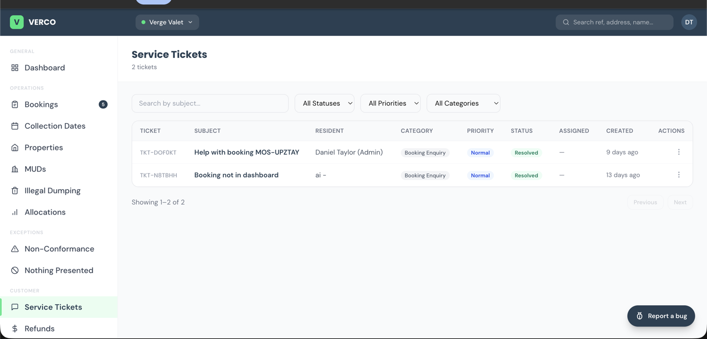

The Service Tickets queue is where resident-side enquiries land that aren't directly tied to a booking action. Examples:

- *"I can't see my booking on the dashboard"*
- *"I didn't receive my OTP email"*
- *"I want to change my email address"*
- *"The address autocomplete won't accept my street"*
- *"I need an invoice for accounting"* (when the receipt isn't enough)

**Filter strip:** All Statuses, All Priorities, All Categories. Search by subject.

**Columns:** TICKET (e.g. `TKT-DOF0KT`) / SUBJECT / RESIDENT / CATEGORY (Booking Enquiry, Account Issue, Technical, Billing, Other) / PRIORITY (Low, Normal, High, Urgent) / STATUS (New, In Progress, Awaiting Resident, Resolved, Closed) / ASSIGNED / CREATED / ACTIONS.

#### Triage workflow

1. **Filter** to Status = "New" + Assigned = empty — the unclaimed queue
2. **Open** the highest-priority ticket
3. **Read** the resident's message + any linked booking
4. **Assign** yourself (or your colleague) so others don't double-handle — the **Assign-to** list is scoped to staff who can actually take the ticket, and the ticket now surfaces the **contact** to reach the resident on _(improved since v1.2)_
5. **Reply** via the ticket comment thread (the resident is emailed)
6. **Change status** to "Awaiting Resident" if you're waiting on them, or "Resolved" once handled
7. **Close** after the resident confirms or after 7 days of silence on Resolved status

> **"Report a bug" floating button vs. Service Tickets.** The floating bug-report button (bottom-right of every admin page) goes to D&M's **dev team** — use it for app misbehaviour. Service Tickets is your **internal customer queue** — use it for things you need to action for a resident. Two different inboxes, two different audiences.

---

### 4.8 Logging an illegal-dumping collection _(new since v1.2)_

**URL:** `https://vvtest.verco.au/admin/illegal-dumping`

Illegal dumping (an **ID**) is waste dumped where there's no booking. IDs are raised two ways: by **rangers in the field** (using the ranger app — separate guide) and by **office staff** here in the admin app. This section covers the office-staff path.

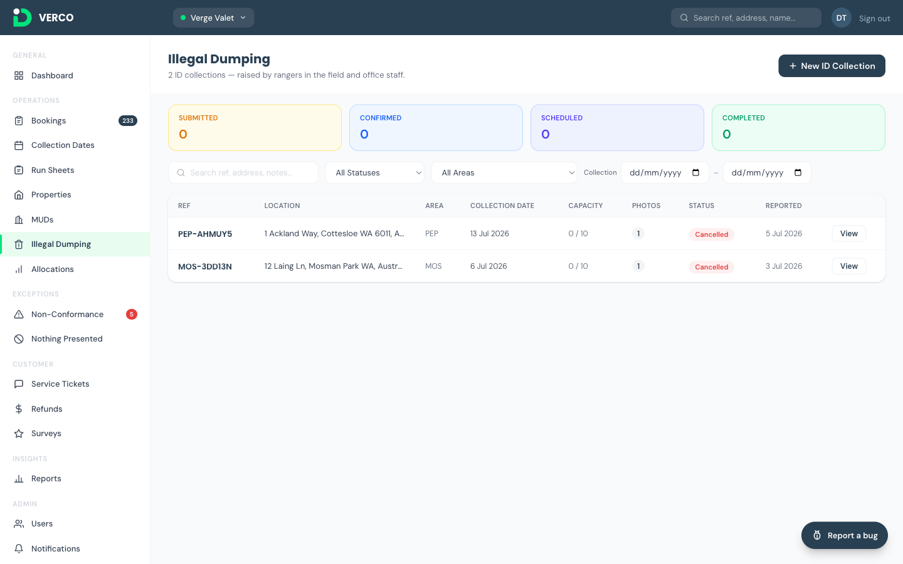

The list heading reads **"Illegal Dumping"** with the subtitle *"ID collections — raised by rangers in the field and office staff"*. To log one from the desk:

1. Click **New ID Collection** → `/admin/illegal-dumping/new`.

   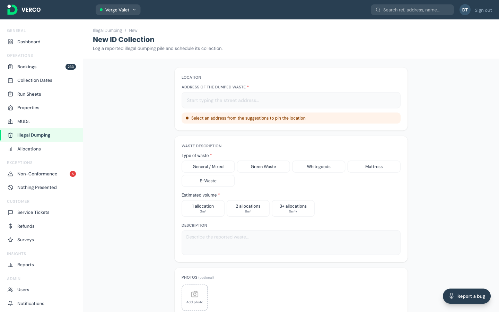

2. **Address** — type it in; Google Places autocomplete resolves it to a precise location (place ID → coordinates).
3. **Collection area** — the form **auto-selects the matching area** from the address. If the address falls outside that area, you get a **soft amber warning** and can switch the area with one click.
4. **Waste type**, **estimated volume**, and **at least one photo** of the dump.
5. **Collection date** — pick from the available dates (capacity is **pool-aware** for Verge Valet's shared pool, so the spots you see are the real remaining capacity).
6. **Submit** — you'll see **"ID Collection Logged"** and it appears in the list, ready for a crew.

> **Volume is an estimate, not a bill.** The volume you enter is a *guide for the crew*. The amount actually collected — and billed — is confirmed by the crew at closeout, the same way MUD counts work. Don't over-think the estimate.

---

### 4.9 Reports — the council analytics dashboard _(new since v1.2)_

**URL:** `https://vvtest.verco.au/admin/reports` — under **INSIGHTS** in the sidebar.

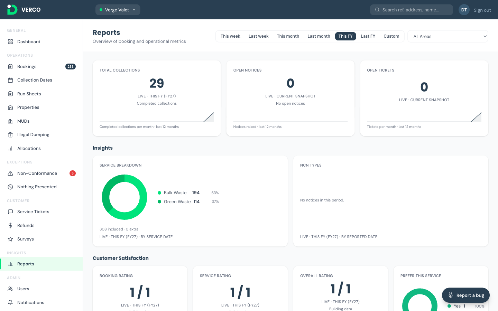

The Reports page is your at-a-glance view of how Verge Valet is performing for your council. It has four bands:

1. **Headline numbers** — **Total Collections**, **Open Notices** (NCN + NP), **Open Tickets**.
2. **Insights** — a **Service Breakdown** donut (Bulk Waste vs Green Waste vs …) and an **NCN Types** donut (why collections were non-conformant).
3. **Customer Satisfaction** — **Booking**, **Service** and **Overall** rating cards, plus a *"Do you prefer …?"* preference donut (Yes / No / Indifferent). These are fed by the resident **surveys** (§3.7 / §4.10).
4. **Service Level** — a grid of eight SLA cards, each with a **period selector**, a **value**, a **target**, and a **12-month sparkline**:
   - Service Delivery · On-Time Collection · Rectification ≤ 2 Days · Ticket First Response · Ticket Resolution · Self-Service Rate · Notification Delivery · Property Penetration.

> **Some metrics are D&M-internal.** A couple of the SLA cards (Self-Service Rate, Notification Delivery) are contractor-operational and are **hidden from council-staff logins** — so a WMRC/member-council user sees a slightly reduced set. That's by design, not a fault.

---

### 4.10 Surveys — resident feedback _(new since v1.2)_

**URL:** `https://vvtest.verco.au/admin/surveys` — under **CUSTOMER** in the sidebar.

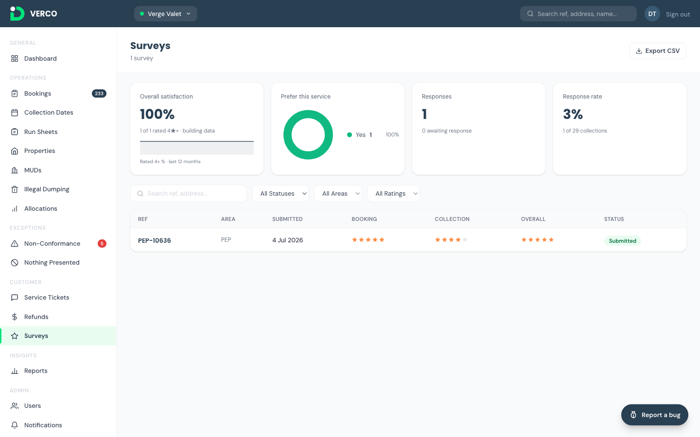

After every completed collection, residents are invited to a short feedback survey (§3.7). Their responses land here:

- **List** — every response, newest first.
- **Detail** (`/admin/surveys/{id}`) — the resident's answers laid out against each question.
- **Summary panel** — aggregate ratings and a **response rate** (measured against the number of *completed* bookings, with a data-quality flag if the sample is thin).
- **Export CSV** — pull the raw responses for your own reporting.

You'll also see the latest handful of responses on the admin **Dashboard** ("Recent Survey Feedback"), and the ratings roll up into the **Reports** dashboard's Customer Satisfaction band (§4.9). No action is required — this is a listening tool.

---

### What's NOT in this guide (yet)

A few surfaces are deliberately left out — either they're **D&M-contractor-only** (council staff never see them) or they're not yet relevant to client-staff training:

- **Run Sheets** (`/admin/run-sheets`) — printable daily crew run sheets. **Contractor-only**; hidden from council staff. Not part of council operations.
- **Notification Templates** (`/admin/notifications/templates`) — a read-only catalog of the transactional email/SMS templates. **Contractor-admin only.**
- **Collection Dates** — the schedule administration UI. Mostly contractor-admin; client-staff read-only.
- **Allocations** — per-area allocation rules. Contractor-admin only.
- **User management** — creating new admin users for your sub-council (and setting their **sub-client scope**, §4.1). Client-admin only; a dedicated onboarding guide is planned.
- **The ranger field app** — checking piles and logging illegal dumping in the field. Covered in its own guide, **`docs/wmrc-ranger-guide.md`**.

If you find yourself needing one of these in day-to-day work and it's not in this guide yet, ping Dan and we'll prioritise the addition.

---

## 5. Suggested dummy-booking scenarios

Pick three to five testers, give each one a fresh test email, and run the following scenarios. Each should produce a different outcome — together they cover the bulk of what the support team will see.

| # | Scenario | Expected outcome |
|---|---|---|
| 1 | Book 1 × Bulk Waste (within the property's included allocation) | Free booking, no Stripe, booking confirmed immediately |
| 2 | Fill the property's included allocation (a mix of Bulk Waste + Green Waste) | Free booking, confirmed |
| 3 | Book more than the property's included allocation | Included units free + the excess paid; Stripe Checkout for the extra; payment with `4242…` card |
| 4 | Test a payment failure | Use card `4000 0000 0000 0002`; booking should stay Pending Payment with **Pay Now** button |
| 5 | Edit a confirmed booking (add an extra service) | Same booking ref, audit trail updated |
| 6 | Cancel a confirmed booking before the cutoff | Status → Cancelled; refund request queued if paid |
| 7 | Try to cancel after the cutoff | Cancel button hidden; if you force the URL, you get the "cutoff has passed" error |
| 8 | Try to book at an ineligible address (anything outside Town of Vincent) | Red "not eligible" banner; cannot proceed |
| 9 | Try to book at a MUD address | Purple "strata manager" banner; cannot proceed |
| 10 | Run through OTP sign-in with a wrong code | Inline error message, can retry or request a new code |
| 11 | Hit the OTP rate limit (request 3 codes in quick succession) | "For security purposes, you can only request this after N seconds" |
| 12 | Receive an NCN (requires coordination with field tester) and dispute it | NCN card with dispute button → Disputed status |
| 13 | Reach the confirm page and try to submit without ticking Terms & Conditions | Accept-terms dialog appears; submit is blocked until you tick the box |
| 14 | Complete a booking, then open the survey link from the confirmation email | Standalone tenant-branded survey page; one submission per link |

For each scenario, **note the booking reference** (e.g. `COT-E88PNN`) so the admin testers can pick it up from the back-office side.

### Admin-side scenarios (Part C exercises)

Pair these with resident scenarios above — one tester runs the resident half, another picks up the booking ref in `/admin` and runs the staff side.

| # | Scenario | Expected outcome |
|---|---|---|
| A1 | Look up a booking from the global search box using a resident's ref | Detail slideover opens straight to that booking |
| A2 | Filter the bookings list to Status = "Pending Payment" + Area = "COT" | List narrows to just Cottesloe pending-payment bookings |
| A3 | Open a Pending Payment booking and click **Pay Now** | Stripe Checkout opens; on test card success the status flips to Confirmed within ~15 seconds |
| A4 | Cancel a Confirmed booking pre-cutoff | Cancellation dialog confirms; status → Cancelled; if extras were paid, refund request appears in `/admin/refunds` |
| A5 | Approve a refund request in `/admin/refunds` | Status → Issued; Stripe Ref column populates; your name appears in Reviewed By |
| A6 | Triage a Disputed NCN by walking from `/admin/non-conformance` → detail → set status to Resolved | NCN status → Resolved; resident is emailed; audit log captures actor |
| A7 | Book on behalf of a MUD by opening the MUDs list, picking a Registered MUD, and walking the wizard | Booking lands directly in Confirmed (no OTP); ref begins with the area prefix; CONTACT shows your name with "(Admin)" suffix |
| A8 | Convert a residential property into a MUD via `/admin/properties` → kebab menu → "Convert to MUD" | Property disappears from `/admin/properties`, appears in `/admin/muds` with status "Contact Made" |
| A9 | Raise a service ticket on behalf of a resident (use the kebab menu on a booking) | Ticket appears in `/admin/service-tickets`; resident is notified; status starts as "New" |
| A10 | Walk a colleague through the audit trail for a booking that's been edited | ACTIVITY timeline shows each change with field-level diff; you can name who made the change and when |
| A11 | Log an illegal-dumping collection from `/admin/illegal-dumping/new` | Address autocompletes, area auto-selects, "ID Collection Logged" on submit; appears in the Illegal Dumping list |
| A12 | Open the Reports dashboard (`/admin/reports`) | Headline numbers, service/NCN donuts, satisfaction cards, and the 8 SLA cards render (council view hides the contractor-only metrics) |
| A13 | Open Surveys (`/admin/surveys`) after a completed booking's survey is submitted | The response appears in the list and detail; the summary panel shows the aggregate rating and response rate |

---

## 6. Tester tips & FAQs

**Q: How do I clear my dummy bookings?**
A: Don't — at least, not yourself. The bookings stay in the system as part of the test history. If you need a true reset, message Dan and he'll wipe the UAT data.

**Q: I can't see my dummy booking on the dashboard.**
A: Two common causes:
- You're signed in with a different email than the one you used to book. Sign out and back in.
- The booking is **Pending Payment** — those appear on the dashboard but in a separate section. Look for the orange banner.

**Q: The OTP code never arrives.**
A: Check the spam folder first — sender is `bookings@verco.au`, subject is "Your VERCO OTP". If still nothing after 60 seconds, click **Resend code** (mind the 30-second cooldown). If it's still failing, the test SendGrid account may have a delivery issue — flag to Dan.

**Q: The OTP code arrived but the site rejects it.**
A: Three possibilities:
1. **Stale code** — you requested a new code, which invalidates the previous one. Use only the *latest* code received.
2. **Rate limit** — repeated request_new_code clicks trigger a Supabase cooldown. Wait 30 seconds before trying again.
3. **Typo** — easy to do under time pressure. Use copy-paste from the email if you can.

**Q: Do residents get a text message as well as email?**
A: Yes. Verge Valet sends **both email and SMS** for the booking confirmation and the collection reminder (sender ID "VergeValet"). The SMS has a short link back to the booking. In UAT the SMS goes to whatever mobile number you enter on the booking, so use a real number you can check if you want to test it.

**Q: What's the Terms & Conditions step on the confirm page?**
A: New during UAT. When a council has published terms, residents must tick "I accept" before the booking is created (§2.6). Verge Valet's terms are live, so you'll see it. It's recorded against the booking for audit.

**Q: A resident got a survey link after their collection — is that real?**
A: Yes (§3.7). Once a collection is marked Completed, the resident is emailed a short feedback survey at a `/survey/…` link that opens without signing in. Responses show up under admin **Surveys** (§4.10) and on the **Reports** dashboard (§4.9).

**Q: The dashboard says "Good morning" but it's afternoon.**
A: That's intentional — the greeting changes based on the time of day in **Perth time**. If you're testing from outside WA, it may not match your local clock.

**Q: Can two testers share a single email and see each other's bookings?**
A: Yes. Anyone who signs in with `wmrc.test@gmail.com` sees the same dashboard. Use the Gmail `+` trick if you want separate residents in the same inbox.

**Q: What's the address autocomplete using under the hood?**
A: Google Places, proxied through a Verco edge function so the API key isn't exposed to the browser. If autocomplete stops returning results, it's usually a Google quota or proxy issue — flag to Dan.

**Q: I see bookings from "Cambridge" or "Kwinana" on my dashboard — what gives?**
A: If your test email is also linked to an admin account on the Verco platform, the dashboard surfaces bookings from any tenant you have access to. End residents only ever see their own. If you want a clean single-tenant view, use a fresh `+suffix` email that has no admin role.

**Q: I clicked "Edit Booking" but the wizard shows my service is now $195.45 even though it was free originally.**
A: This is expected if your booking used up the last of your allocation and you're trying to add an extra item on top. The original items stay at their original price (free); only the additions are priced fresh.

**Q: The Stripe receipt link doesn't open anything.**
A: In UAT mode, Stripe sometimes returns a receipt URL that requires sign-in to Stripe's test dashboard. That's a Stripe-side thing, not a Verco bug.

---

## 7. Reporting issues

When you find a bug or something confusing:

1. **Take a screenshot** of the screen as it looked to you.
2. **Note the booking reference** if one exists (e.g. `VV-2026-XXXX`).
3. **Note the test email** you were signed in as.
4. **Note the time** (Perth time) it happened.
5. **Describe what you expected vs. what you saw** — a sentence each is fine.
6. Send to **Dan Taylor** via the WMRC Slack channel or email.

For urgent issues (e.g. the test site is down, or Stripe is rejecting all cards), message Dan directly.

Inside the admin app, the floating **"Report a bug"** button (bottom-right corner of every page) routes UI / behaviour issues straight to the D&M dev team — use that for admin-side problems instead of Slack. Service Tickets (§4.7) are for resident-facing customer queries you need to action.

---

**Document version:** 1.4
**Last updated:** 2026-07-05
**Next review:** after WMRC sign-off on the redesigned guide

### Revision log

- **1.4 — 2026-07-05**: Restyled to the **D&M Waste Management design system** (v1.0, April 2026) — Poppins display / DM Sans body, the navy `#293F52` + green `#00E47C` palette, a navy gradient cover with the D&M logo, brand callout cards (green top bar, not a left border), navy table headers, and a D&M running footer. Replaced the status-badge emoji with brand status dots (design-system rule: no emoji). No content changes from 1.3.
- **1.3 — 2026-07-05**: Refreshed for all UAT-era developments. **Resident:** added the **Terms & Conditions** acceptance step (§2.6), **SMS** notifications alongside email (§2.6), the availability-calendar **date step** (§2.4), and the post-collection **feedback survey** (§3.7); reworded the email-verification heading; scrubbed "Submitted" as a normal new-booking state. **Admin (Part C):** added **Illegal Dumping / ID intake** (§4.8), the **Reports** analytics dashboard (§4.9), and the **Surveys** module (§4.10); documented **sub-client scoping** (§4.1), the MUD **Registered** gate + Auth-form column (§4.6), contractor **reschedule** of Scheduled bookings (§4.3), bookings-list date-range/sort/services filters (§4.2), and the sidebar's new **Insights → Reports** / **Customer → Surveys** sections; flagged **Run Sheets** and **Notification Templates** as contractor-only (out of scope). Cross-linked the new ranger field-app guide. **Screenshots re-captured (live, 2026-07-05):** resident flow `01`/`04`/`05`/`06`/`08`/`09`/`11`/`13` (incl. the redesigned landing, the availability-calendar date step, and the new **T&Cs dialog** `33`) and the full admin Part C set `21`–`24`, `26`–`32` and `35`–`38` (dashboard, bookings, booking detail, cancel dialog, NCN/NP, refunds, MUDs, properties, tickets, ID intake, Reports, Surveys). PII-bearing shots (`24`/`26`/`30`/`32`) are **redacted** — resident/strata names, emails and mobiles show as grey blocks. **Still pending:** `25` (a Pending-Payment booking detail — none existed in the data) and resident survey `34` (needs a completed booking). **Content corrected against live data:** services are **Bulk Waste / Green Waste** (not "General"); the included allocation is **per member council** (1–6, e.g. Fremantle 1, Vincent 2, Peppermint Grove 6), not a flat 3; location options are Front/Side/Driveway (no Laneway). Text verified current as of 2026-07-05.
- **1.2 — 2026-05-28**: Added Part C (admin operational workflows) covering sign-in, bookings list/detail, confirm/pay/cancel, exception triage (NCN/NP/refunds), MUD admin-on-behalf, and service tickets. Renumbered subsequent sections. Added admin-side dummy-booking scenarios (A1–A10). Renamed file from `wmrc-resident-tester-guide.md` to `wmrc-user-guide.md` to reflect the broader audience. Admin screenshots (21-32) captured separately per `docs/screenshots/ADMIN-CAPTURE-CHECKLIST.md`.
- **1.1 — 2026-05-19**: Initial release. Resident booking + management flow (Parts A + B), screenshots 01-20.

*Resident-side screenshots (01-20) were captured live from `vvtest.verco.au` on 2026-05-19. The UI has since evolved — the words and outcomes are kept current, but several screenshots pre-date the UAT-era redesigns and are flagged inline for re-capture. When in doubt, trust the text.*
